### 因为 ui 这东西做笔记很麻烦，所以可能很多东西自己熟练就好，记一些好贴图的笔记

### UI 界面优化的 35 个小技巧

[哔哩哔哩](<[UI界面优化的35个小技巧【纯干货】_哔哩哔哩_bilibili](https://www.bilibili.com/video/BV1pP4y1R7cM/)>)

#### 以下只记录自己不知道的

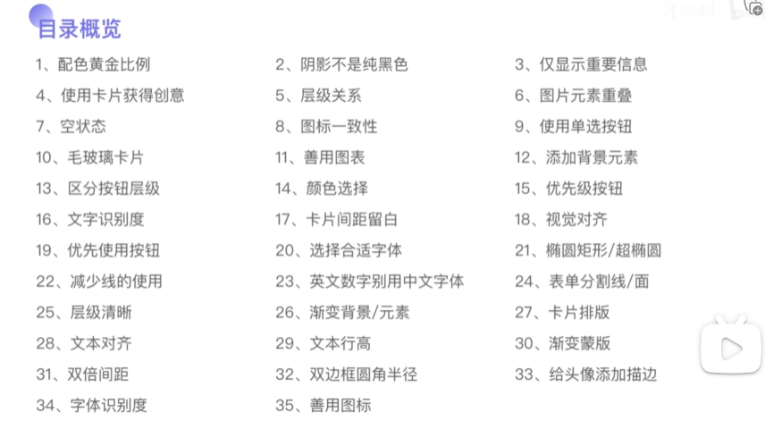
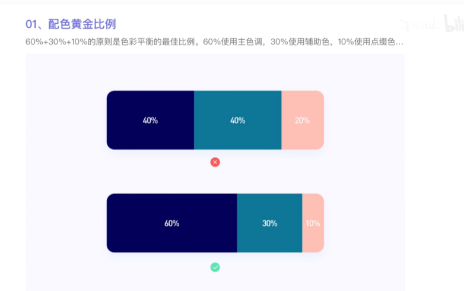
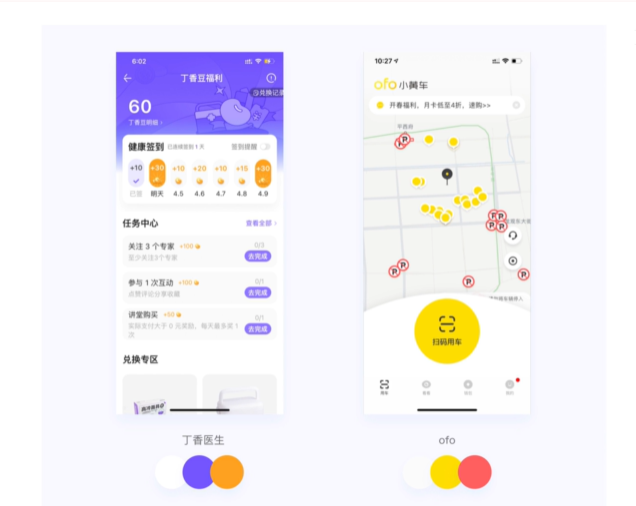

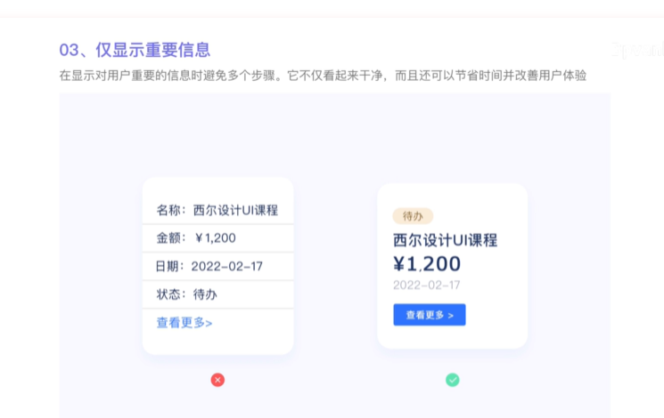
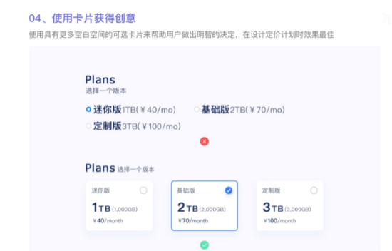

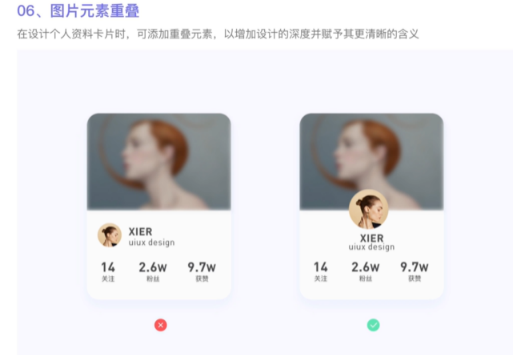
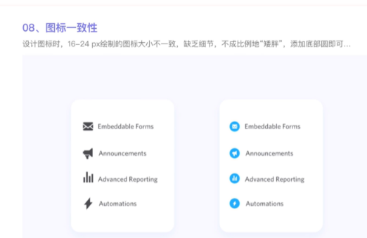

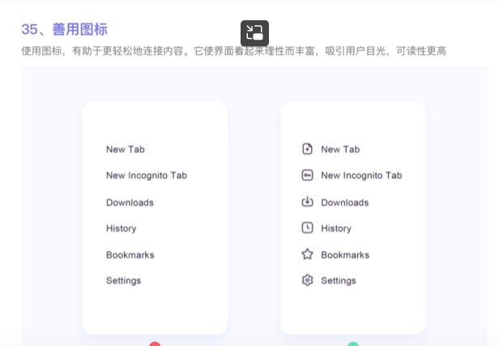
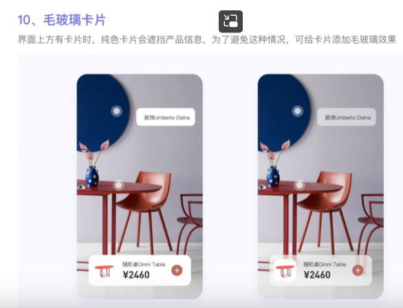

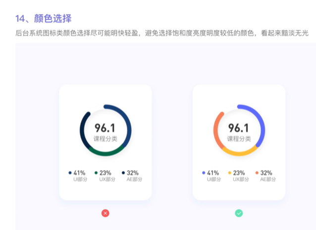
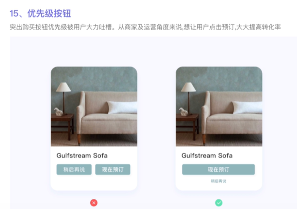
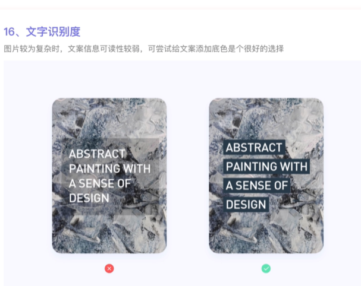
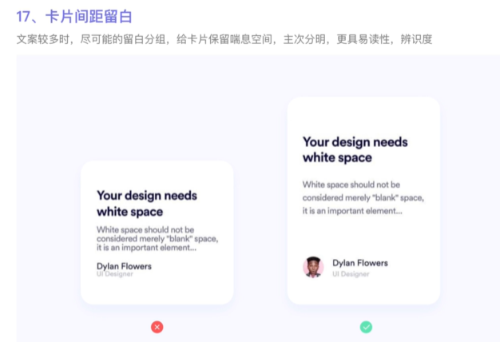
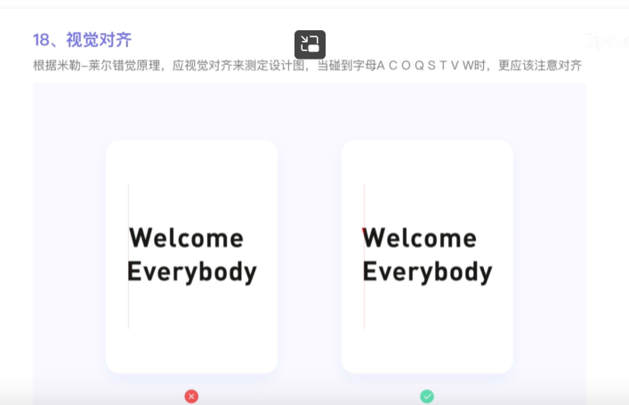
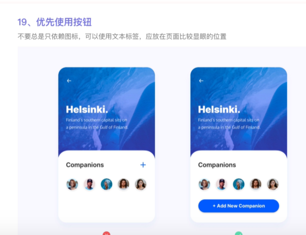

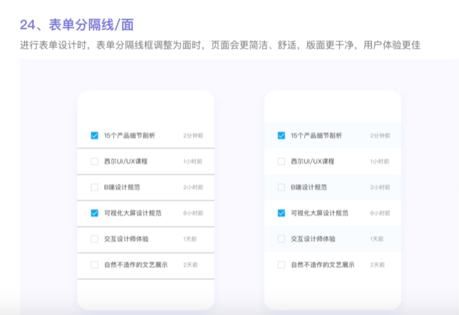

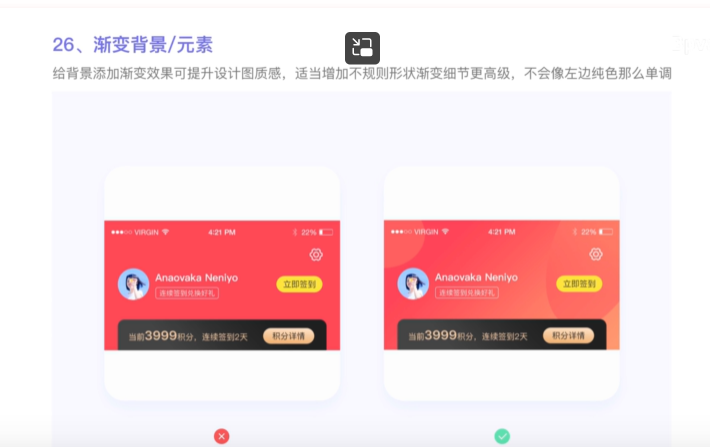

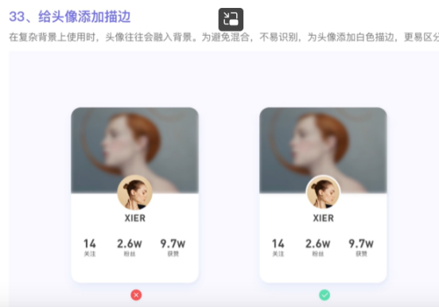
