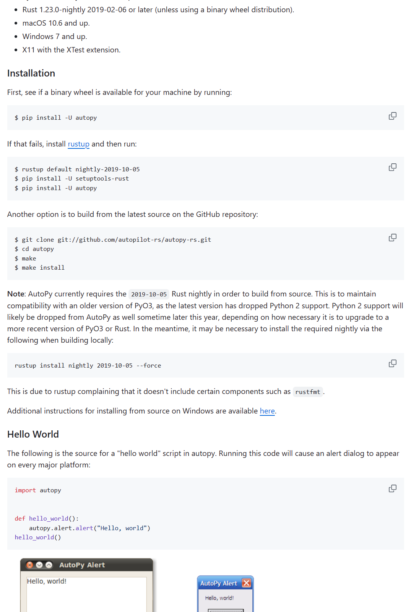
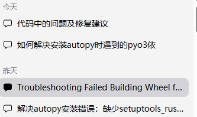

## 起因
写py大作业的时候发现手势控制鼠标老鼻子卡，想康康有没有更丝滑的，然后就找到了这哥们
https://blog.csdn.net/dgvv4/article/details/122268203
ok直接cv，然后这哥们用了autopy，那就安装被
好，问题来了，又是说我缺少rustc 又是说我缺少一个什么wheel的
简单来说就是，这玩意是用rust写的，需要rust环境才能运行，而且看了[官网](https://github.com/autopilot-rs/autopy)，


然后我就照着装了

**还是出现了以下的报错**




```bash  
PS C:\vscode\python> pip install autopy
Collecting autopy
  Using cached autopy-4.0.0.tar.gz (20 kB)
  Preparing metadata (setup.py) ... error
  error: subprocess-exited-with-error
  
  × python setup.py egg_info did not run successfully.    
  │ exit code: 1
  ╰─> [6 lines of output]
      Traceback (most recent call last):
        File "<string>", line 2, in <module>
        File "<pip-setuptools-caller>", line 34, in <module>
        File "C:\Users\31647\AppData\Local\Temp\pip-install-eojqaqou\autopy_3670b565a9404a3da1bf521f2de792f6\setup.py", line 8, in <module>
          from setuptools_rust import Binding, RustExtension
      ModuleNotFoundError: No module named 'setuptools_rust'
      [end of output]
  
  note: This error originates from a subprocess, and is likely not a problem with pip.
error: metadata-generation-failed

× Encountered error while generating package metadata.    
╰─> See above for output.

note: This is an issue with the package mentioned above, not pip.
hint: See above for details.

```

---
```bash  
Downloading autopy-4.0.0.tar.gz (20 kB)
  Preparing metadata (setup.py) ... done
Building wheels for collected packages: autopy
  Building wheel for autopy (setup.py) ... error
  error: subprocess-exited-with-error

  × python setup.py bdist_wheel did not run successfully. 
  │ exit code: 1
  ╰─> [20 lines of output]
      running bdist_wheel
      running build
      running build_py
      creating build
      creating build\lib.win-amd64-cpython-310
      creating build\lib.win-amd64-cpython-310\autopy     
      copying autopy\__init__.py -> build\lib.win-amd64-cpython-310\autopy
      running build_ext
      running build_rust
      error: can't find Rust compiler
     
      If you are using an outdated pip version, it is possible a prebuilt wheel is available for this package but pip is not able to install from it. Installing from the wheel would avoid the need for a Rust compiler.
     
      To update pip, run:
     
          pip install --upgrade pip
     
      and then retry package installation.
     
      If you did intend to build this package from source, try installing a Rust compiler from your system package manager and ensure it is on the PATH during installation. Alternatively, rustup (available at https://rustup.rs) is the recommended way to download and update the Rust compiler toolchain.
      [end of output]

  note: This error originates from a subprocess, and is likely not a problem with pip.
  ERROR: Failed building wheel for autopy
  Running setup.py clean for autopy
Failed to build autopy
ERROR: Could not build wheels for autopy, which is required to install pyproject.toml-based projects
```

然后我去搜了b站，发现这玩意只能运行在py3.8以下的版本，而我的版本是3.10，所以我就得主动降级了，然后nnd，发现都整完了，还是不行，还是出现说找不到轮子
**最后我学会了一手手动安装轮子，然后就解决了问题，终于能找到autopy包了，后面mediapipe也是python版本问题，3.10上装了再install就不行了，会提示已拥有，我也在python3.8的包库里手动装了mediapipe的whl也解决了感觉这个可以解决大部分的包问题**


## 解决

### 安装rustc 
看官网。。。这玩意还需要下载visual Studio的tool


### 下载python3.8


### 手动安装whl

可以看这个blog https://zhuanlan.zhihu.com/p/624374119

whl后缀的文件是python的包文件，相当于是一个压缩包，里面包含了python的包
这个得学
首先去https://pypi.org/project/autopy/#files 找到对应的版本，然后下载

在这里也可以看到py的限制版本在3.8及以下

然后我们找到了以后，就可以把这个放到python的根目录下，或者项目的根目录下
cd 根目录，运行

```python
python -m pip install autopy-4.0.0-cp38-cp38-win_amd64.whl
```
可以先看一下系统具体可以安装哪些标签的.whl文件，可以在命令提示符窗口输入：```pip debug --verbose```,兼容的文件标签就会显示。

