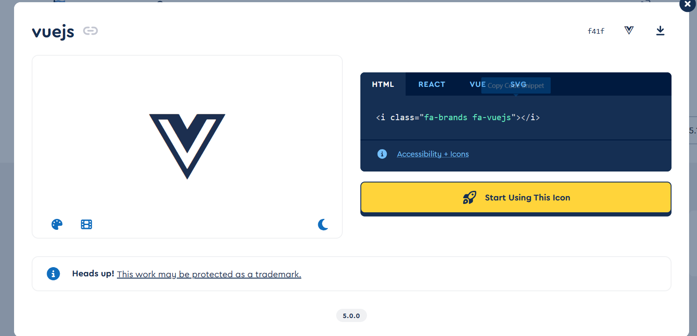

## 图标的使用

这文档写的一点都不清楚，让我想了很久，翻遍配置也找不到图片的引入

原来是在主题中内置了 fontawesome 的图标库，所以可以直接使用图标库的图标
[fontawesome](https://fontawesome.com/search?q=js&o=r)

在官网找到想用的图标的名字，然后复制 i 连接里面的名字就可以了

比如这个 VUE 的图标，就在 icon 字段中输入 `fa-brands fa-vuejs`
就可以显示了
**然后 fa-brands 可以简写为 fab**
然后官方文档中 demo 的图标为什么直接是打一个 `lap-top-code`
设置图标前缀
iconPrefix 是你要设置的图标前缀，

- **from 文档**
  通常，你的图标类应该有一个通用前缀，对于 iconfont，图标类名为 iconfont icon-<ICON-NAME>，对于 fontawesome free，图标类名为 fas fa-<icon-name>。 因此，当你使用关键字或从 iconfont 网站、fontawesome kit 或 fontawesome CDN 生成的单个链接设置上述 asset 选项时，插件会识别它们并自动为你设置前缀为 iconfont icon- 和 fas fa-.在你使用自己的 url 或设置多个 url 的其他情况下，你可以自己手动设置此选项。毕竟输入 icon: apple 总是比 icon: iconfont icon-apple、icon: mdi:apple 或 icon: fa-solid fa-apple 更好。
