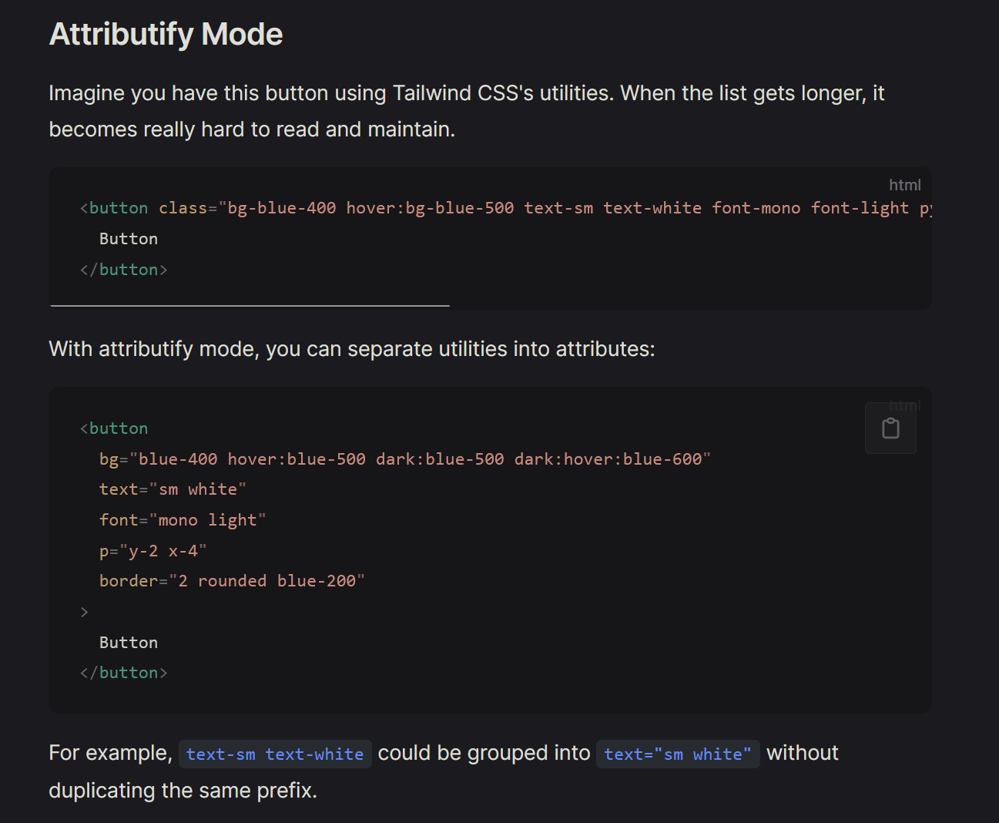

[官方文档](https://alfred-skyblue.github.io/unocss-docs-cn/)
[交互文档忘了就查这玩意](https://unocss.dev/interactive/)

## 什么是 Unocss

简单来说就是 tailwind 的拓展

### 特点



## 基础配置

可以直接抄 antifu 大佬的
https://github.com/antfu/vitesse/blob/main/README.zh-CN.md

### 一些快捷配置

比如说 center 就可以将 flex justify-center items-center 简写成 center
写在 unocss.config.ts 里

```js {.line-numbers}
import {
  defineConfig,
  presetAttributify,
  presetIcons,
  presetUno,
  presetWebFonts,
} from "unocss";

export default defineConfig({
  shortcuts: [
    [
      "btn",
      "px-4 py-1 rounded inline-block bg-teal-600 text-white cursor-pointer hover:bg-teal-700 disabled:cursor-default disabled:bg-gray-600 disabled:opacity-50",
    ],
    [
      "icon-btn",
      "text-[0.9em] inline-block cursor-pointer select-none opacity-75 transition duration-200 ease-in-out hover:opacity-100 hover:text-teal-600 !outline-none",
    ],
    {
      center: "flex justify-center items-center",
      "center-col": "center flex-col",
    },
    {
      icon: "h-4 w-4 cursor-pointer inline-block",
      "icon-btn": "rounded-full p-2 center",
    },
  ],
  presets: [
    presetUno(),
    presetAttributify(),
    presetIcons({
      scale: 1.2,
      warn: true,
    }),
    presetWebFonts({
      fonts: {
        sans: "DM Sans",
        serif: "DM Serif Display",
        mono: "DM Mono",
      },
    }),
  ],
});
```

## 语法

语法经过这段时间的写已经差不多了

### 两种用法

- 其一经典的 tailwind 用法

```css {.line-numbers}
/* tailwind */
<div class="bg-red-500 text-white p-4">Hello</div>
```

- 其二是可以拆开来用
  比如说 p="x-4 y-2" 代表 padding-x-4 padding-y-2

```css {.line-numbers}
<div p="x-4 y-4" w="full 100% 10vw" bg="black" >Hello</div>

```

第二种其实感觉比较合理，如果都堆在 class 里的话会很丑。。但是其实 uno 的写法就已经很乱了，所以只有自己爽的时候或者是简单样式再用 uno 吧
