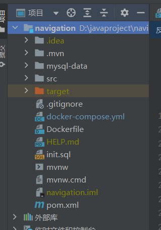

---

shortTitle: docker 部署 springboot+mysql

---

## 用 docker 部署 mysql 和 springboot

docker init 没带 springboot 玩，所以得自己配置

### 配置文件

首先在 sb 的根目录下创建 Dockerfile，然后编写一些基础的配置
其实在这里重点关注 jdk 版本，然后工作路径，copy 的名字，可以直接写成 xx.jar 后面是打包后的名字 app.jar
我们常规来说要先打包 jar 才能 compose 那么其实可以在 dockerfile 里面直接写 RUN sh./mvnw package 就可以打包了

```docker 
# syntax=docker/dockerfile:1

FROM openjdk:17-jdk-alpine as base

WORKDIR /app

COPY . .

RUN sh ./mvnw package -DskipTests

FROM openjdk:17-jdk-alpine as prod

WORKDIR /app

ARG APPNAME=navigations

COPY --from=base /app/target/$APPNAME.jar app.jar

EXPOSE 8080

ENV JAVA_OPTS="\
  -server \
  -Xms256m \
  -Xmx512m \
  -XX:MetaspaceSize=256m \
  -XX:MaxMetaspaceSize=512m"

ENV PARAMS=""

ENTRYPOINT ["sh","-c","java -jar $JAVA_OPTS app.jar $PARAMS"]
```

### 最为关键的 docker-compose.yml

springboot application.yml
由于 mysql 在 docker 上部署后这个端口和在本地上跑是不一样的，如果在本地跑默认就连到 3306，但是在 docker 上是需要我们制定 MYSQL_URL 的，所以在 application 这里需要把 url 改成变量的形式
然后在 java 的 environment 里面是不用写什么 username，rootname 什么的，会根据 application 自动补齐
**最重要的是要在 environment 里，把 url 替换成这种形式**

```java 
  environment:
      - MYSQL_URL=jdbc:mysql://db-mysql/navigation?useUnicode=true&characterEncoding=utf-8&useSSL=false&serverTimezone=GMT%2B8&rewriteBatchedStatements=true
```

db-mysql 表示依赖的 mysql 镜像名称
depends_on 要注意一下，就是要等 mysql 服务启动完了以后我才启动 java 服务，不然就连不上了

- **重点在于 mysql**
  mysql，不需要写 mysql_username 不然会提示找不到，这个会自动补齐的，写 rootname 就好
  然后很重要一点，
  要预先把初始化数据库的 sql 准备好，然后在 volume 加上 - ./init.sql:/docker-entrypoint-initdb.d/init.sql

```java 
spring:
  datasource:
    url: ${MYSQL_URL:jdbc:mysql://localhost:3306/navigation?useUnicode=true&characterEncoding=utf-8&useSSL=false&serverTimezone=GMT%2B8&rewriteBatchedStatements=true}
    username: root
    password: root
    driver-class-name: com.mysql.cj.jdbc.Driver
    hikari:
      initialization-fail-timeout: 5000
```

```docker 
version: "3.8"
services:
  # 定义web服务
  client:
    image: blue-navigation-management-server
    container_name: blue-navigation-management
    ports:
      - "4173:4173"
    environment:
      API_URL: http://localhost:8080
  springboot-app:
    # 构建镜像的路径
    build:
      context: .
      dockerfile: Dockerfile
    container_name: springboot-app
    ports:
      - "8080:8080"
    environment:
      - MYSQL_URL=jdbc:mysql://db-mysql/navigation?useUnicode=true&characterEncoding=utf-8&useSSL=false&serverTimezone=GMT%2B8&rewriteBatchedStatements=true
    depends_on:
      - db-mysql

    #定义mysql服务
  db-mysql:
    image: mysql:8.0.28
    container_name: db-mysql
    #restart: always 表示容器退出时总是重启
    #    restart: always
    environment:
      MYSQL_ROOT_PASSWORD: root
      MYSQL_DATABASE: navigation
      MYSQL_PASSWORD: root
    # ports: 表示将容器的端口映射到宿主机的端口 13306表示宿主机的端口 3306表示容器的端口
    volumes:
      - mysql-data:/var/lib/mysql
      - ./init.sql:/docker-entrypoint-initdb.d/init.sql
    ports:
      - "4406:3306"
    healthcheck:
      test: [ CMD, mysqladmin, ping, -h, localhost ]
      interval: 10s
      timeout: 5s
      retries: 5
volumes:
  mysql-data:
```

项目结构


