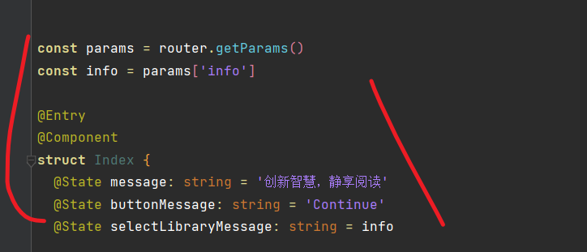
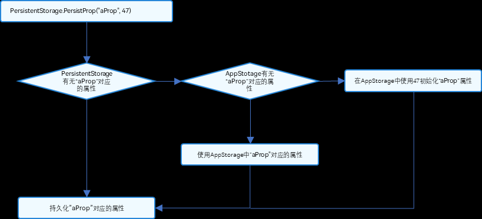
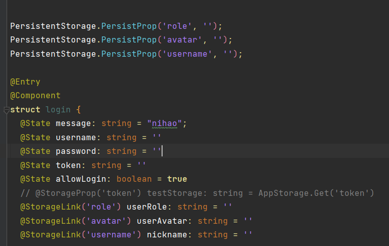
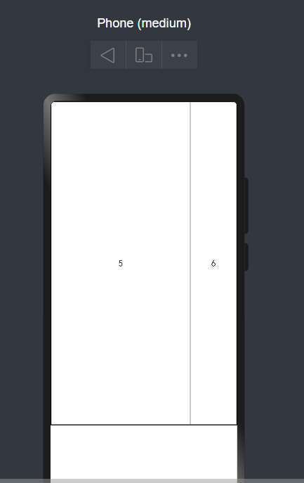
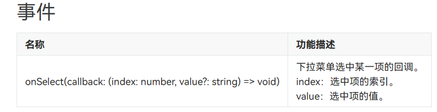
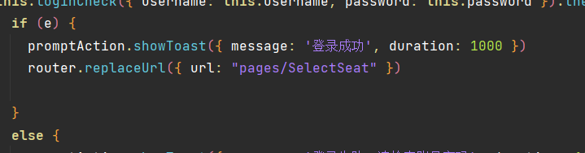
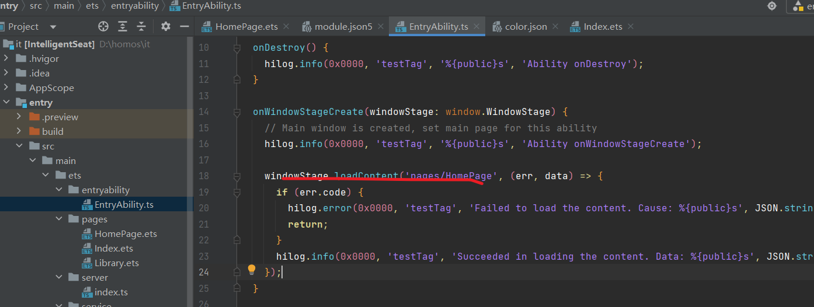

[toc]

## 安装及配置

[官网下载 devco，一路 continue]()
然后会让选择 node 版本，需要$>16<18$ 所以这个时候要下载一个[fnm](https://zhuanlan.zhihu.com/p/587008009)
然后使用 fnm 来切换版本

```bash
PS C:\Users> fnm ls
* v16.20.2
* v18.17.1 default, lts-latest
* system
fnm -v
```

## 快速使用 arkts 创建一个基础项目(stage 模型)

- ArkTS 工程目录结构（Stage 模型）


- **AppScope > app.json5**：应用的全局配置信息。
- **entry**：OpenHarmony 工程模块，编译构建生成一个[HAP](http://docs.openharmony.cn/pages/v3.2/zh-cn/glossary.md/#hap)包。
  - **src > main > ets**：用于存放 ArkTS 源码。
  - **src > main > ets > entryability**：应用/服务的入口。
  - **src > main > ets > pages**：应用/服务包含的页面。
  - **src > main > resources**：用于存放应用/服务所用到的资源文件，如图形、多媒体、字符串、布局文件等。关于资源文件，详见[资源文件的分类](http://docs.openharmony.cn/pages/v3.2/zh-cn/application-dev/quick-start/resource-categories-and-access.md/#%E8%B5%84%E6%BA%90%E5%88%86%E7%B1%BB)。
  - **src > main > module.json5**：模块配置文件。主要包含 HAP 的配置信息、应用/服务在具体设备上的配置信息以及应用/服务的全局配置信息。具体的配置文件说明，详见[module.json5 配置文件](http://docs.openharmony.cn/pages/v3.2/zh-cn/application-dev/quick-start/module-configuration-file.md/)。
  - **build-profile.json5**：当前的模块信息 、编译信息配置项，包括 buildOption、targets 配置等。其中 targets 中可配置当前运行环境，默认为 HarmonyOS。若需开发 OpenHarmony 应用，则需开发者自行修改为 OpenHarmony。
  - **hvigorfile.ts**：模块级编译构建任务脚本，开发者可以自定义相关任务和代码实现。
- **oh_modules**：用于存放三方库依赖信息。关于原 npm 工程适配 ohpm 操作，请参考[历史工程手动迁移](https://developer.harmonyos.com/cn/docs/documentation/doc-guides-V3/project_overview-0000001053822398-V3#section108143331212)。
- **build-profile.json5**：应用级配置信息，包括签名、产品配置等。
- **hvigorfile.ts**：应用级编译构建任务脚本。

## 构建第一个页面

1. 使用文本组件。

   工程同步完成后，在“**Project**”窗口，点击“**entry > src > main > ets > pages**”，打开“**Index.ets**”文件，可以看到页面由 Text 组件组成。“**Index.ets**”文件的示例如下：

   ```
   // Index.ets
   @Entry
   @Component
   struct Index {
     @State message: string = 'Hello World'

     build() {
       Row() {
         Column() {
           Text(this.message)
             .fontSize(50)
             .fontWeight(FontWeight.Bold)
         }
         .width('100%')
       }
       .height('100%')
     }
   }
   ts
   ```

2. 添加按钮。

   在默认页面基础上，我们添加一个 Button 组件，作为按钮响应用户点击，从而实现跳转到另一个页面。“**Index.ets**”文件的示例如下：

   ```
   // Index.ets
   @Entry
   @Component
   struct Index {
     @State message: string = 'Hello World'

     build() {
       Row() {
         Column() {
           Text(this.message)
             .fontSize(50)
             .fontWeight(FontWeight.Bold)
           // 添加按钮，以响应用户点击
           Button() {
             Text('Next')
               .fontSize(30)
               .fontWeight(FontWeight.Bold)
           }
           .type(ButtonType.Capsule)
           .margin({
             top: 20
           })
           .backgroundColor('#0D9FFB')
           .width('40%')
           .height('5%')
         }
         .width('100%')
       }
       .height('100%')
     }
   }
   ts
   ```

3. 在编辑窗口右上角的侧边工具栏，点击 Previewer，打开预览器。第一个页面效果如下图所示：


## 构建第二个页面

1. 创建第二个页面。

   - 新建第二个页面文件。在“**Project**”窗口，打开“**entry > src > main > ets**”，右键点击“**pages**”文件夹，选择“**New > ArkTS File**”，命名为“**Second**”，点击“**Finish**”。可以看到文件目录结构如下：
     
     > **说明：**
     >
     > 开发者也可以在右键点击“**pages**”文件夹时，选择“**New > Page**”，则无需手动配置相关页面路由。
   - 配置第二个页面的路由。在“**Project**”窗口，打开“**entry > src > main > resources > base > profile**”，在 main_pages.json 文件中的“src”下配置第二个页面的路由“pages/Second”。示例如下：
     ```
     {
       "src": [
         "pages/Index",
         "pages/Second"
       ]
     }
     json
     ```

2. 添加文本及按钮。

   参照第一个页面，在第二个页面添加 Text 组件、Button 组件等，并设置其样式。“**Second.ets**”文件的示例如下：

   ```
   // Second.ets
   @Entry
   @Component
   struct Second {
     @State message: string = 'Hi there'

     build() {
       Row() {
         Column() {
           Text(this.message)
             .fontSize(50)
             .fontWeight(FontWeight.Bold)
           Button() {
             Text('Back')
               .fontSize(25)
               .fontWeight(FontWeight.Bold)
           }
           .type(ButtonType.Capsule)
           .margin({
             top: 20
           })
           .backgroundColor('#0D9FFB')
           .width('40%')
           .height('5%')
         }
         .width('100%')
       }
       .height('100%')
     }
   }
   ts
   ```

## [](http://docs.openharmony.cn/pages/v3.2/zh-cn/application-dev/quick-start/start-with-ets-stage.md/#%E5%AE%9E%E7%8E%B0%E9%A1%B5%E9%9D%A2%E9%97%B4%E7%9A%84%E8%B7%B3%E8%BD%AC)实现页面间的跳转

页面间的导航可以通过[页面路由 router](http://docs.openharmony.cn/pages/v3.2/zh-cn/application-dev/reference/apis/js-apis-router.md/)来实现。页面路由 router 根据页面 url 找到目标页面，从而实现跳转。使用页面路由请导入 router 模块。

1. 第一个页面跳转到第二个页面。

   在第一个页面中，跳转按钮绑定 onClick 事件，点击按钮时跳转到第二页。“**Index.ets**”文件的示例如下：

   ```
   // Index.ets
   // 导入页面路由模块
   import router from '@ohos.router';

   @Entry
   @Component
   struct Index {
     @State message: string = 'Hello World'

     build() {
       Row() {
         Column() {
           Text(this.message)
             .fontSize(50)
             .fontWeight(FontWeight.Bold)
           // 添加按钮，以响应用户点击
           Button() {
             Text('Next')
               .fontSize(30)
               .fontWeight(FontWeight.Bold)
           }
           .type(ButtonType.Capsule)
           .margin({
             top: 20
           })
           .backgroundColor('#0D9FFB')
           .width('40%')
           .height('5%')
           // 跳转按钮绑定onClick事件，点击时跳转到第二页
           .onClick(() => {
             console.info(`Succeeded in clicking the 'Next' button.`)
            // 跳转到第二页
              router.pushUrl({ url: 'pages/Second' }).then(() => {
                console.info('Succeeded in jumping to the second page.')
              }).catch((err) => {
                console.error(`Failed to jump to the second page.Code is ${err.code}, message is ${err.message}`)
              })
           })
         }
         .width('100%')
       }
       .height('100%')
     }
   }
   ts
   ```

2. 第二个页面返回到第一个页面。

   在第二个页面中，返回按钮绑定 onClick 事件，点击按钮时返回到第一页。“**Second.ets**”文件的示例如下：

   ```
   // Second.ets
   // 导入页面路由模块
   import router from '@ohos.router';

   @Entry
   @Component
   struct Second {
     @State message: string = 'Hi there'

     build() {
       Row() {
         Column() {
           Text(this.message)
             .fontSize(50)
             .fontWeight(FontWeight.Bold)
           Button() {
             Text('Back')
               .fontSize(25)
               .fontWeight(FontWeight.Bold)
           }
           .type(ButtonType.Capsule)
           .margin({
             top: 20
           })
           .backgroundColor('#0D9FFB')
           .width('40%')
           .height('5%')
           // 返回按钮绑定onClick事件，点击按钮时返回到第一页
           .onClick(() => {
             console.info(`Succeeded in clicking the 'Back' button.`)
             try {
               // 返回第一页
               router.back()
               console.info('Succeeded in returning to the first page.')
             } catch (err) {
               console.error(`Failed to return to the first page.Code is ${err.code}, message is ${err.message}`)
             }
           })
         }
         .width('100%')
       }
       .height('100%')
     }
   }
   ts
   ```

## 使用真机运行应用


在 settings 里面勾这个，然后在虚拟机那里下载本地虚拟机(9gwtf)，然后就能跑虚拟机了
想在虚拟机上运行就点击右上角的绿色 run 箭头就可以

## 路由跳转

对于那种登录或者起始页，跳转后最好使用 replaceUrl，这样子的话会自动清栈，然后返回不了这个页面


**！注意**

这玩意在传值的时候要先用 const 去接，然后再赋值，不然就会一直找不到。。。rnm 的鸿蒙

**新遇到一个离谱的**
路由的路径原本可以使用相对路径的，但是不知道怎的，会提示找不到页面，也已经注册了，然后绝对路径也不行，只能使用一个四不像的路径，否则就不给跳了


## arkTs 语法

## 关于 homo 本地存储的使用

http://docs.openharmony.cn/pages/v3.2/zh-cn/application-dev/quick-start/arkts-appstorage.md/

### AppStorage

这玩意相当于 vue 里面的仓库全局可以使用，但是比较麻烦
在 ui 界面中要想使用的话必须使用
**@StorageProp 或者@StorageLink**来和本地的值做一个绑定，prop 能读不能改，link 双向绑定

```js 
AppStorage.set('xx',xx)
@Entry
 @StorageLink('role') userRole: string = ''
  @StorageLink('avatar') userAvatar: string = ''
```

### persistStorage


这里就相当于是持久化存储，可以拿来存 token 和一些固定的属性，直接写进磁盘，只有应用卸载或重新 build 的时候才会被删掉
**用法**
必须先声明要使用持久化存储，然后会自动判断在 Appstorage 里有没有这个项，没有就生成，有就更新什么的，在重开的时候也会保存


```js 
PersistentStorage.PersistProp('role', '');
PersistentStorage.PersistProp('avatar', '');
PersistentStorage.PersistProp('username', '');

@Entry
@Component
struct login {
  @State message: string = "nihao";
  @State username: string = ''
  @State password: string = ''
  @State token: string = ''
  @State allowLogin: boolean = true
  // @StorageProp('token') testStorage: string = AppStorage.Get('token')
  @StorageLink('role') userRole: string = ''
  @StorageLink('avatar') userAvatar: string = ''
  @StorageLink('username') nickname: string = ''

```

## 组件参考

### 线性布局

这玩意就是 column，row，也就是行列布局，自带 flex，row 布局的话就是一列，然后垂直结构，column 布局就是一行，然后水平结构
行里可以套列，列里也可以套行，然后也可以行套行
**使用 justify 和 align**

- .justifyContent(FlexAlign.Center)
- .alignItems(VerticalAlign.Center)

### grid

```js 
Grid() {
        ForEach(this.counts, (count: number) => {
          GridItem() {
            Text(count.toString())
            // Image($r('app.media.student'))
          }.border({ width: 1, color: ($r('app.color.border_shadow1')) })
        })

      }
      .rowsTemplate('0fr 2fr 0fr')
      .border({ width: 1 })
      .columnsTemplate('0fr 3fr 1fr')

    }
```



### border

边框老麻烦，使用 border 的话要注意，在里面有很多属性，width，color，然后在 width 里面的话，也需要再套一层花括号

```js 
// xxx.ets
@Entry
@Component
struct BorderExample {
  build() {
    Column() {
      Flex({ justifyContent: FlexAlign.SpaceAround, alignItems: ItemAlign.Center }) {
        // 线段
        Text('dashed')
          .borderStyle(BorderStyle.Dashed).borderWidth(5).borderColor(0xAFEEEE).borderRadius(10)
          .width(120).height(120).textAlign(TextAlign.Center).fontSize(16)
        // 点线
        Text('dotted')
          .border({ width: 5, color: 0x317AF7, radius: 10, style: BorderStyle.Dotted })
          .width(120).height(120).textAlign(TextAlign.Center).fontSize(16)
      }.width('100%').height(150)

      Text('.border')
        .fontSize(50)
        .width(300)
        .height(300)
        .border({
          width: { left: '5lpx', right: '10lpx', top: '20lpx', bottom: '30lpx' },
          color: { left: '#e3bbbb', right: Color.Blue, top: Color.Red, bottom: Color.Green },
          radius: { topLeft: 10, topRight: 20, bottomLeft: 40, bottomRight: 80 },
          style: {
            left: BorderStyle.Dotted,
            right: BorderStyle.Dotted,
            top: BorderStyle.Solid,
            bottom: BorderStyle.Dashed
          }
        }).textAlign(TextAlign.Center)
    }
  }
}

```

### Select




### promptAction

toast 弹出框，好用


## 基础的必须理解的

### 页面结构

### 关于如何将首页变成自定义的页面

在入口 ability 里改，然后记得在页面里要注册



### 获取权限的方法

在 sb 的 module.json5 里配置

具体属性看官方文档

### 如何引入资源文件

- 访问应用资源

在工程中，通过"$r('app.type.name')"的形式引用应用资源。app 代表是应用内 resources 目录中定义的资源；type 代表资源类型（或资源的存放位置），可以取“color”、“float”、“string”、“plural”、“media”，name 代表资源命名，由开发者定义资源时确定。

引用 rawfile 下资源时使用"$rawfile('filename')"的形式，filename 需要表示为 rawfile 目录下的文件相对路径，文件名需要包含后缀，路径开头不可以以"/"开头。

访问 rawfile 文件的 descriptor 时，可使用资源管理 getRawFd 接口，其返回值 descriptor.fd 为 hap 包的 fd，访问此 rawfile 文件需要结合{fd, offset, length}一起使用。

资源描述符不能拼接使用，仅支持普通字符串如'app.type.name'。

**$r 返回值为 Resource 对象，可通过 getStringValue 方法获取对应的字符串**。

在 xxx.ets 文件中，可以使用在 resources 目录中定义的资源。资源分类中资源组目录下的“资源文件示例”显示了.json 文件内容，包含 color.json 文件、string.json 文件和 plural.json 文件。资源的具体使用方法如下：

```js 
Text($r("app.string.string_hello"))
  .fontColor($r("app.color.color_hello"))
  .fontSize($r("app.float.font_hello"));

Text($r("app.string.string_world"))
  .fontColor($r("app.color.color_world"))
  .fontSize($r("app.float.font_world"));

// 引用 string.json 资源。Text 中$r的第一个参数指定string资源，第二个参数用于替换string.json文件中的%s。
//如下示例代码value为"We will arrive at five of the clock"。
Text($r("app.string.message_arrive", "five of the clock"))
  .fontColor($r("app.color.color_hello"))
  .fontSize($r("app.float.font_hello"));

// 引用 plural$资源。Text中$r 的第一个指定 plural 资源，第二个参数用于指定单复数（在中文，单复数均使用 other。在英文，one：代表单数，取值为 1；other：代表复数，取值为大于等于 1 的整数），第三个参数用于替换%d
// 如下示例代码为复数，value 为"5 apples"。
Text($r("app.plural.eat_apple", 5, 5))
  .fontColor($r("app.color.color_world"))
  .fontSize($r("app.float.font_world"));

Image($r("app.media.my_background_image")); // media资源的$r 引用

Image($rawfile("test.png")); // rawfile$r 引用 rawfile 目录下图片

Image($rawfile("newDir/newTest.png")); // rawfile$r 引用 rawfile 目录下图片
ts;
Text($r("app.string.string_hello"))
  .fontColor($r("app.color.color_hello"))
  .fontSize($r("app.float.font_hello"));

Text($r("app.string.string_world"))
  .fontColor($r("app.color.color_world"))
  .fontSize($r("app.float.font_world"));

// 引用 string.json 资源。Text 中$r的第一个参数指定string资源，第二个参数用于替换string.json文件中的%s。
//如下示例代码value为"We will arrive at five of the clock"。
Text($r("app.string.message_arrive", "five of the clock"))
  .fontColor($r("app.color.color_hello"))
  .fontSize($r("app.float.font_hello"));

// 引用 plural$资源。Text中$r 的第一个指定 plural 资源，第二个参数用于指定单复数（在中文，单复数均使用 other。在英文，one：代表单数，取值为 1；other：代表复数，取值为大于等于 1 的整数），第三个参数用于替换%d
// 如下示例代码为复数，value 为"5 apples"。
Text($r("app.plural.eat_apple", 5, 5))
  .fontColor($r("app.color.color_world"))
  .fontSize($r("app.float.font_world"));

Image($r("app.media.my_background_image")); // media资源的$r 引用

Image($rawfile("test.png")); // rawfile$r 引用 rawfile 目录下图片

Image($rawfile("newDir/newTest.png")); // rawfile$r 引用 rawfile 目录下图片
```

**系统资源**
系统资源包含色彩、圆角、字体、间距、字符串及图片等。通过使用系统资源，不同的开发者可以开发出具有相同视觉风格的应用。

开发者可以通过“$r('sys.type.resource_id')”的形式引用系统资源。sys 代表是系统资源；type 代表资源类型，可以取“color”、“float”、“string”、“media”；resource_id 代表资源 id。

可以查看应用 UX 设计中关于资源的介绍，获取 OpenHarmony 支持的系统资源 ID 及其在不同配置下的取值。

说明：

仅声明式开发范式支持使用系统资源，类 Web 开发范式不支持。

可以查看 OpenHarmony/resources 代码仓了解系统预置资源的实现，这里的目录结构与工程中的 resources 目录类似，也是通过资源限定词匹配不同的设备或设备状态。

系统资源的使用场景、id、参数详细对照表详见 OpenHarmony\_系统资源分层设计表\_V1.0.xlsm

```js 
Text("Hello")
  .fontColor($r("sys.color.ohos_id_color_emphasize"))
  .fontSize($r("sys.float.ohos_id_text_size_headline1"))
  .fontFamily($r("sys.string.ohos_id_text_font_family_medium"))
  .backgroundColor($r("sys.color.ohos_id_color_palette_aux1"));

Image($r("sys.media.ohos_app_icon"))
  .border({
    color: $r("sys.color.ohos_id_color_palette_aux1"),
    radius: $r("sys.float.ohos_id_corner_radius_button"),
    width: 2,
  })
  .margin({
    top: $r("sys.float.ohos_id_elements_margin_horizontal_m"),
    bottom: $r("sys.float.ohos_id_elements_margin_horizontal_l"),
  })
  .height(200)
  .width(300);
```

## 动手时遇到的好多好多问题，sbhomo！垃圾社区

### 关于 websocket 的问题

ws，的 on('message',(err,value))能发送的数据只有 string 和 arraybuffer，所以要用 JSON.parse(value)来得到值

```js 

```
