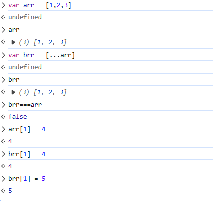

## 起因
在写我的navigation项目时，我拿取仓库的网站列表数据(存在local中),然后想使用一个temp数组在后台添加一个checked属性，以便更好的控制checkbox的状态，但是我发现，我在temp数组中添加checked属性后，local中的数据也被添加了checked属性，这是为什么呢？
一开始我以为是pinia的持久化插件的问题，自动检测到我的数据变化就给我更新了
但是我把他注释掉后，而且使用了原生的localStorage.setItem()方法，还是会出现这个问题，那我们继续排查
- 先让我们看看代码
  .png)
在这里面我首先拿数据时就使用了解构赋值，然后我又使用了map，map本身就是获得一个新的数组，所以我想，我在map中添加checked属性，应该不会影响到原数组的，而且console出来的值也表示这俩货不相等，那么问题出现在哪里呢？
- 检索网上+自己实验后发现，解构赋值在1层数组的时候实现的是深拷贝
  
- 但是我的website数组，嵌套了两层
  
由此引出了解决方法
方法1是传统的```JSON.parse(JSON.stringify())```方法
```ts  
const tempWebSiteList = JSON.parse(JSON.stringify(webSiteList)).map((item) => {
  const website = item
  website.bookmarks = item.bookmarks.map((bookmark) => {
    bookmark.checked = false
    return bookmark
  })
  return website
})
```
方法2的话，还是使用解构，那我们想，第一层解构解不了，那我们就使用两层解构呗
```js  
const tempWebSiteList = webSiteList.map((website: webSiteType) => {
  const bookmarks = website.bookmarks.map((bookmark: bookMarkType) => {
    return { ...bookmark, checked: false }
  })
  return { ...website, bookmarks }
})
```