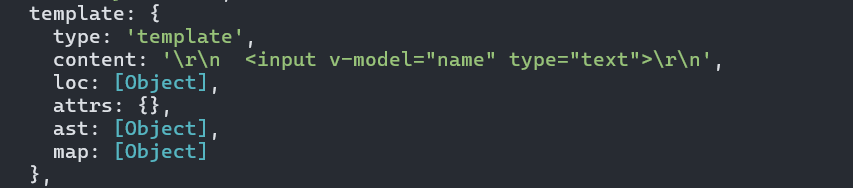
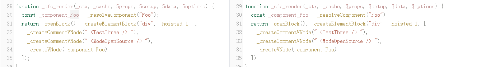
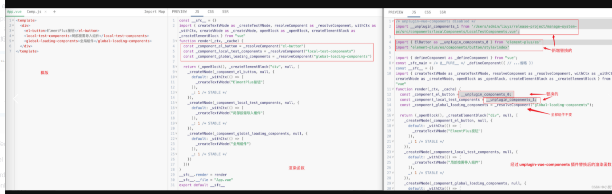
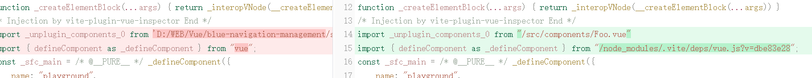
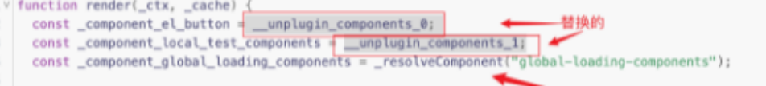
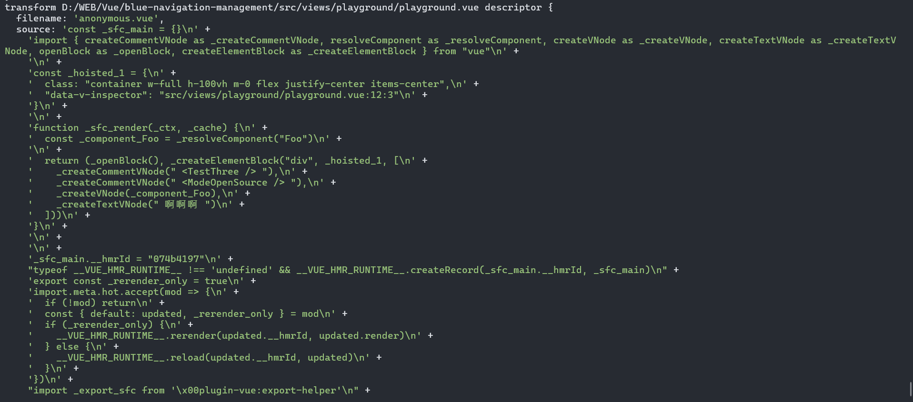

## 尝试手动实现一下 unplugin-vue-components 的功能

https://blog.csdn.net/Liu_yunzhao/article/details/130181440 很好的解读使我冰粥旋转

## 原理解析

看了源码和博客，其实原理就是，vue 不管你有没有 import 代码，只要你写了形如`<Foo/>` 在 template 里，他就会标记为组件 Vnode，但是他不会渲染，即使你注释掉了他也会标记
组件都是通过 render 函数渲染的

然后 unplugin 的原理就是拿到这些，然后将 import 变成`import unplugin xxx`
然后我们只要用魔法字符串，拿到这些我们自定义的组件的名称，然后再和这些 unplugin 替换掉就好了

### 动手

看了半天，我们明白一个是，

- 解析模板的方法(用不上)
  安装了 vue-compiler-sfc，我们可以直接使用里面的 parse 函数来解析模板，然后我们得到的值大概是,可以在里面看到 render 的函数，接下来就是想办法用正则匹配出来，然后再替换了
  

### 超小实现

