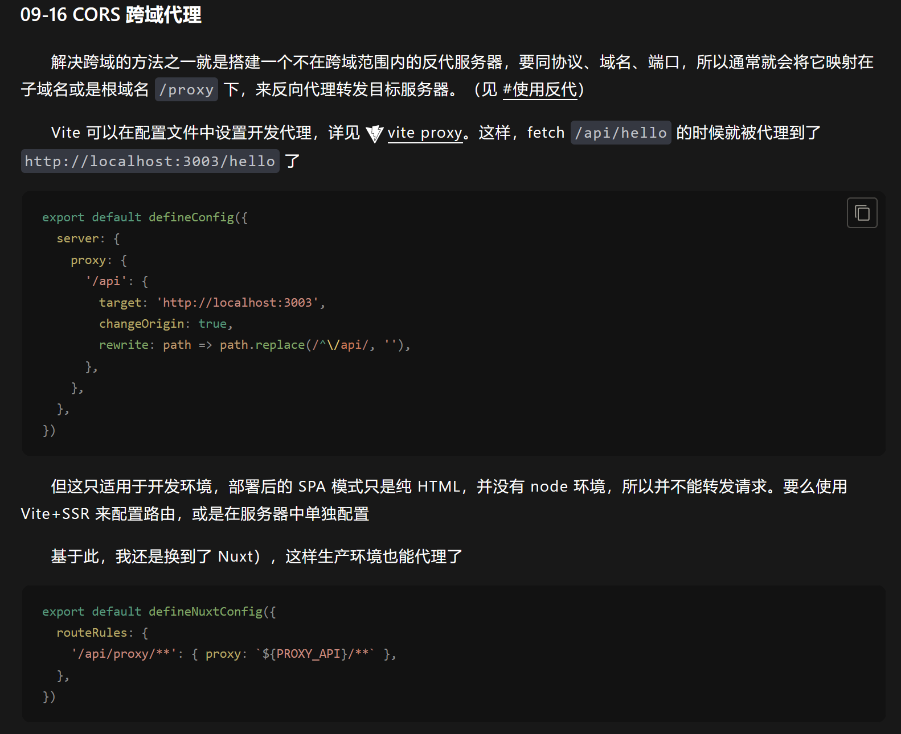

## 在 vite 中使用全局变量的方法

现在的方法就是在根目录下.env 文件或.env.local(自动 gitignore)
然后在里面命名以 VITE_APP 开头的变量

```bash
VITE_APP_USER_SECRET='c264583195f8c54dfe9bfb342b35448f400fe9b4a5eda6e0758ca04ab7fa133a'

VITE_APP_USER_APP_ID='rm8oj29o'
VITE_APP_USER_TOKEN_SECRET='1c1a5208b1430a17eb4e1b8beef9340eb3b81edc433e35928d811a017437c698'

```

然后可以设置 vite-env.d.ts 文件，可以获取 ts 支持

```js
/// <reference types="vite/client" />

interface ImportMetaEnv {
  readonly VITE_APP_TITLE: string
  VITE_APP_USER_SECRET: string

  VITE_APP_USER_APP_ID: string
  // 更多环境变量...
}
interface ImportMeta {
  readonly env: ImportMetaEnv
}

```

如果需要改变的话看文档

然后在全局中使用`import.meta.env.xxx`就行了

## 用 vite 代理请求



然后在里面 url 想使用变量的话，这样做

```js
/// <reference types="vitest" />

import path from "node:path";
import { defineConfig, loadEnv } from "vite";
import Vue from "@vitejs/plugin-vue";
import Components from "unplugin-vue-components/vite";
import AutoImport from "unplugin-auto-import/vite";
import UnoCSS from "unocss/vite";
import VueMacros from "unplugin-vue-macros/vite";
import VueRouter from "unplugin-vue-router/vite";
import { VueRouterAutoImports } from "unplugin-vue-router";
import { ElementPlusResolver } from "unplugin-vue-components/resolvers";

export default ({ mode }) => {
  const appId = loadEnv(mode, process.cwd()).VITE_APP_USER_APP_ID;
  return defineConfig({
    resolve: {
      alias: {
        "~/": `${path.resolve(__dirname, "src")}/`,
      },
    },

    plugins: [
      VueMacros({
        defineOptions: false,
        defineModels: false,
        plugins: {
          vue: Vue({
            script: {
              propsDestructure: true,
              defineModel: true,
            },
          }),
        },
      }),

      // https://github.com/posva/unplugin-vue-router
      VueRouter(),

      // https://github.com/antfu/unplugin-auto-import
      AutoImport({
        resolvers: [ElementPlusResolver()],
        imports: [
          "vue",
          "@vueuse/core",
          VueRouterAutoImports,
          {
            // add any other imports you were relying on
            "vue-router/auto": ["useLink"],
          },
        ],
        dts: true,
        dirs: ["./src/composables"],
        vueTemplate: true,
      }),

      // https://github.com/antfu/vite-plugin-components
      Components({
        dts: true,
        resolvers: [ElementPlusResolver()],
      }),

      // https://github.com/antfu/unocss
      // see uno.config.ts for config
      UnoCSS(),
    ],

    // https://github.com/vitest-dev/vitest
    test: {
      environment: "jsdom",
    },
    server: {
      proxy: {
        "/api": {
          target: `https://${appId}.collab.tiptap.cloud/api`,
          changeOrigin: true,
          rewrite: (path) => path.replace(/^\/api/, ""),
        },
      },
    },
  });
};m
```
