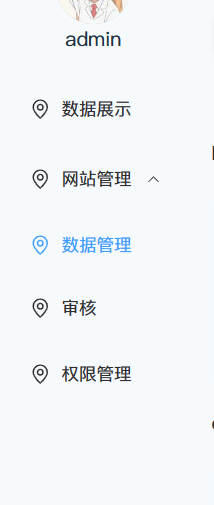
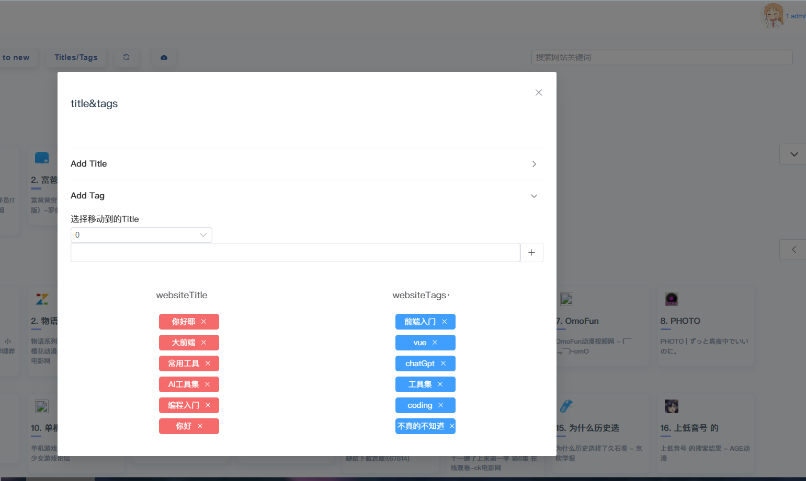

## 基础使用

饿了么 plus 是基于 Vue3 的组件库，组件支持 ts，且很多功能都很完善了，拿来做后台刚好

### 安装

```bash {.line-numbers}
pnpm install element-plus
```

### 引入/按需引入

https://element-plus.org/zh-CN/guide/quickstart.html
**完整**

```ts {.line-numbers}
import { createApp } from "vue";
import ElementPlus from "element-plus";
import "element-plus/dist/index.css";
import App from "./App.vue";

const app = createApp(App);

app.use(ElementPlus);
app.mount("#app");
```

**按需**
先装两款插件

```ts {.line-numbers}
pnpm install -D unplugin-vue-components unplugin-auto-import
```

然后把下列代码插入到你的 Vite 或 Webpack 的配置文件中

Vite

```ts {.line-numbers}
// vite.config.ts
import { defineConfig } from "vite";
import AutoImport from "unplugin-auto-import/vite";
import Components from "unplugin-vue-components/vite";
import { ElementPlusResolver } from "unplugin-vue-components/resolvers";

export default defineConfig({
  // ...
  plugins: [
    // ...
    AutoImport({
      resolvers: [ElementPlusResolver()],
    }),
    Components({
      resolvers: [ElementPlusResolver()],
    }),
  ],
});
```

## element-container

container 主要用的是包括 header，main，footer 的
这玩意没啥好说的，不过可以将 main，header，footer 封装在 layouts 里面，然后一般来说都是 header，aside，footer 是固定的，只将内容渲染到 main 里面

### 将页面的其他部分固定，将内容渲染到 main 里面，作为路由组件的出口

然后放在父组件的 Main 里面

```js {.line-numbers}
// management.vue
  <div class="el-container m-t-1">
    <el-container>
      <el-aside class="h-full" width="auto">
        <div class="user-agent">
          <span class="flex flex-col">
            <el-avatar :size="60" :src="userAvatar" />
            {{ username }}
          </span>
        </div>
        <Menu :menu-list="useStore.constanRoutes" :collapse="isCollapse" />
      </el-aside>
      <el-container>
        <el-header class="header">
          <!-- <h1>sea blue navigation</h1> -->
          <el-button @click="() => (isCollapse = !isCollapse)">
            <el-icon>
              <Expand />
            </el-icon>
          </el-button>
          <router-link to="/">
            <el-button>home</el-button>
          </router-link>
          <div class="avatar">
            <el-dropdown class="el-dropdown-link">
              <span>
                <el-avatar :size="40" :src="userAvatar" />
                {{ userId }} {{ username }}
              </span>
              <span>
                <el-icon class="el-icon--right">
                  <arrow-down />
                </el-icon>
              </span>
              <template #dropdown>
                <el-dropdown-menu>
                  <el-dropdown-item>登录</el-dropdown-item>
                  <el-dropdown-item>个人中心</el-dropdown-item>
                  <el-dropdown-item @click="logout">
                    退出登录
                  </el-dropdown-item>
                </el-dropdown-menu>
              </template>
            </el-dropdown>
          </div>
        </el-header>
        <el-main>
          <Transition>
            <Main />
          </Transition>
        </el-main>
        <el-footer class="h-1">
          Footer
        </el-footer>
      </el-container>
    </el-container>
  </div>
```

```js {.line-numbers}
// layouts/main.vue
<template>
  <!-- 路由组件出口的位置 -->

  <router-view v-slot="{ Component }">
    <transition name="fade">
      <!-- 渲染layout一级路由的子路由 -->
      <component :is="Component" />
    </transition>
  </router-view>
</template>
// management.vue

```

## element-menu

可以注释掉一些原本的样式，不然不方便布局

```css {.line-numbers}
/* 针对饿了么的设置 */
.el-menu {
  background-color: transparent !important;
  border: none !important;
}
.el-menu--collapse .el-submenu__title span {
  display: none !important;
}

/*隐藏 > */
.el-menu--collapse .el-submenu__title .el-submenu__icon-arrow {
  display: none !important;
}
```

### 封装常量 menu 然后递归打印


像这些菜单栏一般来说可以固定的封装在一起，然后根据用户权限再渲染不同的菜单
**做法**
这里看我们的常量路由，我们可以将一些配置项写好，然后

```js {.line-numbers}
const constantRoute = [
  {
    path: "/management/showdata",
    component: () => import("../views/management/showdata.vue"),
    name: "数据展示",
    meta: {
      title: "数据展示",
    },
  },
  {
    path: "/management",
    name: "网站管理",
    children: [
      {
        path: "/management/webside",
        component: () => import("../views/management/manage/webside.vue"),
        name: "数据管理",
        meta: {
          title: "数据管理",
        },
      },
      {
        path: "/management/audit",
        component: () => import("../views/management/manage/audit.vue"),
        name: "审核",
        meta: {
          title: "审核",
        },
      },
    ],
  },
  {
    path: "/management/permission",
    component: () => import("../views/management/permission.vue"),
    name: "权限管理",
    meta: {
      title: "权限管理",
      audit: true, // 是否通过验证
    },
  },
];
```

写一个 Menu 组件，然后递归渲染

```js {.line-numbers}
<template>
  <el-menu class="el-menu" :collapse="collapse">
    <template v-for="(item, index) in menuList" :key="item.path">
      <!-- 单级 -->

      <el-menu-item v-if="!item.children" :index="item.name" @click="routerPush(item.path)">
        <el-icon>
          <location />
        </el-icon>
        <span>{{ item.name }}+</span>
      </el-menu-item>
      <!-- 1子 -->
      <el-sub-menu v-if="item.children && item.children.length === 1" :index="item.name">
        <template #title>
          <el-menu-item @click="routerPush(item.path)">
            <el-icon>
              <location />
            </el-icon>
            <span>{{ item.name }}</span>
          </el-menu-item>
        </template>
      </el-sub-menu>
      <!-- 2+ -->
      <el-sub-menu v-if="item.children && item.children.length > 1" :index="item.name">
        <template #title>
          <el-icon>
            <location />
          </el-icon>
          <span>{{ item.name }}</span>
        </template>
        <!-- <el-menu-item-group>
          <el-menu-item v-for="(childItem, childIndex) in item.children" :key="childIndex" :index="childItem.path">
            <span>{{ childItem.name }}</span>
          </el-menu-item>
        </el-menu-item-group> -->
        <Menu :menu-list="item.children" :collapse="collapse" />
      </el-sub-menu>
    </template>
  </el-menu>
</template>
```

## el-icons

### 自动导入

vite.config.ts

```js {.line-numbers}
import path from "path";
import { defineConfig } from "vite";
import Vue from "@vitejs/plugin-vue";
import Icons from "unplugin-icons/vite";
import IconsResolver from "unplugin-icons/resolver";
import AutoImport from "unplugin-auto-import/vite";
import Components from "unplugin-vue-components/vite";
import { ElementPlusResolver } from "unplugin-vue-components/resolvers";
import Inspect from "vite-plugin-inspect";

const pathSrc = path.resolve(__dirname, "src");

export default defineConfig({
  resolve: {
    alias: {
      "@": pathSrc,
    },
  },
  plugins: [
    Vue(),
    AutoImport({
      // Auto import functions from Vue, e.g. ref, reactive, toRef...
      // 自动导入 Vue 相关函数，如：ref, reactive, toRef 等
      imports: ["vue"],

      // Auto import functions from Element Plus, e.g. ElMessage, ElMessageBox... (with style)
      // 自动导入 Element Plus 相关函数，如：ElMessage, ElMessageBox... (带样式)
      resolvers: [
        ElementPlusResolver(),

        // Auto import icon components
        // 自动导入图标组件
        IconsResolver({
          prefix: "Icon",
        }),
      ],

      dts: path.resolve(pathSrc, "auto-imports.d.ts"),
    }),

    Components({
      resolvers: [
        // Auto register icon components
        // 自动注册图标组件
        IconsResolver({
          enabledCollections: ["ep"],
        }),
        // Auto register Element Plus components
        // 自动导入 Element Plus 组件
        ElementPlusResolver(),
      ],

      dts: path.resolve(pathSrc, "components.d.ts"),
    }),

    Icons({
      autoInstall: true,
    }),

    Inspect(),
  ],
});
```

没啥坑可以直接用，当然 uno 的 icon 也很不错
https://element-plus.org/zh-CN/component/icon.html
我闲懒就全局注册了 icons

```js {.line-numbers}
// 如果您正在使用CDN引入，请删除下面一行。
import * as ElementPlusIconsVue from "@element-plus/icons-vue";

const app = createApp(App);
for (const [key, component] of Object.entries(ElementPlusIconsVue)) {
  app.component(key, component);
}
```

## el-button

### Button 按钮

常用的操作按钮。

基础用法#
使用 type、plain、round 和 circle 来定义按钮的样式。

```js {.line-numbers}
<template>
  <div class="mb-4">
    <el-button>Default</el-button>
    <el-button type="primary">Primary</el-button>
    <el-button type="success">Success</el-button>
    <el-button type="info">Info</el-button>
    <el-button type="warning">Warning</el-button>
    <el-button type="danger">Danger</el-button>
  </div>

  <div class="mb-4">
    <el-button plain>Plain</el-button>
    <el-button type="primary" plain>Primary</el-button>
    <el-button type="success" plain>Success</el-button>
    <el-button type="info" plain>Info</el-button>
    <el-button type="warning" plain>Warning</el-button>
    <el-button type="danger" plain>Danger</el-button>
  </div>

  <div class="mb-4">
    <el-button round>Round</el-button>
    <el-button type="primary" round>Primary</el-button>
    <el-button type="success" round>Success</el-button>
    <el-button type="info" round>Info</el-button>
    <el-button type="warning" round>Warning</el-button>
    <el-button type="danger" round>Danger</el-button>
  </div>

  <div>
    <el-button :icon="Search" circle />
    <el-button type="primary" :icon="Edit" circle />
    <el-button type="success" :icon="Check" circle />
    <el-button type="info" :icon="Message" circle />
    <el-button type="warning" :icon="Star" circle />
    <el-button type="danger" :icon="Delete" circle />
  </div>
</template>

<script lang="ts" setup>
import {
  Check,
  Delete,
  Edit,
  Message,
  Search,
  Star,
} from '@element-plus/icons-vue'
</script>

```

## el-backtop

## el-dialog

https://element-plus.org/zh-CN/component/dialog.html

### 关于样式的坑


这个弹出对话框，在里面如果嵌套了 select 组件的话，展开会跳出滚动条，而我的 main 早已设置了 overflow:hidden,经过排查后发现还是不行，查了一些文章才知道这是饿了么的问题,他的遮罩层并没有 overflow
解决方法：

```css {.line-numbers}
.el-overlay-dialog {
  overflow: hidden !important;
}
```

## el-Cascader 级联选择器

## 二次封装组件！
