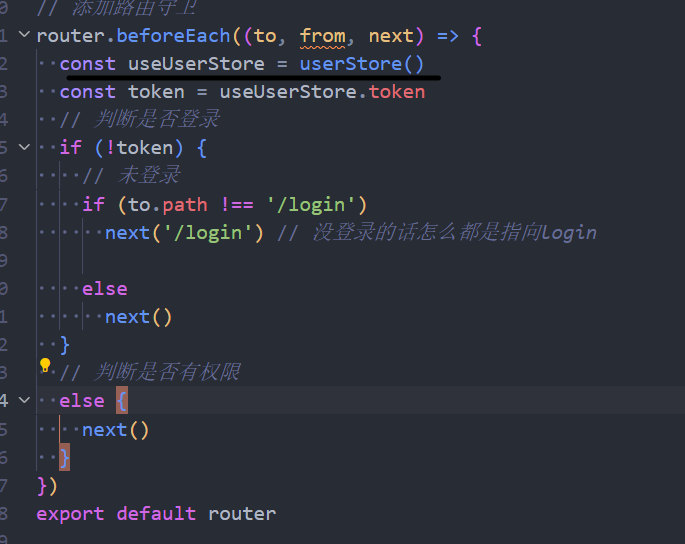
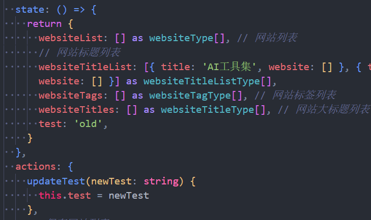

## state


### 如果在组件外使用 pinia(在.vue 之外)的方法

https://pinia.vuejs.org/zh/core-concepts/outside-component-usage.html
这里会报一个通常的错

```bash
getActivePinia was called with no active Pinia. Did you forget to install pinia? #971
调用 getActivePinia 时没有激活 Pinia。你是不是忘记安装pinia了？
```

然后在 github 上搜索后就找到相关的解决方法了，官方文档也指出了怎么处理

简单来说就是，把 useStore 在函数里面使用就可以了，一般也是用于路由守卫或者请求拦截器


```js
router.beforeEach((to, from, next) => {
  const useUserStore = userStore();
  const token = useUserStore.token;
  // 判断是否登录
  if (!token) {
    // 未登录
    if (to.path !== "/login") next("/login"); // 没登录的话怎么都是指向login
    else next();
  }
  // 判断是否有权限
  else {
    next();
  }
});
```

## actions

actions 就是仓库自带的一些方法，也就是仓库自带的函数，一般使用 actions 的时候都是在一开始我就需要一些数据时，由仓库自己调用，然后获取
比如说，开局我要发送登录请求，或者开局我登录以后我要获取用户信息，这个时候就可以考虑使用 actions

## 各种使用 tips

### 关于响应式数据的问题

如果在组件内使用 store 的话，用 storeTorefs 调用 state，然后在 template 里面更新数据是会响应式更新的


然后调用里面的 get 函数的话，也是可以响应式更新的



但是如果隔了两层的话就不行了，就是如果在 actions 里面再调用 get 函数的话，就不会响应式更新了


这样添加了以后页面数据是没有更新的
