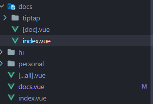
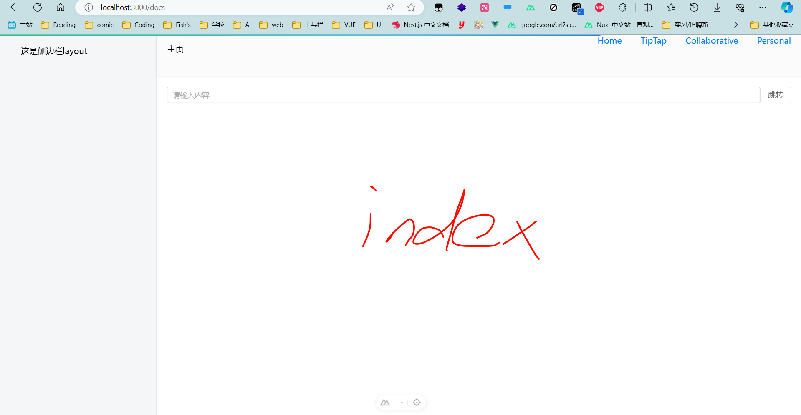
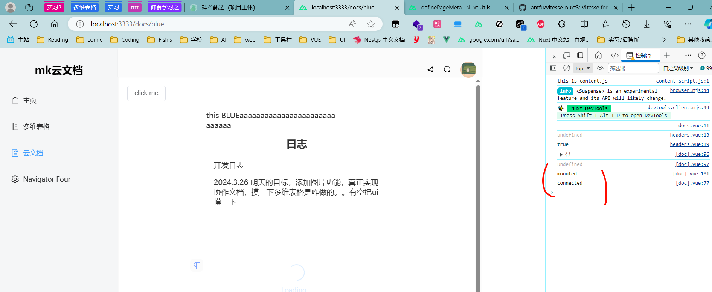
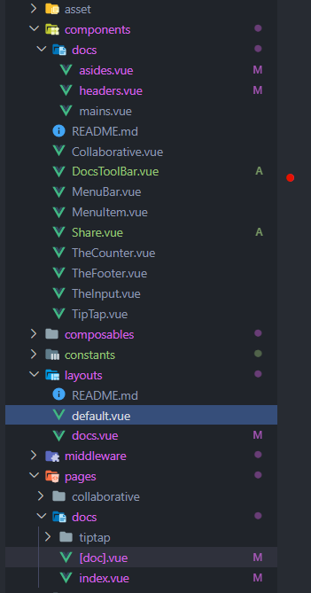
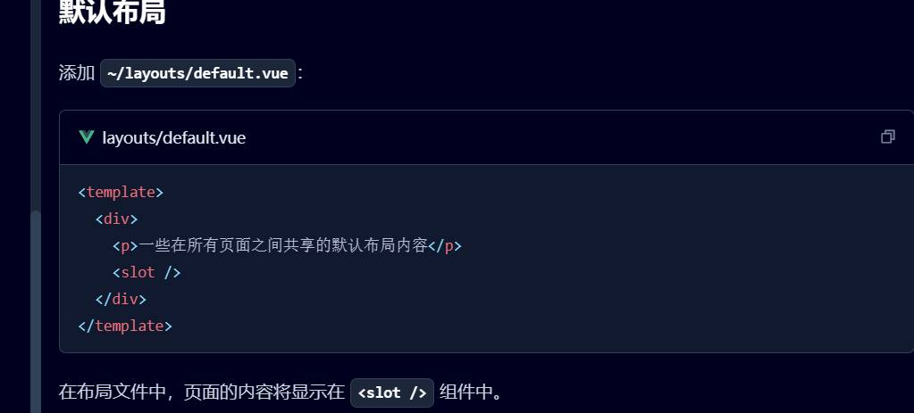

## 先思考

看到路由，无非是想到 3 个问题

1. 基础路由怎么配置
2. 动态路由/路由嵌套怎么做
3. 路由鉴权怎么做

https://juejin.cn/post/7245165497632964666

## unpluginRouter 文件路由

### 配置多级子路由的方法

先讲讲这沟槽的文件路由，如果想像以前那样，/management/xxx 那这样的配置方法是这样的
假设我们需要以下文件结构，需要将路由渲染到/docs/\*下

```js
--- docs
------ xxx
------ xxx
--- index
```

那我们就需要这样子来设置


需要配置一个与文件夹同名的 xxx.vue，这样会表明这个目录下有子路由，然后这个 docs.vue 就变成 layout，路由的出口

```js
<script setup lang="ts" generic="T extends any, O extends any">
import asides from '~/layouts/asides.vue'
import mains from '~/layouts/mains.vue'
import headers from '~/layouts/headers.vue'

defineOptions({
  name: 'Docs',
})
</script>

<template>
  <el-container min-h="100vh">
    <asides />
    <el-container>
      <el-header>
        <headers />
      </el-header>
      <el-main><mains /></el-main>
    </el-container>
  </el-container>
</template>
```

我们将 main 作为出口就行

```js
<!--
 * new page
 * @author: blue
 * @since: 2024-03-17
 * main.vue
-->
<script setup lang="ts"></script>

<template>
  <div class="container">
    <router-view v-slot="{ Component }">
      <transition name="fade">
        <!-- 渲染layout一级路由的子路由 -->
        <component :is="Component" />
      </transition>
    </router-view>
  </div>
</template>

<style scoped></style>

```


这样这里就是 docsindex 的出口

然后后续的路由就按照子路由那样配置就好了
比如说 docs/tiptap 就放一个 tiptap 目录

## 重大！关于使用 router 的时候的组件渲染问题

### 起因，在 feishumock 项目中，两个文件夹的跳转无法重新刷新组件的生命周期，导致无法重新获得编辑器实例

正常来说，如果使用 router push 跳转的时候，比如从/a/跳到/b/，那么 a 组件会被销毁，b 组件会被创建，即组件会重新进行一遍 mounted。但是如果是带参数的，比如说我从 /docs/a 到 /docs/b，组件是不会刷新的

## 重大之使用 nuxt 的路由，自定义 layout 时的一些细节

### 熟悉的起因之



就是在 layout 中无法拿到路由参数，跳转了以后必须刷新才能拿到，然后导致了 header 无法更新
layout 结构如下


### 解决

鱼酱的一早上排查后发现
我的 main docs 子路由出口是用了原本我们在 vue3 中常用的，用 routerview 然后 component 渲染的方式，但是在 nuxt 中，他的 layout 是用 slot 作为出口的，因为在 app.vue 中已经有了一层 router-view，所以在 layout 中再套了一层相当于嵌套了，经典的不可达


- **重要之** [https://nuxt.com.cn/docs/guide/directory-structure/layouts]
  

如果要使用 layout 布局的话要自定义 meta，和 layout，还要注意出口为一个 slot