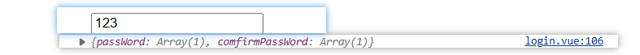
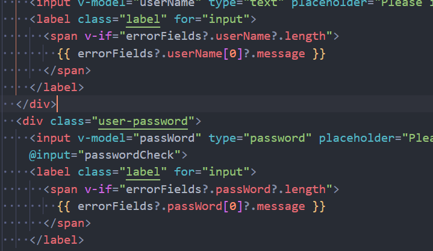

# 记录一些用过的/常用的 vueUse 函数

## 首先当然是安装

[用英文版的文档才是最新的](https://vueuse.org/)

```bash
pnpm i @vueuse/core
pnpm i @vueuse/integrations
// nuxt
npm i -D @vueuse/nuxt @vueuse/core


```

```js 
Nuxt 3
// nuxt.config.ts
export default defineNuxtConfig({
  modules: [
    '@vueuse/nuxt',
  ],
})
Nuxt 2
// nuxt.config.js
export default {
  buildModules: [
    '@vueuse/nuxt',
  ],
}
And then use VueUse function anywhere in your Nuxt app. For example:

html
<script setup lang="ts">
const { x, y } = useMouse()
</script>

<template>
  <div>pos: {{x}}, {{y}}</div>
</template>
```

## @Integrations

### useAsyncValidator

用于表单的检验。。但是做不出我要的效果
https://vueuse.org/integrations/useAsyncValidator/

```ts 
import type { Rules } from "async-validator";
import { useAsyncValidator } from "@vueuse/integrations/useAsyncValidator";
const rules: Rules = {
  name: [
    { required: true, message: "Please input name" },
    { min: 3, max: 5, message: "Length should be 3 to 5" },
  ],
  password: [
    { required: true, message: "Please input password" },
    { min: 12, message: "Length should be 12" },
    { pattern: /[A-Z]/, message: "Upper letter" },
    { pattern: /\d/, message: "Number" },
    { pattern: /[^\w\s]/, message: "Symobl" },
  ],
};
const form = reactive({
  name: "",
  password: "",
});
```

```ts 
        <div>
            <input type="text" v-model="form.name" placeholder="username"
                :class="{ 'border-red': errorFields?.name?.length }" />
            <div v-if="errorFields?.name?.length" class="border-red">
                {{ errorFields.name[0].message }}
            </div>
            <input type="password" v-model="form.password" placeholder="input password"
                :class="{ 'border-red': errorFields?.password?.length }" />
            <div v-if="errorFields?.password?.length" class="border-red">
                {{ errorFields.password[0].message }}
            </div>
            <span :class="pass ? 'correct' : ''">{{ pass }}</span>
        </div>
```

这玩意的使用原理，举一个里面为什么用 length 来判断的例子，其实这玩意有点像一个队列，如果输入框满足了条件，就自动 pop 掉了,看 console 就明白了




**注意**

这玩意要套在 v-if 里面用才行，如果要这样显示 message 的话，不然会报错 undefined

```bash
login.vue:124  Uncaught (in promise) TypeError: Cannot read properties of undefined (reading '0')
    at Proxy._sfc_render (login.vue:124:31)
    at renderComponentRoot (runtime-core.esm-bundler.js:816:16)
    at ReactiveEffect.componentUpdateFn [as fn] (runtime-core.esm-bundler.js:5764:26)
    at ReactiveEffect.run (reactivity.esm-bundler.js:178:19)
    at instance.update (runtime-core.esm-bundler.js:5814:51)
    at callWithErrorHandling (runtime-core.esm-bundler.js:158:32)
    at flushJobs (runtime-core.esm-bundler.js:357:9)

```
