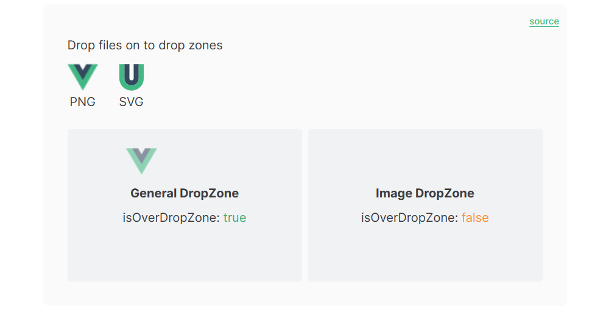
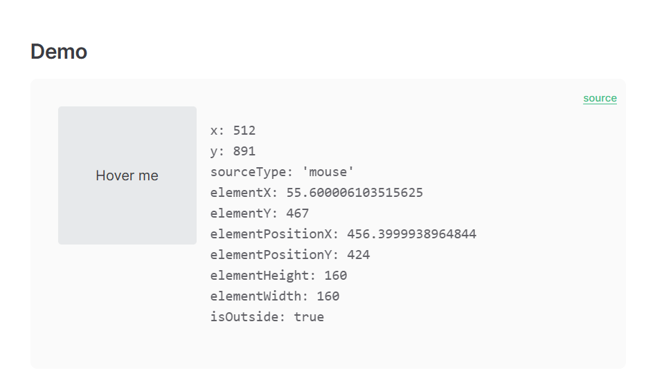

# 记录一些用过的/常用的 vueUse 函数

## 首先当然是安装

[用英文版的文档才是最新的](https://vueuse.org/)

```bash
pnpm i @vueuse/core
pnpm i @vueuse/integrations
// nuxt
npm i -D @vueuse/nuxt @vueuse/core


```

```js
Nuxt 3
// nuxt.config.ts
export default defineNuxtConfig({
  modules: [
    '@vueuse/nuxt',
  ],
})
Nuxt 2
// nuxt.config.js
export default {
  buildModules: [
    '@vueuse/nuxt',
  ],
}
And then use VueUse function anywhere in your Nuxt app. For example:

html
<script setup lang="ts">
const { x, y } = useMouse()
</script>

<template>
  <div>pos: {{x}}, {{y}}</div>
</template>
```

## @Integrations

### useAsyncValidator

用于表单的检验。。但是做不出我要的效果
https://vueuse.org/integrations/useAsyncValidator/

```ts
import type { Rules } from "async-validator";
import { useAsyncValidator } from "@vueuse/integrations/useAsyncValidator";
const rules: Rules = {
  name: [
    { required: true, message: "Please input name" },
    { min: 3, max: 5, message: "Length should be 3 to 5" },
  ],
  password: [
    { required: true, message: "Please input password" },
    { min: 12, message: "Length should be 12" },
    { pattern: /[A-Z]/, message: "Upper letter" },
    { pattern: /\d/, message: "Number" },
    { pattern: /[^\w\s]/, message: "Symobl" },
  ],
};
const form = reactive({
  name: "",
  password: "",
});
```

```ts
        <div>
            <input type="text" v-model="form.name" placeholder="username"
                :class="{ 'border-red': errorFields?.name?.length }" />
            <div v-if="errorFields?.name?.length" class="border-red">
                {{ errorFields.name[0].message }}
            </div>
            <input type="password" v-model="form.password" placeholder="input password"
                :class="{ 'border-red': errorFields?.password?.length }" />
            <div v-if="errorFields?.password?.length" class="border-red">
                {{ errorFields.password[0].message }}
            </div>
            <span :class="pass ? 'correct' : ''">{{ pass }}</span>
        </div>
```

这玩意的使用原理，举一个里面为什么用 length 来判断的例子，其实这玩意有点像一个队列，如果输入框满足了条件，就自动 pop 掉了,看 console 就明白了


**注意**

这玩意要套在 v-if 里面用才行，如果要这样显示 message 的话，不然会报错 undefined

```bash
login.vue:124  Uncaught (in promise) TypeError: Cannot read properties of undefined (reading '0')
    at Proxy._sfc_render (login.vue:124:31)
    at renderComponentRoot (runtime-core.esm-bundler.js:816:16)
    at ReactiveEffect.componentUpdateFn [as fn] (runtime-core.esm-bundler.js:5764:26)
    at ReactiveEffect.run (reactivity.esm-bundler.js:178:19)
    at instance.update (runtime-core.esm-bundler.js:5814:51)
    at callWithErrorHandling (runtime-core.esm-bundler.js:158:32)
    at flushJobs (runtime-core.esm-bundler.js:357:9)

```

## useDropZone

https://vueuse.org/core/useDropZone/
拖动上传


用法
可以从 useDropZone 返回的对象中获取 isOverDropZone，然后在模板中使用它来显示拖放区域是否被拖放。
第二个参数为处理文件或图片上传后的函数，以下是一个示例，用于拖放解析 html 并存入数组中

- script

```ts {.line-numbers}
import { useDropZone } from "@vueuse/core";
const showDrop = ref(false);

const dropZoneRef = ref<HTMLElement>();
const { isOverDropZone } = useDropZone(dropZoneRef, onDrop);
function parseHtml(html: HTMLElement) {
  const main = html.querySelector("DL DT");
  const DT = Array.from(main!.querySelectorAll("DT"));

  return DT.map((item) => {
    const name = item.querySelector("H3");
    if (!name) return undefined;

    const _bookmark = Array.from(
      item.querySelectorAll("A")
    ) as HTMLAnchorElement[];
    const bookmarks = _bookmark.map((bookmark) => ({
      bookmarkWebsiteTitle: bookmark.textContent,
      bookmarkWebsiteUrl: bookmark.href,
      bookmarkWebsiteIcon: bookmark.attributes.getNamedItem("icon")?.value,
    }));
    return {
      bookmarkName: name.textContent,
      bookmarks,
    };
  }).filter((item) => item !== undefined);
}
function onDrop(files: File[] | null) {
  vloading.value = true;
  setTimeout(() => {
    vloading.value = false;
    showDrop.value = false;
    // 刷新页面
    location.reload();
  }, 2000);
  if (!files) return;
  console.log(files);
  // 如果文件是html就解析
  files.forEach((file) => {
    if (file.type === "text/html") {
      const reader = new FileReader();
      reader.readAsText(file);
      reader.onload = function (e) {
        const div = document.createElement("div");
        div.innerHTML = e.target?.result as string;
        console.log(div);
        // console.log(typeof div)
        const data = parseHtml(div);
        bookmarkList.value = data as websiteType[];
        bookmarkRaws.value = bookmarkList.value;
        useStore.saveBookmarkList(bookmarkList.value);
      };
    }
  });
}
```

- template

```js {.line-numbers}
      <div v-if="showDrop" ref="dropZoneRef" v-loading="vloading" class="bg-blueGray w-auto h-50">
        <div>
          isOverDropZone:
          <div :value="isOverDropZone" />
        </div>
      </div>
```

## useMouseInElement

很直白的控制鼠标，相当于是 mouseEvent 的封装，可以实时获取鼠标的坐标，如果绑定了一个元素的话，就可以获取这个元素的长宽 position 等,**最重要的好处是可以用来判断是否在一个区域内(但实际使用场景其实也没那么好用)**



- script

```js {.line-numbers}
import { useMouseInElement } from "@vueuse/core";
const target = ref(null)
const mouse = reactive(useMouseInElement(target))
const position = ref({ x: 0, y: 0 })
const isDragging = ref(false)
const ball = ref() as Ref<HTMLElement>
const cube = ref() as Ref<HTMLElement>
const gameSquare = ref() as Ref<HTMLElement>

const cubePosition = ref({ x: 0, y: 0 })
const angle = ref(0)
const distance = ref(0)
const cubDistance = ref({ x: 0, y: 0 })
const power = ref(0) // 摇杆力度
function handleMouseDown() {
  isDragging.value = true
}
function handleMouseUp() {
  isDragging.value = false
}
```

- template

```js {.line-numbers}
            <div
              class="joystick-outline" @mousemove="handleMouseMove" @mousedown="handleMouseDown"
              @mouseup="handleMouseUp"
            >
```

## refDebounced 超好用的节流

https://vueuse.org/core/refDebounced/

用法很简单，绑定到 input 里就可以做到节流，不过我们可以用 rx.js 来做节流，更能应对大场景

```js {.line-numbers}
import { refDebounced } from "@vueuse/core";
const searchInputDebounced = refDebounced(searchInput, 2000);
```
