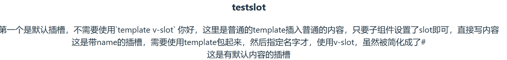
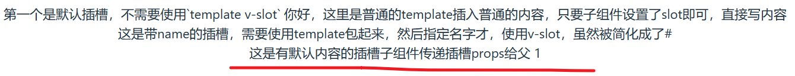

## createApp()[​](https://cn.vuejs.org/api/application.html#createapp)

### 创建一个应用实例

**类型**

```bash
  function createApp(rootComponent: Component, rootProps?: object): App
```

**详细信息**
第一个参数是根组件。第二个参数可选，它是要传递给根组件的 props。
**示例**

- 可以直接内联根组件：

```bash
  import { createApp } from 'vue'

  const app = createApp({
    /* 根组件选项 */
  })
```

- 也可以使用从别处导入的组件：

```bash
 import { createApp } from 'vue'
 import App from './App.vue'

 const app = createApp(App)
```

#### 挂载应用[​](https://cn.vuejs.org/guide/essentials/application.html#mounting-the-app)

应用实例必须在调用了  `.mount()`  方法后才会渲染出来。该方法接收一个“容器”参数，可以是一个实际的 DOM 元素或是一个 CSS 选择器字符串：

html

```
<div id="app"></div>
```

js

```
app.mount('#app')
```

应用根组件的内容将会被渲染在容器元素里面。容器元素自己将**不会**被视为应用的一部分。

`.mount()`  方法应该始终在整个应用配置和资源注册完成后被调用。同时请注意，不同于其他资源注册方法，它的返回值是根组件实例而非应用实例。

#### DOM 中的根组件模板[​](https://cn.vuejs.org/guide/essentials/application.html#in-dom-root-component-template)

根组件的模板通常是组件本身的一部分，但也可以直接通过在挂载容器内编写模板来单独提供：

```html
<div id="app">
  <button @click="count++">{{ count }}</button>
</div>
```

```js
import { createApp } from "vue";

const app = createApp({
  data() {
    return {
      count: 0,
    };
  },
});

app.mount("#app");
```

当根组件没有设置  `template`  选项时，Vue 将自动使用容器的  `innerHTML`  作为模板。

DOM 内模板通常用于[无构建步骤](https://cn.vuejs.org/guide/quick-start.html#using-vue-from-cdn)的 Vue 应用程序。它们也可以与服务器端框架一起使用，其中根模板可能是由服务器动态生成的。

### 应用配置[​](https://cn.vuejs.org/guide/essentials/application.html#app-configurations)

应用实例会暴露一个  `.config`  对象允许我们配置一些应用级的选项，例如定义一个应用级的错误处理器，用来捕获所有子组件上的错误：

```js
app.config.errorHandler = (err) => {
  /* 处理错误 */
};
```

应用实例还提供了一些方法来注册应用范围内可用的资源，例如注册一个组件：

```js
app.component("TodoDeleteButton", TodoDeleteButton);
```

这使得  `TodoDeleteButton`  在应用的任何地方都是可用的。我们会在指南的后续章节中讨论关于组件和其他资源的注册。你也可以在  [API 参考](https://cn.vuejs.org/api/application.html)中浏览应用实例 API 的完整列表。

确保在挂载应用实例之前完成所有应用配置！

### 多个应用实例[​](https://cn.vuejs.org/guide/essentials/application.html#multiple-application-instances)

应用实例并不只限于一个。`createApp` API 允许你在同一个页面中创建多个共存的 Vue 应用，而且每个应用都拥有自己的用于配置和全局资源的作用域。

```js
const app1 = createApp({
  /* ... */
});
app1.mount("#container-1");

const app2 = createApp({
  /* ... */
});
app2.mount("#container-2");
```

## 响应式基础

### ref

ref 其实可以理解为带了响应式的值，他的原型大概为

```bash
function ref(value):<T>{
  return value:<T>.value
}
```

我们可以使用 ref() 函数来声明响应式状态
然后我们平时的使用其实就是相当于直接拿 ref 来为我们的值赋值就好了，在`setup`中使用的话，我们需要用.value 来获取里面的值

```bash
const foo = ref(1)
console.log(foo.value) // 1
```

使用 ref 的场景就是当我们需要获取响应式的值时，才调用，有一些常量我们还是用以前的声明方法。具体的响应式原理请看[vue 进阶](vue进阶.md)

#### 在 TS 中为 ref 标注类型

ref 会根据初始化时的值推导其类型：

```ts
import { ref } from "vue";

// 推导出的类型：Ref<number>
const year = ref(2020);

// => TS Error: Type 'string' is not assignable to type 'number'.
year.value = "2020";
```

有时我们可能想为 ref 内的值指定一个更复杂的类型，可以通过使用  `Ref`  这个类型：

```js
import { ref } from 'vue'
import type { Ref } from 'vue'

const makeType:Ref<string:number> = ref('2020');
makeType.value = 2020; // 成功！
```

或者，在调用  `ref()`  时传入一个泛型参数，来覆盖默认的推导行为：

```js
// 得到的类型：Ref<string | number>
const year = (ref < string) | (number > "2020");
year.value = 2020; // 成功！
```

如果你指定了一个泛型参数但没有给出初始值，那么最后得到的就将是一个包含  `undefined`  的联合类型：

```js
// 推导得到的类型：Ref<number | undefined>
const n = ref<number>()// undefined
```

### reactive

reactive 其实可以理解为带了响应式的对象，但是他和原本的对象是不同的，他本质上返回的是原对象的 [proxy]

::: tip proxy

`Proxy` 是 JavaScript 中的一个内置对象，它允许你拦截并自定义对象的基本操作。通过使用 `Proxy`，你可以在对象的读取、赋值、函数调用等操作之前或之后插入自定义的逻辑。

创建一个 `Proxy` 对象时，你需要传入两个参数：目标对象和处理程序（handler）。目标对象是你想要拦截操作的对象，处理程序是一个包含拦截方法的对象。

下面是一个简单的示例，展示了如何使用 `Proxy` 来拦截对象的读取和赋值操作：

:::

```javascript
const target = {
  name: "John",
  age: 30,
};

const handler = {
  get: function (target, property) {
    console.log(`正在读取属性 ${property}`);
    return target[property];
  },
  set: function (target, property, value) {
    console.log(`正在设置属性 ${property} 为 ${value}`);
    target[property] = value;
  },
};

const proxy = new Proxy(target, handler);

console.log(proxy.name); // 读取属性 name，输出 "正在读取属性 name"，然后输出 "John"
proxy.age = 35; // 设置属性 age 为 35，输出 "正在设置属性 age 为 35"
console.log(proxy.age); // 读取属性 age，输出 "正在读取属性 age"，然后输出 35
```

在上面的示例中，我们创建了一个目标对象 `target`，它包含 `name` 和 `age` 两个属性。然后，我们定义了一个处理程序 `handler`，它包含了 `get` 和 `set` 方法来拦截属性的读取和赋值操作。最后，我们创建了一个 `Proxy` 对象 `proxy`，将目标对象和处理程序传入。

当我们通过 `proxy` 对象读取或设置属性时，处理程序中的相应方法会被调用，并且我们可以在这些方法中插入自定义的逻辑。在上面的示例中，我们简单地输出了一些日志信息，但你可以根据需要执行任何自定义操作。

`Proxy` 对象还支持其他许多拦截方法，例如 `apply`（拦截函数的调用）、`has`（拦截 `in` 操作符）、`deleteProperty`（拦截属性删除操作）等。你可以根据需要使用这些方法来自定义对象的行为。

#### 为  `reactive()`  标注类型[​](https://cn.vuejs.org/guide/typescript/composition-api.html#typing-reactive)

`reactive()`  也会隐式地从它的参数中推导类型：

```js
import { reactive } from 'vue'

// 推导得到的类型：{ title: string }
const book = reactive({ title: 'Vue 3 指引' })


要显式地标注一个  `reactive`  变量的类型，我们可以使用接口：


import { reactive } from 'vue'

interface Book {
  title: string
  year?: number
}
const book: Book = reactive({ title: 'Vue 3 指引' })
```

## v-for

## computed 计算属性

计算属性要记得，只做计算，也就是说，不应该有副作用，即不要在计算属性中尝试操作 dom 元素或者异步操作。
他就像一个 temp，只读的返回每一次得到计算后的结果
计算属性的值会缓存，只有当计算属性的依赖变化了才会重新计算
他的原型大概为

## props

父组件可以像子组件传递值，在`<script setup>`中,可以使用 vue 自带的 defineprops(不需要 import) 来定义要传递的值，然后在子组件中使用 props 接收
我们使用一个简单的 todolist 和 listItem 来实验一下

::: tips
现在来说一般都使用 defineProps<{}>()这样的格式在子组件定义传递的参数

```ts
// 父组件
  <div class="center-col p-2 gap-2">
      <ul v-for="(habit, index) in habitList" :key="index">
        <HabitItem :habit="habit" :index="index + 1" />
      </ul>
</div>

// 子组件

const props = defineProps<{
  habit: Habit
  index: number
}>()
 <p class="text-4.3 font-bold truncate overflow-x-auto mb-1 text-start">
        {{ index }}. {{ habit.title }}
</p>
```

### 用 TS 标准 props

通过基于类型的声明，一个 prop 可以像使用其他任何类型一样使用一个复杂类型：

```ts
<script setup lang="ts">
interface Book {
  title: string
  author: string
  year: number
}

const props = defineProps<{
  book: Book
}>()
</script>
```

对于运行时声明，我们可以使用 PropType 工具类型：

```ts
import type { PropType } from "vue";

const props = defineProps({
  book: Object as PropType<Book>,
});
```

## emits

### 子传父

emits
在 vue3 中可以直接使用 defineEmits 来定义传递的事件

- 指正版
  首先子组件给父组件传值，需要定义 emits，传的是方法，

然后在父组件那边引用子组件的地方，可以@这个传过去的方法，再写一个函数来接子组件的值，父组件这边函数的(parms),其实就是从子组件引过来的值，直接用父组件这边的值等于就好了

本质：在父组件中，可以调用子组件的事件，但是相对的如果要接受子组件的值，需要父组件这边再写一个方法来传值

- 官方代码示例

在父组件中，我们若想接收子组件传递的数据，还得再声明一个方法，然后用一个参数，接收子组件传来的参数。

- 首先，要使用 emit 的话，要先使用 defineEmits() 定义需要传过去的方法名称
- 然后，可以在需要绑定事件的地方，可以直接使用，$emit("methods",parms) 写事件，也可以在 script 中，用 emit 先创建一个事件
  **上示例**

```js {.line-numbers}
// 子组件
<script setup lang="ts">
  const emits = defineEmits<{
    // 定义需要传递的方法名称
    addHabit: (habit: Habit) => void

  }>()
  const habit = ref<Habit>({
    title: '',
    date: new Date().toISOString()
  })
</script>
<template>

<button @click="emits('add',habit)">添加</button>

<template>

```

## 插槽

slot 插槽是为了可以更好的使用组件，因为我们的组件内容如果是写死的话，复用性会很低
比如说我有一个组件

```ts
// son.vue
<template>这是写死的内容</template>
```

那么我在别的任何地方引入时这一块渲染的内容时这一块的内容就是死的
为了提高复用性，vue 提供了插槽

### 默认插槽

使用默认插槽只要在组件内部需要插值的地方提供`<slot></slot>`标签即可

```ts
<template>
  <div>
    <h3>testslot</h3>
    第一个是默认插槽，不需要使用`template v-slot`
    <slot></slot>
  </div>
</template>
```

然后在需要用到组件的地方，直接在组件标签内部写入需要插入的内容即可

```ts
script setup lang="ts">
import TestSlot from '../components/TestSlot.vue'

</script>
<template>
  <h3>vue进阶</h3>
  <div>
    <h4>插槽练习</h4>
    在这里我们可以引入我们需要的组件，然后将组件标签打开
    <TestSlot>
      你好，这里是普通的template插入普通的内容，只要子组件设置了slot即可，直接写内容
      <!-- <template v-slot="header">
          这是带name的插槽，需要使用template包起来，然后指定名字才，使用v-slot，虽然被简化成了#
        </template> -->
    </TestSlot>
  </div>
</template>
```


### 具名插槽

有时在一个组件中包含多个插槽出口是很有用的。举例来说，在一个 组件中，有如下模板：

```ts
<div class="container">
  <header>
    <!-- 标题内容放这里 -->
  </header>
  <main>
    <!-- 主要内容放这里 -->
  </main>
  <footer>
    <!-- 底部内容放这里 -->
  </footer>
</div>
```

然后我们使用的时候，需要具体的命名 slot 才能使用
::: tip 注意
这里的默认插槽需要使用#default，不然就会报错
要为具名插槽传入内容，我们需要使用一个含 v-slot 指令的

```ts
<template> 元素，并将目标插槽的名字传给该指令：

template
<BaseLayout>
<template v-slot:header>
<!-- header 插槽的内容放这里 -->
</template>
</BaseLayout>
```

:::
v-slot 有对应的简写 #，因此 `<template v-slot:header> `可以简写为 `<template #header>`。其意思就是“将这部分模板片段传入子组件的 header 插槽中”。


```ts

    在这里我们可以引入我们需要的组件，然后将组件标签打开
    <TestSlot>
      <template #default>你好，这里是普通的template插入普通的内容，只要子组件设置了slot即可，直接写内容</template>

      <template #header>
        这是带name的插槽，需要使用template包起来，然后指定名字才，使用v-slot，虽然被简化成了#
      </template>
    </TestSlot>
```


还可以往里面放默认内容,就是在`<slot>`标签里写好，如果没有使用 slot 的话也会默认的渲染出来

### 可以动态插槽名

动态插槽名 ​
动态指令参数在 v-slot 上也是有效的，即可以定义下面这样的动态插槽名：

```ts

<base-layout>
  <template v-slot:[dynamicSlotName]>
    ...
  </template>

  <!-- 缩写为 -->
  <template #[dynamicSlotName]>
    ...
  </template>
</base-layout>
```

### 作用域插槽

在插槽中，我们是无法访问子组件的作用域的，也就是说拿不到子组件的数据，如果想要拿子组件的数据，也可以和使用 props 那样，通过 slot 传递

### 具名作用域插槽

```ts

<script setup lang="ts">
import { ref } from 'vue'
const message = ref("子组件传递插槽props给父")
</script>
 <slot name="props" :text="message" :count=1>这是通过子slot向上传递props</slot>
```

```ts
<template #props="testProps">
      {{ testProps.text }}
      {{ testProps.count }}
      </template>
```


