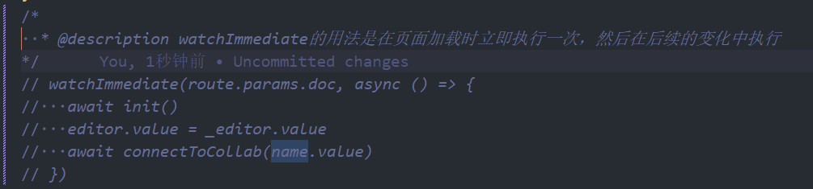
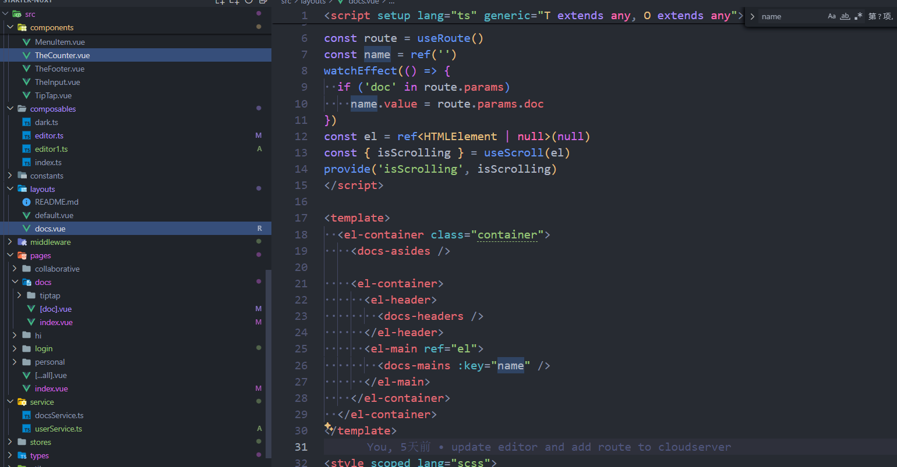

### 递归生成路由

## 关于在 VUE 中如何局部渲染组件/路由组件

### 场景

在做协作文档项目时，因为把 provider 抽出去了，而 editorContent 是需要先绑定 editor 的，每次路由跳转的时候，虽然会触发路由参数的刷新，但是却不会重新的请求服务器拿到文档信息

然后一开始想的是用watchImmediately，但是发现即使是我重新赋值了editor，但是他已经被销毁了，需要重新创建一个实例，即需要重新onMounted挂载一遍

### 解决方案
这个时候，鱼酱登场，在vue中组件的刷新是根据标识符key的，也就是说如果key改变的话，那么这个组件就会重新渲染，然后我们的main路由出口本身就是个组件，所以只需要给他监听路由参数的变化就行了
在layout—docs中
