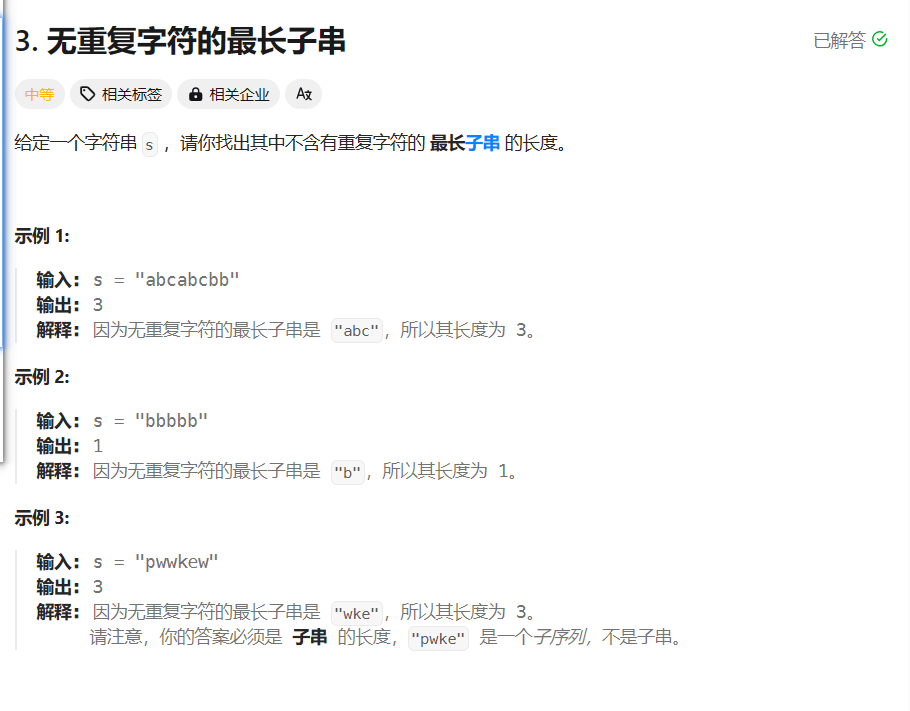
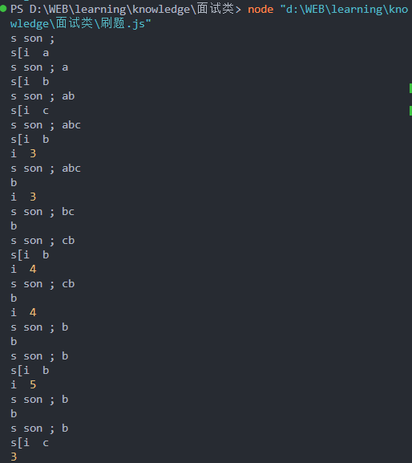
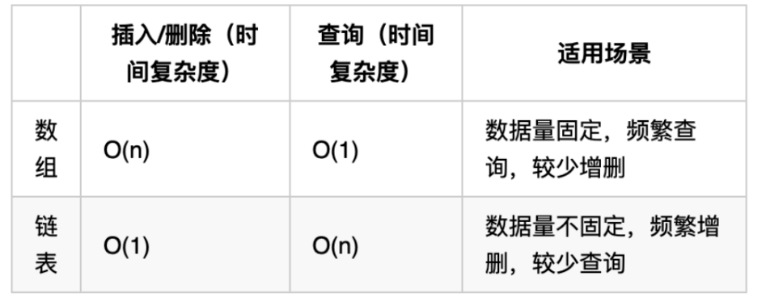
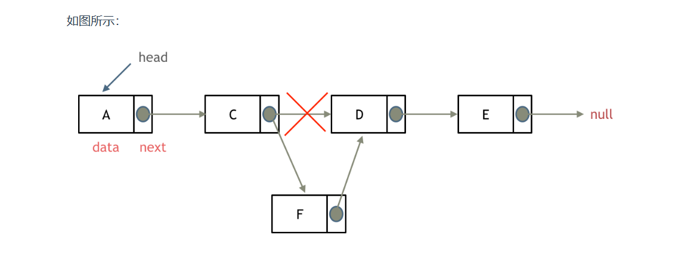
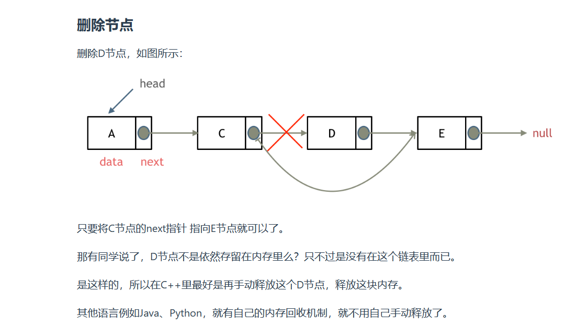
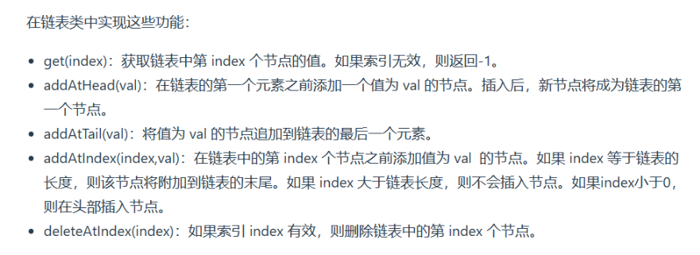

## 本笔记顺序按照代码随想录

## 数组

数组只需要明白一点，核心思路是，数组是连续的，二维数组的内存空间也一样是连续的

### 二分查找

二分查找首先明白两个关键点，第一个是，数组是有序的
，然后看我们查找的区间是闭区间还是开区间

### 删除数组中重复项

## 滑动窗口

### hot100 无重复字符的最长子串



```js
let s = "abcbbbc";
// todo 明天归纳一下while用于跳过重复项的方法，在双指针里很常见
// 其实这个做法可以等价于，我们平时用i跳过去，不过这个太巧妙了，不用双指针，因为for和while刚好形成了一个时差，导致，只有出现重复项的时候，才会进循环，比如第一次s.slice为空，i = 0 当i = 1时，s[i]已经等于b了
let maxx = s.length ? 1 : 0,
  start = 0;
for (let i = 0; i < s.length; i++) {
  console.log("s son ;", s.slice(start, i));
  console.log("s[i ", s[i]);
  while (s.slice(start, i).includes(s[i])) {
    console.log("i ", i);
    console.log("s son ;", s.slice(start, i));
    console.log(s[i]);
    start++;
  }
  maxx = Math.max(i - start + 1, maxx);
}
console.log(maxx);
```



## 哈希表

哈希表的核心思想是，通过哈希函数，将 key 映射到 value 上，这样就可以通过 key 来快速的查找到 value
其实我们用的很多的是桶

## 双指针大法

双指针大法的核心在于，一个指针用来走，遍历，另一个指针在于如何根据在动的指针来更新
比如 j 是遍历数组的，判断什么情况以后，才能移动 i

## 链表

链表这个东西，当年学数据结构的时候就觉得抽象，现在再回头来刷，还是觉得有点不好理解，在这里用例题来附件，而且因为是使用 js 来写链表，没有 c++的指针，实现起来也不是真正的链表了，用数组来模拟真的太抽象了

### 链表的基础操作



**定义链表**

```js
class ListNode {
  constructor(val, next) {
    this.val === val ? val : 0;
    this.next === undefined ? null : undefined;
  }
}
```

增加，删除，遍历节点

增加和删除节点都是 o1，遍历节点是 O(n) 适用于需要频繁增删的场景

链表的增加就是，new 一个新的节点，然后将 new 出来节点的 next 指向原本节点的 next，然后将原本节点的 next 指向新节点


```js
let list = [1, 2, 3];
let node = new ListNode(1, null);
let cur = head;
while (cur) {
  cur = cur.next;
}
node.next = cur.next;
cur.next = node;
```

链表的删除就是，将当前节点指向下一个节点就好了，c++里面要手动回收，但是 js 里面不需要


### 关于虚拟头结点的问题

我们一般会定义一个虚拟头结点，这样就不用考虑头结点的问题了，虚拟头结点的 next 指向真正的头结点,所以一般会让 cur = head 然后我们遍历 cur 的时候，cur 遍历完了，head 也遍历完了，然后 head.next 指向的才是真正的链表头结点

### 设计基础链表



### 翻转链表

```js
function reverseList(head) {
  let pre = null;
  let cur = head;
  while (cur) {
    let temp = cur.next;
    cur.next = pre;
    pre = cur;
    cur = temp;
  }
}
```

### 合并两个有序链表

```js
function mergeTwoLists(l1, l2) {
  let head = new ListNode(0);
  let cur = head;
  while (l1 & l2) {
    if (l1.val <= l2.val) {
      cur.next = l1;
      l1 = l1.next;
    } else {
      cur.next = l2;
      l2 = l2.next;
    }
    cur = cur.next;
  }
  cur.next = l1 !== null ? l1 : l2;
  return head.next;
}
```

## 字符串

在 JavaScript 中，要实现类似 C++ 中 str[i] - '0' 的操作，你可以使用以下方法：

使用 charCodeAt() 方法获取字符的 ASCII 值：
