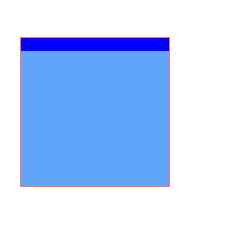
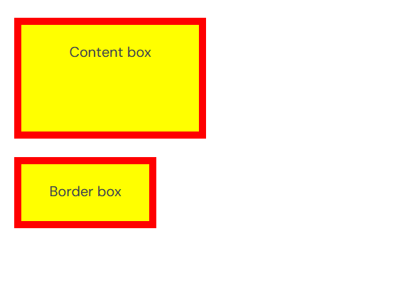
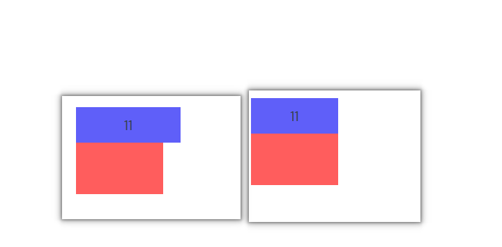
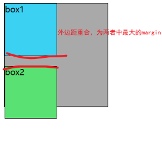
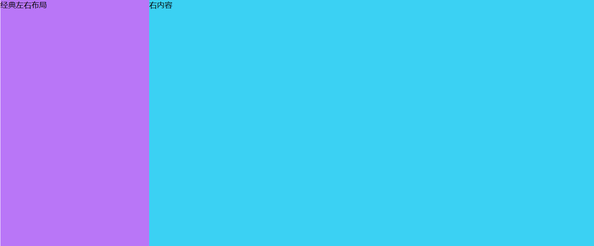
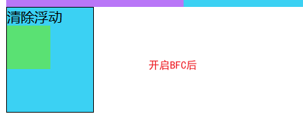

分清 display 的那几个
然后明白行内元素，块级元素的区别

## CSS 的特性

### 继承性

继承性很好理解，比如说，我的父元素下的子元素默认基础字体大小，颜色，行高等

- 1.并不是所有的属性都可以继承, 只有以 color/font-/text-/line-开头的属性才可以继承
- 2.在 CSS 的继承中不仅仅是儿子可以继承, 只要是后代都可以继承
- 3.继承性中的特殊性
  3.1 a 标签的文字颜色和下划线是不能继承的
  3.2 h 标签的文字大小是不能继承的

### 层叠性

层叠性，指的是有样式冲突时，如何解决冲突，比如说，我一个 P 标签，设置了字体颜色为 black，blue，red
然后这个时候会根据就进原则，因为黑色是直接在 style 里面的，所以就是黑色

```css
<p style="color: black" > 我是段落</p > */ p {
  color: red;
}
p {
  color: blue;
}
```

### 优先级

**当多个选择器选中同一个标签, 并且给同一个标签设置相同的属性时, 如何层叠就由优先级来确定**,比如我们可能会给一个 container 标签设置 class 和 id,然后给这个标签设置了相同的属性,那么就会根据优先级来确定
优先级也很好理解，就是选择器是有优先级的，比如说 ID 的优先级就大于 class，然后全局的优先级是最低的

#### 选择器的优先级

选择器包括，行内样式，比如说` <p style="xxx">`
id 选择器，比如说`#id`，class 选择器，比如说`.class`，标签选择器，比如说`p`，全局选择器，比如说`*`，伪类选择器，比如说`:hover`，伪元素选择器，比如说`::before`，然后还有一个`!important`，属性选择器，比如说`[type="text"]`
然后这些选择器的优先级为
**!important > 行内样式 > id > 类选择器/伪类选择器/属性选择器 > 标签 >全局选择器**

```css
!important > style=xxx > #id > .class=:hover=[text=xxx] > p > *

```

#### 作用

作用最明显的就是我们自己在 debug 的时候老是发现有些样式因为有更高的优先级导致不能用，还得去找他的高优先级
有时候想直接修改样式的话，可以直接在 class 里面加上`!important`，这样就可以直接覆盖掉其他的样式，或者把人家的类名，变成 ID 什么的
然后在 unocss 里面优先级是不如在 style 里面设置的，也就是说我们可以在 style 里来覆盖样式

```html
<div class="box1 w-full bg-red p-5px" />
```

```css
.box1 {
  box-sizing: border-box;
  background-color: blue;
}
```



## css 的历史

## CSS 的盒模型

什么是 css 的盒模型呢，每一个 HTML 的元素都可以看成是一个盒子，然后盒子的话有长度，宽度，内边距和外边距
然后,盒子的默认内容是 content-box,也就是说盒子的实际宽度就是包括内边距和边框的宽度，但是不包括 margin 的宽度

然后第二种盒子模型就是 border-box,也就是说盒子的实际宽度就是包括内边距和边框的宽度，一样不包括 margin 的宽度
**这俩货的区别就是，计算方式不一样**
content-box: 实际宽度 = width + padding + border
border-box: 实际宽度 = width，会把那些 padding 什么的融合起来
下面是一个栗子，我们可以发现这俩货明明宽度是一样的，但是在网页上差那么多


```css
/* <div class="test">
      <div class="content-box">
        Content box
      </div>
      <br>
      <div class="border-box">
        Border box
      </div>
    </div> */

.test div {
  width: 160px;
  height: 80px;
  padding: 20px;
  border: 8px solid red;
  background: yellow;
}
.content-box {
  box-sizing: content-box;
  /* Total width: 160px + (2 * 20px) + (2 * 8px) = 216px
     Total height: 80px + (2 * 20px) + (2 * 8px) = 136px
     Content box width: 160px
     Content box height: 80px */
}

.border-box {
  box-sizing: border-box;
  /* Total width: 160px
     Total height: 80px
     Content box width: 160px - (2 * 20px) - (2 * 8px) = 104px
     Content box height: 80px - (2 * 20px) - (2 * 8px) = 24px */
}
```

### 用途

根据官方示例，就是在父元素下，如果是 100%宽度的话，父元素是有具体值的，那么子元素加上 padding 就很容易出去了，加上 border-box 就会根据父元素的宽度来计算，当然如果 padding 很大的话还是会挤出去


```css
/* <div class="content">
  <div class="box">11</div>
</div> */

.content {
  width: 100px;
  height: 100px;
  background-color: rgb(255, 93, 93);
}
.box {
  width: 100%;
  padding: 10px;
  background-color: rgb(95, 95, 249);
  box-sizing: border-box;
}
```

## 理解行内元素和块级元素

### 块级元素

**其实平时我们用的大部分元素都是快级元素**
块级元素的特点就是，**会独立的占一行**，**可以指定宽度，高度**

### 行内元素

行内元素的特点就是，独立在一行

## 谈谈 BFC

- 官方定义：BFC（Block Formatting Context）块格式化上下文， 是 Web 页面的可视 CSS 渲染的一部分，是块盒子的布局过程发生的区域，也是浮动元素与其他元素交互的区域。

- 说人话：BFC 就是页面上的一个隔离的独立容器，容器里面的子元素不会影响到外面的元素。 我们经常使用到 BFC，只不过不知道它是 BFC 而已，其实可以理解为一个黑盒子，最好理解的最常用的`position:absoulte`就是 BFC

**如何创建一个 BFC**

常用的方式有以下几种：

- 浮动元素（元素的 float 不是 none，指定 float 为 left 或者 right 就可以创建 BFC）
- 绝对定位元素（元素的 position 为 absolute 或 fixed）
- display:inline-block，display:table-cell，**display:flex**，display:inline-flex
- overflow 指定除了 visible 的值

**BFC 的特点**

- 在 BFC 中，块级元素从顶端开始垂直地一个接一个的排列。（当然了，即便不在 BFC 里块级元素也会垂直排列）
- 如果两个块级元素属于同一个 BFC，它们的上下 margin 会重叠（或者说折叠），以较大的为准。但是如果两个块级元素分别在不同的 BFC 中，它们的上下边距就不会重叠了，而是两者之和。
- BFC 的区域不会与浮动的元素区域重叠，也就是说不会与浮动盒子产生交集，而是紧贴浮动边缘。
- 计算 BFC 的高度时，浮动元素也参与计算。BFC 可以包含浮动元素。（利用这个特性可以清除浮动）
- BFC 就是页面上的一个隔离的独立容器，容器里面的子元素不会影响到外面的元素。

### 两个盒子的 margin 如果有重合的话，解决重合冲突

- 比如说！
  
- 没开启 BFC 之前，这两个 margin 是会重合的，然后取 margin 最大的那个，在这里是 20px

```js {.line-numbers}
<div class="box">
  <div class="box-1">解决两者的margin差问题</div>
  <div class="box-2">box2</div>
</div>
.box {
      width: 200px;
      height: 200px;
      background: #aaa9a9;
      border: 1px solid;
      display: flex;
      /*flex-direction: column;*/
    }
    .box-1 {
      width: 100px;
      height: 100px;
      border: 1px solid;
      margin-bottom: 10px;
      background: #3bd1f3;
    }
    .box-2 {
      width: 100px;
      height: 100px;
      border: 1px solid;
      margin-top: 20px;
      background: #5ae173;
    }
```

- 开启了以后
  

```js {.line-numbers}
<div class="box">
  <div class="box-1">解决两者的margin差问题</div>
  <div class="box-2">box2</div>
</div>
.box {
      width: 200px;
      height: 200px;
      background: #aaa9a9;
      border: 1px solid;
      display: flex;
      flex-direction: column;
    }
    .box-1 {
      width: 100px;
      height: 100px;
      border: 1px solid;
      margin-bottom: 10px;
      background: #3bd1f3;
    }
    .box-2 {
      width: 100px;
      height: 100px;
      border: 1px solid;
      margin-top: 20px;
      background: #5ae173;
    }
```

### 2、制作两栏布局

BFC 的区域不会与浮动的元素区域重叠。

我们可以利用这个特性来创建 CSS 中常用的两栏布局（左边宽度固定，右边宽度自适应）。


```js {.line-numbers}
<div class="left"></div>
<div class="right"></div>

.left {
      width: 20vw;
      height: 70vh;
      float: left;// 开启bfc
      background: #b976f7;
    }
    .right {
      width: 80vw;
      height: 70vh;
      background: #3bd1f3;
    }

```

### 清除元素内部的浮动

这里清除浮动的意思并不是清除你设置的元素的浮动属性，而是清除设置了浮动属性之后给别的元素带来的影响。例如我们给子元素设置浮动，那么父元素的高度就撑不开了。

BFC 有一个特性：计算 BFC 的高度时，浮动元素也参与计算，利用这个特性可以清除浮动。



