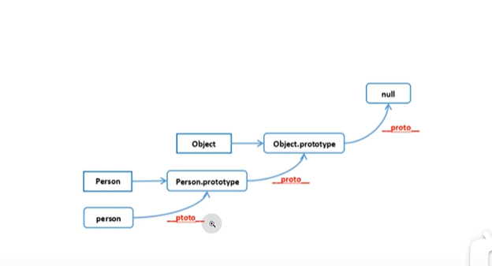

# JS 面经

## JS 由哪三部分组成

js 由 ECMAScript，DOM(文件对象)，BOM(浏览器对象)组成

ECMAScript 就是 js 的核心语法，比如说变量，函数，数据类型，if，while 操作语句等等
然后 DOM 就是操作文档的对象，这个对象是封装好的，比如说 document 对象，可以操作文档的一些属性，比如说文档的标题，文档的内容等等
然后 BOM 就是 window 对象，这个对象是浏览器提供的，比如说，alert，confirm，prompt，location，history

## js 有哪些内置对象

JS 的内置对象有很多，比如说 Math，Date，String，Object，Number

在这里讲几个比较常用对象的常用方法
Math

```js
let math = Math;
console.log(
  math.sqrt(4),
  math.abs(-1),
  math.ceil(1.1), // 向上取整 2
  math.floor(1.5), // 向下取整 1
  math.round(1.6), // 最近取整 2
  Math.trunc(1.6), // 去掉小数部分 1
  math.max([1, 2, 3]), // NAN 因为Max不能传入数组，只能在一组数字参数中比较最大值 Max(1,2,3)
  math.min(1,2),// 1
  math.random() // 0-1 之间的随机数 如果要生成别的范围的随机数的话就是 math.random() * (max - min) + min
```

Number

```js
let num = 1;
console.log(
  num.toString(), // 1
  num.toFixed(2), // 1.00
  num.toExponential(2) // 1.00e+0
);

num = 21.22222222;
console.log(
  num.toFixed(2), // 保留小数点后几位
  num.toPrecision(5) // 保留几位有效数字算上整数位
);
```

String

```js
let str = "hello";
console.log(
  str.charAt(0), // h 返回指定位置的字符
  parseInt(str), // NAN 数字开头的字符串解析
  parseInt("123"), // 123
  str.slice(1, 3), // el
  str.padStart(1, "a") //  在字符串前面填充字符
);
```

## 操作数组的方法

[跳转至 js.md](../javascript/js.md#array-方法常用集合)

## 判断数据类型的方法

### 基本数据类型和引用数据类型

再提一嘴 JS 的原始数据类型，String，Number，Boolean，Null，Undefined，Symbol，BigInt，在地址中就是值本身
引用数据类型就是复杂的数据类型，比如说 Object，Array，Function
然后引用数据类型是存储在堆内存中的，然后如果两个引用数据类型指向了同一个地址，那么你修改一个的时候，另一个也会被修改

```js
// 引用数据类型
let testObj = {
  name: "blue",
};

let testObj1 = testObj;
testObj1.name = "red";
console.log(testObj, testObj1);
```


## 什么是闭包

闭包其实简单来说就是一个作用域，函数套函数，内部的函数可以调用外部函数的参数
简单示例

```js
function test() {
  let a = 1;
  return function () {
    console.log(a);
    a++;
  };
}
let result = test();
result(); // 1
result(); // 2
```

### 闭包的用途

1. 像类一样封闭私有变量，让外部可以调用内部的变量，私有模块

```js
function testModule() {
  let pri = 1;
  let pub = 2;
  function getPub() {
    return pub;
  }
  return {
    getPub,
  };
}
let result = testModule();
let pub = result().getPub(); // 2 可以拿到值
let pri = result().pri; // 不能直接拿到值
```

2. 做到一个缓存的作用，因为闭包是不会被垃圾回收机制回收的

```js
function store() {
  let state = {};
  return function (key, value) {
    if (value) {
      state.key = value; // 如果有设置值的话就设置值
    } else {
      return state.key; // 如果再次调用的话就直接返回
    }
  };
}
let store1 = store();
store1("a", 1);

console.log(store1("a"));
console.log(store1("a")); // 赋值了第二次直接就拿缓存的数据了
store1("a", 2);
console.log(store1("a"));
```

3. 用于循环中的异步操作

```js
for (var i = 0; i < 5; i++) {
  setTimeout(() => {
    console.log(i);
  }, 1000);
}
```

4. 用于防抖，节流

## ES6

## 什么是 apply，call，bind，他们的区别是什么

apply，call，bind 方法都是改变上下文的，即改变 this 的，他们都是作用于一个函数上
apply(this,[arg1,arg2])
call(this,arg1,arg2)
let bindFn = fn.bind(this,arg1,arg2)
看上面三个例子就能看出这三者的区别，apply 和 call 是立刻执行，他们的唯一区别就是 apply 如果是传入参数的话传入的是数组，而 call 是参数列表仅此而已
bind 就是延迟使用
**用一个充电宝的例子来解释，John 的手机有 90 电，他调用函数充了 10 的电，然后这个时候 mike 想要电宝，就叫 john 借给他，这个时候电宝的主人就变成了 mike，然后 mike 用完了**
**而 bind 呢，就是这个时候，john 先把电宝借给了 Amy，然后 amy 再给 mike 充电**

```js
// 拿充电宝的例子来解释
const mike = {
  name: "mike",
  battery: 50,
  charge: function (battery) {
    this.battery += battery;
  },
};
const john = {
  name: "john",
  battery: 90,
  charge: function (battery, battery1) {
    this.battery += battery + battery1;
  },
};
console.log("john", john.battery); //90
john.charge(10, 20); // 120
console.log("john电", john.battery); // 120
console.log("mike", mike.battery); // 50
// john.charge.apply(mike, [10, 20])
// john.charge.call(mike, 10, 20)
// bind 就是延迟使用 永久改变this指向，返回一个函数
const newBattery = john.charge.bind(mike);
newBattery(10, 20);

console.log("mike电", mike.battery); // 80
```

- apply 的另一个用途就是，他可以很简单的实现找数组的最大值
  关于参数传 null 的原因其实就是传入默认对象

```js
let arr = [1, 2, 3, 4, 5];
let maxx = Math.max.apply(null, arr);
```

## 讲一下防抖，节流，怎么实现

## JS 的垃圾回收机制

在 js 中定义的函数及其参数，全局变量，调用链上的函数等都是不会被垃圾回收机制回收的

js 中的垃圾回收机制本质就是可达性
比如说我有一个对象，我可以访问到，就是把 this 指向他，表示这货是可达的，那么这个对象就不会被垃圾回收机制回收
然后 js 是垃圾回收算法本质就是
标记和清除
从根开始标记所有可达的对象，然后清除所有没有标记的对象

**FROM gpt**
标记（Marking）：垃圾回收器会从一个称为"根"的起始点开始，标记所有可以访问到的对象。根可以是全局对象、当前执行上下文中的变量和参数，以及调用栈中的对象引用。通过从根出发，垃圾回收器遍历对象之间的引用关系，并标记所有可达的对象。
清除（Sweeping）：在标记阶段之后，垃圾回收器会扫描内存中的所有对象，并清除没有被标记的对象。这些没有被标记的对象被认为是不再被使用的，它们所占用的内存将被释放。

## js 的内存泄露

像计时器，闭包太多，直接为声明赋值，反复引用都会导致内存泄露

```js
// 导致内存泄露的原因
// 1. 闭包太多
// 2.无效引用
function test() {
  let obj = {};
  return obj;
}
let result = test(); // obj不会被垃圾回收机制回收

// 3. 定时器
function statTimer() {
  let timer = setInterval(() => {
    console.log("timer");
  }, 1000);
  return timer;
}
// let timer = statTimer() // 需要手动清除定时器 clearInterval(timer)-+-

//4. 为声明直接赋值的变量
let a = 1; // window.a = 1 这样就是直接为window对象添加了一个属性，这样就不会被垃圾回收机制回收

// 5 . 反复引用
let obj1 = {};
let obj2 = {};
obj1.name = obj2;
obj2.name = obj1;
// 这样就会导致内存泄露，因为obj1和obj2都引用了对方，所以就不会被垃圾回收机制回收
```

## JS 的原型链


