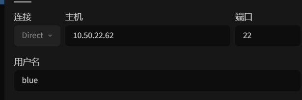

## 配置 ssh

在 linux 第一节课丢大脸了。。tabby 一直连不上，排查了半天发现都没问题，ip 地址没错，能 ping 上，然后 ssh 能连，然后密码也没错
结果最后是用户名写错了。。本来的是 root，然后我一直没改，鬼知道我是怎么想的。。


好扯回正题，应该如何在 Ubuntu 上配置 ssh 呢

### 安装 ssh

```bash 
sudo apt install openssh-server
sshd
```

### 启动 ssh

    ```bash 
    sudo systemctl start sshd
    ```
