## 第一章 操作系统概论

2023-12.25 今日目标是系统的对操作系统的知识过一遍，晚上再刷题，然后看数据库的网课，也过一遍

### 什么是操作系统

操作系统是管理计算机硬件与软件的计算机程序，是直接在裸机上运行的程序，本质就是个程序，然后可以直接调用硬件的资源
用户通过操作系统实现对硬件资源的访问，对软件的控制

### 操作系统的功能

#### os 作为计算机系统的管理者


四大类计算机资源

- 处理机管理
  这玩意就涉及到进程，进程控制，进程调度，进程同步，进程通信
- 存储器管理
  内存分配，内存保护，内存扩充，地址映射
- i/o 设备管理
  缓冲管理，设备分配，设备处理
- 文件管理
  文件存储空间管理，目录管理，文件读写保护管理（权限

#### os 作为用户和计算机硬件系统的接口（提供接口


- 程序接口
  程序可以调用操作系统的接口，来实现对硬件资源的访问，这叫系统调用，也就是说用户直接通过系统调用来访问硬件资源
- 命令接口
  用户可以通过命令行来访问操作系统，直接调用操作系统的一些操作
- gui
  操作系统就提供了一个 gui 来让用户直接操作，很多操作系统是没有 gui 的

#### os 实现了对计算机资源的抽象

os 将具体的硬件资源抽象成软件资源，方便用户的使用
开放了简单的访问方式使得用户可以简单的使用硬件资源
比如说我在浏览器进行访问网页，浏览器通过系统调用调用了网卡进行网络请求

### 操作系统的特征

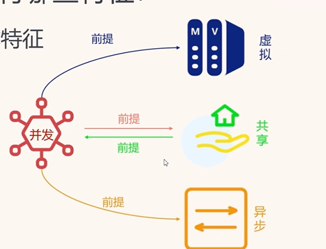
四大特征

- 并发
  是一切特征的前提
  并发很好理解，同一时间段执行和调度多个程序，就是看起来好像是一起执行的，其实是在时间段里面来回切换的。
  打开我们的任务管理器，就可以看到，很多进程都在并发的执行
  而并行就是真正的，在同一时刻一起执行
  并发能力就是在同一时间段内处理任务数量的能力
  比如说之前的单核 cpu，在同一时间段只能处理一个进程
  而现在的 cpu 是多核的，就可以在同一时间段内处理多个进程
- 共享
  共享 就是系统的资源可以被多个进程共享
  共享有同时访问，和互斥共享
  同时访问的系统资源比如说磁盘，音频设备
  而互斥访问的资源称为临界资源，是需要排队的，最经典的例子就是打印机
  其实 io 设备都是临界资源，因为 io 设备的访问速度是很慢的，而且写的时候不能读，读的时候不能写，否则会产生脏数据

**并发和共享互为前提/存在条件**
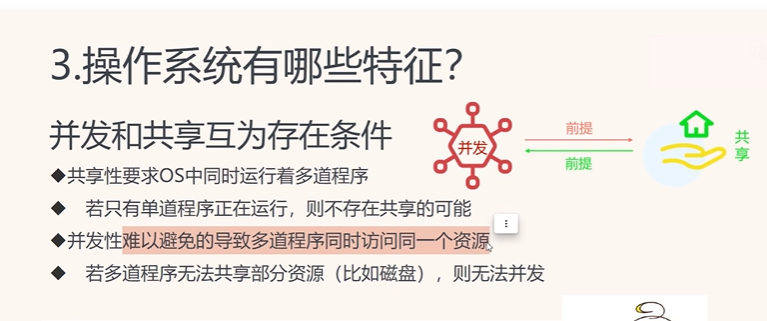
很好理解，如果没有并发的话，我就一个程序在运行，我还共享啥啊，同理，如果没有磁盘资源的共享，就不能够并发的执行多个程序，因为执行程序需要从磁盘中调用程序到内存中

- 虚拟
  **并发是虚拟的前提**
  
  cpu 只有八核，但是打开任务管理器看到有几百个任务都在运行，看起来好像几百个 cpu 在运行，其实是通过时间片轮转的方式来实现的
  虚拟就是使用某种技术把一个物理上的实体变成若干个逻辑上的对应物，比如说虚拟内存，虚拟磁盘，虚拟 cpu
  虚拟内存是后面我们看到的比较多的， 对虚拟内存的定义是基于对地址空间的重定义的，即把地址空间定义为“连续的虚拟内存地址”，以借此“欺骗”程序，使它们以为自己正在使用一大块的“连续”地址，其实就是将内存都运行在一片连续的存储空间中，而这一段连续的存储空间后面如何映射到物理地址即磁盘，程序是不知道的，磁盘中的空间并不是连续的，那么虚拟内存的结果就是会调用磁盘中的碎片，来为程序分配一片空间。
  再通俗点解释就是，我只有 4g 的内存，但是我的每一个进程都可以使用者一套 4g 的内存，看起来这 4g 的地址是很连续的，但是其实后面怎么映射到物理地址，操作系统会搞定，映射到物理地址是不连续的，程序独立的运行在这开辟出来的 4g 里，互不干扰，这就是虚拟内存的概念

  **时分复用技术**
  时分复用技术就是通过时间片轮转的方式来实现的，比如说我有 100 个进程在运行，然后每一个进程都运行 10ms，然后轮转到下一个进程，这样看起来就好像是 100 个进程在同时运行一样，其实是在轮转，这就是时分复用技术
  这就是虚拟处理机，还有一种虚拟打印机，就是通过排队来“同时”的打印多个文件
  **空分复用技术**
  空分复用技术就是通过分区的方式来实现的，比如说我有 100 个进程在运行，然后我把内存分成 100 个区域，每一个进程运行在一个区域，这样看起来就好像是 100 个进程在同时运行一样，其实是在分区，这就是空分复用技术
  虚拟磁盘，将磁盘虚拟出若干个卷，每一个卷都是一个独立的磁盘，但是实际上是在一个磁盘上，这就是虚拟磁盘，比如说 c 盘，d 盘
  虚拟存储器技术：将内存虚拟出若干个区域，每一个区域都是一个独立的内存，但是实际上是在一个内存上
  也就是说，我就一个大硬盘，一个大内存条，但是我给他划分了很多区域，这就是虚拟出来的磁盘，虚拟出来的内存

- 异步
  
  异步也很好理解，这里用 js 的异步理解就好了，我处理机处理完一个进程，就去处理另一个进程，不需要等待上一个进程的结果，这就是异步

### 操作系统的发展

手工阶段
人工写纸袋

- 单道批处理
  丢磁盘，纸袋机处理，系统资源利用率低，而且不能人机交互，因为你整个 cpu 都在执行一个程序，那么你就不能够和用户交互了，用户只能等待程序执行完毕，然后才能够使用
  单道批处理主要解决的是 cpu，内存，和 io 设备利用率不足的问题

#### 多道批处理


多道批处理系统就是，系统中可以同时运行多个作业，也就是说可以有很多个口塞很多个纸带

- 优点
  当然的，可以运行的多了，所以 cpu 的利用率提高
  然后也提高了内存和 io 设备的利用率
  系统的吞吐量提高了，什么是吞吐量，就是单位时间内处理的作业数量
- 缺点
  当然还是不能人机交互，只能看着他动
  然后平均周转时间长，因为只能等，本质上看起来是并行的，其实是串行运行，你得排队啊，等待着你前面的程序执行完毕，才能够执行你的程序，所以平均周转时间长
  多道批系统主要解决 io 操作时的 cpu 闲置问题，提高了 cpu 的利用率
  

#### 分时操作系统


分时操作系统就是，一个主机，多个显示屏连着，多个用户都能使用这个主机，然后为每一个用户都提供了一个时间片，这个时间片很短，用户一般感受不到，所以有一种同时使用的感觉

- 分时系统的特征
  多路性，时间片轮转机制
  独立性，每一个用户都是独立的，互不干扰
  及时性，用户的响应时间很短，用户感受不到，但是及时不是同时，比如说我允许你响应 3s，那么在 3s 内给我反应就好了
  交互性，用户可以和系统交互贼拉重要，终于可以和系统交互了

- 缺点
  缺点就是，优先级问题，作业用户的优秀级相同，不能优先处理紧急的任务，假如我一个作业执行的贼拉久，那么就把大伙都卡住了

#### 实时操作系统

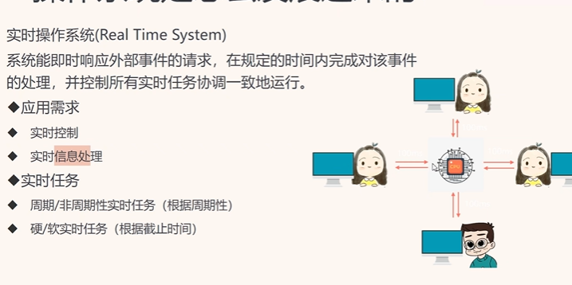
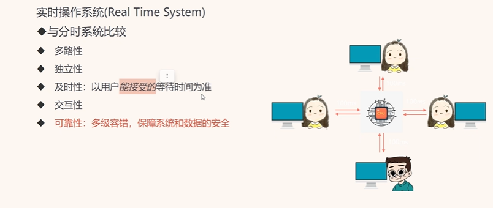
实时操作系统就是在规定时间内及时响应外部事件的请求，毫秒级的完成处理，然后控制所有的实时任务协调运行
这个和分时的比较就是，他对于实时任务，会设置为周期性和非周期性实时任务，周期性就是周期性的执行任务，然后非周期就是，一定会给出 ddl
还有软/硬实时，软实时就是尽量在规定时间内完成，硬实时就是一定要在规定时间内完成

#### 微机(pc)操作系统，就是现在的操作系

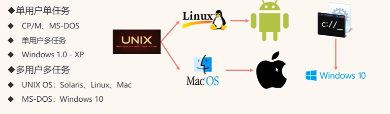


网络操作系统，就是现在的服务器操作系统，就是远程资源共享，远程通信

分布式操作系统，分布性和并行性
就是多台计算机组成一个系统，然后这些计算机之间通过网络进行通信，然后这些计算机之间可以共享资源，可以并行的处理任务

- **微内核操作系统的优点：**

a)提高了系统的可扩展性
b)增强了系统的可靠性
c)可移植性
d)提供了对分布式系统的支持
e)融入了面向对象技术

### 操作系统的运行机制

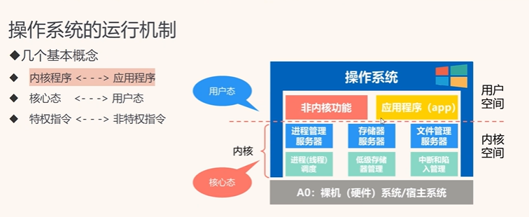

#### 操作系统的运行机制的几个基本概念

内核程序————应用程序
内核程序就是想进程管理，内存管理，文件管理，设备管理，网络管理，安全管理，中断和陷入管理这种东西，然后应用程序就不用说了
核心态（管态）————用户态（目态
特权指令————非特权指令
在内核程序中执行的指令就是特权指令，比如说我要访问内存，我要访问 io 设备，这些都是特权指令，而应用程序中执行的指令就是非特权指令，比如说我要访问一个文件

然后 cpu 是不知道到底执行的是用户态还是核心态的，所以需要通过中断来判断，如果是特权指令，那么就会触发中断，然后进入核心态，如果是非特权指令，那么就不会触发中断，然后就会进入用户态

#### 时钟管理（计时器


#### 中断机制

中断机制是来源于时钟管理的
中断，很好理解，就是在执行程序的时候不执行了，去执行另一个程序
中止断开

中断的目的是为了提高 cpu 的利用率，因为 cpu 在执行一个程序的时候，可能会等待 io 设备的响应，这个时候 cpu 就会闲置，所以就会去执行另一个程序，这样就提高了 cpu 的利用率
中断分为外中断和内中断
外中断是外部设备发出的中断信号，比如说我 io 设备要进行 io，那就会发出中断指令，cpu 就不会傻傻的等 io 了

内中断/异常

内中断是来源于


内中断也被称为是异常，也不一定是出现了问题
内中断的话，比如说我在网页中要求访问文件资源管理器，那么这个时候就要从用户态切换到核心态，这个时候就会发生中断，然后 cpu 就去干别的事了，所以我们打开文件夹的时候，会弹出一个模态框，程序我们是运行不了的，这时网页在等待 io

还有一种中断情况就是发生异常了，比如说缺页中断，发现内存缺页了就赶紧中断

中断处理过程

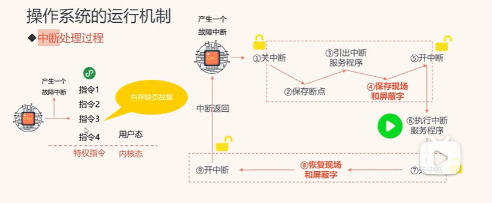

#### 原语

原语由若干条指令组成，用来完成某个特定的功能，执行过程不会被中断
比如说 wait（）原语

#### 系统数据结构


#### 系统调用

系统调用就是有操作系统实现的，给用户提供的接口，用户可以通过系统调用即访问接口来访问内核服务
系统调用就是接口集合

### 操作系统的结构是怎么样设计的

## 进程管理 贼拉重要的一章

### 什么是进程


#### 进程的基本组成

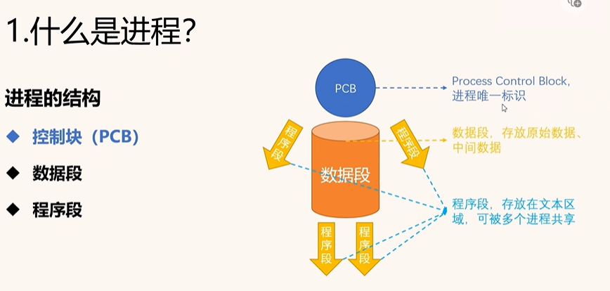
一个进程由 pcb，程序段，数据段，堆栈段组成
pcb 是唯一标识符，里面有进程的状态，进程的优先级，占用资源，pid 等等，是头部
数据段就是进程的私有数据，比如说我启动了一个浏览器，那么这个浏览器就是一个进程，那么这个进程就会有一些私有数据，比如说我打开了一个网页，那么这个网页就是这个进程的私有数据，这个进程就可以访问这个网页，但是其他进程是不能访问这个网页的，这就是数据段
程序段是可以被多个进程共享的，也就是在个软件的代码，比如说我打开了一个浏览器，那么这个浏览器就是一个进程，那么这个进程就会有一些程序段，比如说浏览器的代码，这个代码是可以被多个进程共享的，因为我打开了两个浏览器，那么这两个浏览器的代码是一样的，所以这个代码是可以被多个进程共享的

#### 线程

线程简单来说就是程序中的模块，执行单元，执行程序的不同的，也就是一个执行路径

比如说 qq 的网络模块，聊天模块就是一个线程，线程之间也可以相互通信

线程是 os 运算调度的最小单位

线程就是为了实现进程内部的并发，如果没有线程的话，那么我很多模块都一个进程搞定，那就变成串行的了

#### 进程和线程的区别

本质上进程就是一块内存空间，也就是说，进程拥有资源，线程只拥有进程的使用权
线程和线程可以共享当前进程的资源
但是进程和进程之间是独立的

### 进程的三种基本状态

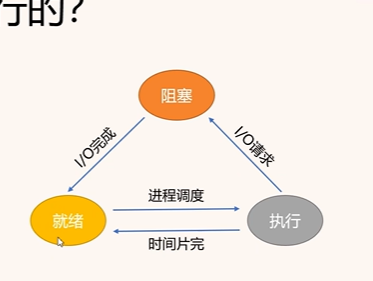
就绪态，运行态，阻塞态

然后其实还有创建态，终止态

终止态是进程执行完毕，或者进程被强制终止（发生异常
终止时需要先标记终止，然后释放资源，然后消掉 pcb

### 进程控制

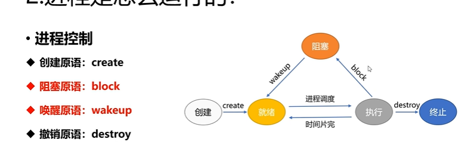

#### 进程控制是通过原语实现的

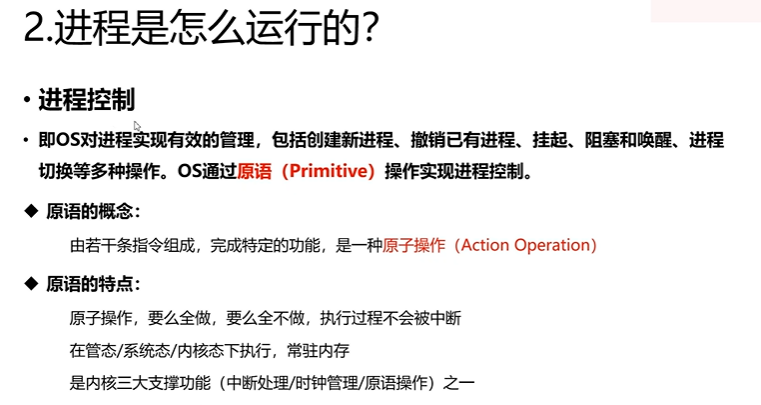

进程的创建，撤销，挂起，阻塞，都是使用原语来实现的，也就是封装好的小程序段，即原语
是一种原子操作

原子操作，要么全做，要么全不做，不会被中断
原语是直接在内核态中实现的
也是内核三大支撑功能之一

#### 挂起和激活


挂起原语 suspend，在运行态的时候是不可以挂起的
就绪挂起，就绪挂起放在外存放在挂起队列，等待着被激活
阻塞挂起
激活原语 active
两个操作
活动就绪，等待调度，就是把挂起的进程放到就绪队列
活动阻塞，等待事件，就是把挂起的进程放在阻塞队列，等待唤醒

### 处理机调度


为什么要处理机调度

#### 调度的层次

##### 作业的概念

在这里我们要先知道一下什么是作业
"作业"（Job）是指用户提交给计算机系统执行的一项任务或一组任务的集合。作业可以是一个程序、一个脚本、一个批处理文件或者其他形式的任务。作业通常包含了一系列的指令和数据，这些指令和数据需要被计算机系统按照一定的顺序和规则执行。

举个简单的例子，我们打开一个文档编辑器开始写文章的时候，这个进程就是一个作业，包括了我的输入，修改什么的
作业简单来说就是一个任务或者一个任务的集合，是用户提交给计算机干的活
作业和进程的区别
作业可以由多个进程组成，作业的范围是比进程大的，进程是操作系统分配资源的基本单位，而作业是用户提交给计算机的基本单位
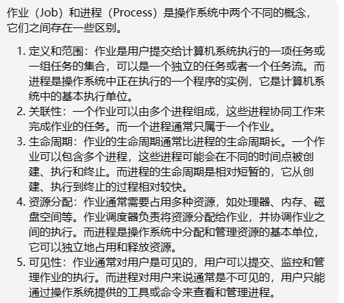


- **作业运行的三个阶段和三种状态**
  作业从进入系统到运行结束通常需要经过收容，运行，完成三个阶段，对应三个状态分别是后备状态，运行状态，完成状态

##### 三种调度

高级调度/作业调度
高级调度也被称为是作业调度
由于内存空间有限，所以不能把所有的作业都放入内存中，**那么就需要把作业放在处于外存**的后背队列里
然后高级调度就是按照一定的规则从后备队列中选择作业，给他们分配内存等必要资源，使他们获得竞争处理机的权利
中级调度/内存调度
中级调度就是把内存中的进程调度到外存中，或者把外存中的进程调度到内存中
低级调度/进程调度
低级调度是频率最高的调度，就是进程调度，从就绪队列中选择一个进程，分配处理机，使其运行，相当于一个时间片完成就要调度一次


#### 调度的方式

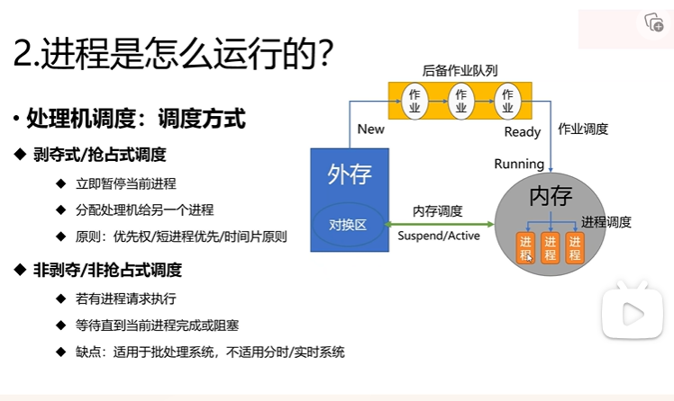
抢占/剥夺式调度
抢占式的调度就是，立刻暂停当前的进程，然后将资源分配给另一个进程
一般来说的话是根据优先级，或者短进程优先，还有时间片原则
这里有好多个算法
非抢占/剥夺式调度
非抢占就是等待当前进程执行完毕，或者阻塞，或者主动放弃处理机，才会调度下一个进程
不适合在分时和实时操作系统，只能在批处理系统

### 调度算法的评价指标

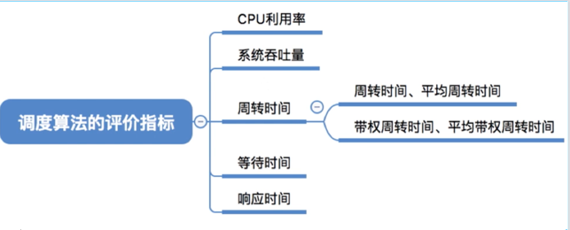

- cpu 利用率
  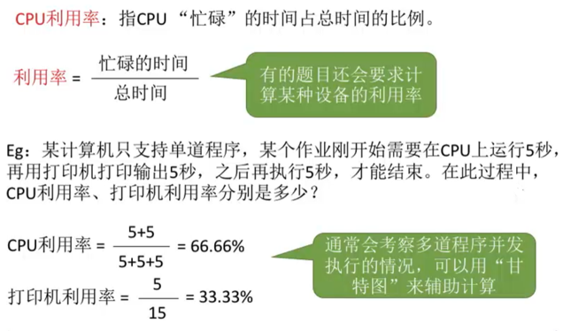

- 吞吐量
  吞吐量表示单位时间内完成的进程的数量
  

响应比：响应时间/总的服务时间
响应时间=完成服务的时间-到达的时间
周转时间：完成服务的时间-到达的时间
平均周转时间：所有进程的周转时间之和/作业的数量

- 带权周转时间
  
  带权周转时间也就是作业完成的时间减去作业到达的时间除作业实际运行的时间

### 调度算法们


#### 先来先服务 FCFS


这玩意非抢占式，就是按照队列那样，最新入队的就先执行，先来先服务，然后一直到执行完才下一个

#### 短作业优先 SJF


短作业优秀其实就是已经到达的且服务时间最短的

还有个抢占式的 srtn，最短剩余时间优先


#### 高响应比调度 HRRN

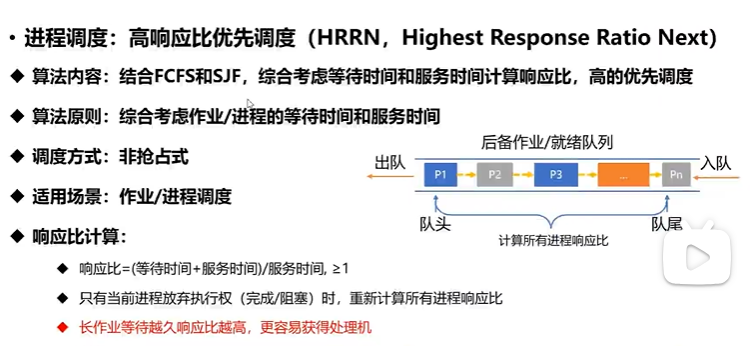
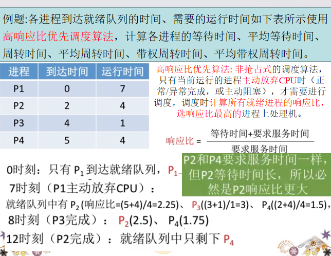

- 相应比
  响应比 = 等待事件+服务时间/服务时间 >=1

缺点，长作业等待响应比越搞，更容易获得处理机

#### 优先级调度

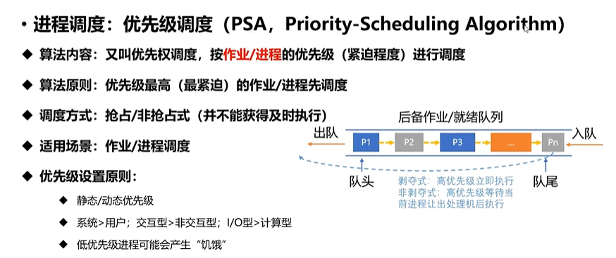
优先级最高的作业先调度

#### 时间片轮转调度 RR

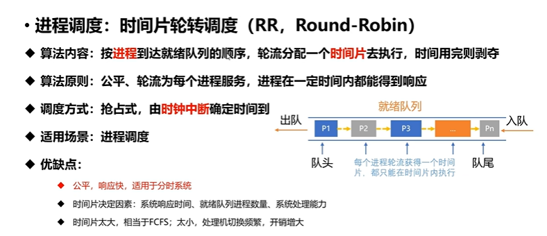
时间片论证调度的，按照进程到达就绪队列的顺序，轮流分配一个时间片去执行，时间用完就剥夺，是抢占式的，这个算法就是贼拉公平，进程在一定的时间内都可以得到响应
但是的话时间片太长的话，就会变成先来先服务，时间片太短的话，就会变成上下文切换的开销太大

#### 多级反馈队列调度

是比较好的一种算法，也比较难算
思想就是每个队列分配的时间片大小是越来越大的，然后优先级的话是越来越低的，就是如果进程在一级队列里没有执行完，那么就会进入下一级队列，然后下一级队列的时间片就会变大，优先级就会变低，这样就可以保证短进程优先，而且也不会出现饥饿的情况
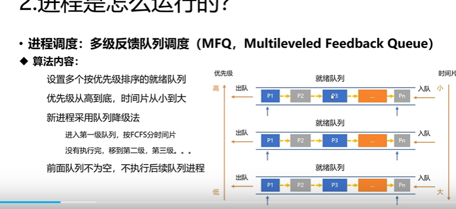


### 进程通信

其实还有网络上的通信，那就是设计到 tcp，socket 那种了，以下讲的是在本机内的进程通信


#### 共享存储


多个进程共用某个数据结构
由用户负责同步处理也就是用户设置申请的
这是低级通信，因为是 cpu 直接访问内存，不需要中断，所以是低级通信
共享的话，比如说，共享打印机这种

共享存储区
共用一块存储区域，比如说我有一个进程，我要把数据写到这个存储区域，然后另一个进程就可以从这个存储区域读取数据，这样就实现了进程间的通信
这属于高级通信

由进程控制数据的形式

#### 消息传递

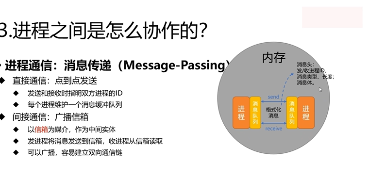
直接通信
点到点发送，
间接通信,使用广播信箱


#### 管道通信

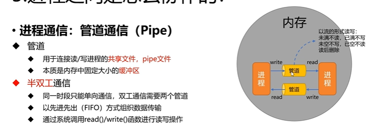

- 管道
  管道通信管道用于连接读写进程的共享文件，pipe 文件
  管道的本质就是一个文件，或者一个缓冲区
  就是这玩意是用于进程直接共享文件的
  写满才读，读满才写，这里其实就是要利用信号量了

- 半双工通信
  半双工通信就是只能单向通信，比如说我只能从管道中读取数据，或者只能往管道中写入数据，不能同时读写
  两个管道才能实现全双工

### 进程同步 重点

简单来说就是让进程们好好干活

本质就是协调进程之间的相互制约关系，使得他们按照预期的方式执行。
进程同步是指在多个进程之间协调和控制它们的执行顺序，以避免出现竞态条件（Race Condition）或其他并发问题的一种机制。进程同步的目的是确保多**个进程能够按照一定的顺序和规则访问共享资源**，避免数据的不一致性和错误的结果。
引入这玩意最关键的还是说要解决访问共享资源的问题，因为共享资源，比如打印机是有限的
没有好的同步机制就会出现
竞态条件，多个资源同时竞争访问一个资源，导致数据不一样
死锁，两个进程互相等待对方释放资源，导致都不释放，就死锁了

- 相互制约关系
  **间接制约关系**（互斥，也就是竞态
  直接相互制约关系

### 解决进程同步

#### 临界资源

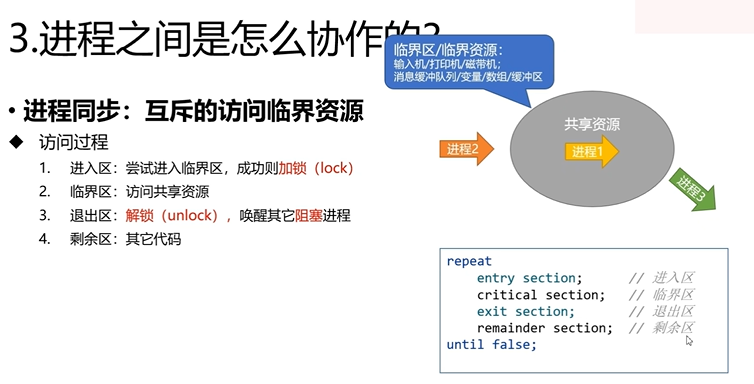
临界资源就是一次只能被一个进程访问的资源，比如说打印机

进入区，临界区，退出区，剩余区

进入区就是进程要进入临界区之前的代码，进入成功之后则加锁

临界区就是进程要访问临界资源的代码

退出去，解锁，唤醒其他阻塞的进程，然后进入剩余区
进入临界区以后，其他进程都不能进来了，像厕所那样

- 访问原则
  空闲让进，一旦临界区是空的就给进
  忙则等待，如果临界区有进程在执行，那么就等待
  有限等待，不能等太久否则进程饥饿，且会死锁
  让权等待，等待时，cpu 就去干别的事情了，让出 cpu 的执行权，防止忙等待（写个死循环

#### 执行算法（软件

- 单标志法
  交替的进入临界区
  
- 双标志法
  
  使用两个标志可以实现互斥访问，也可以重复的进入临界区

#### 执行算法 硬件

#### 信号量 大碟来啦

- pv 操作

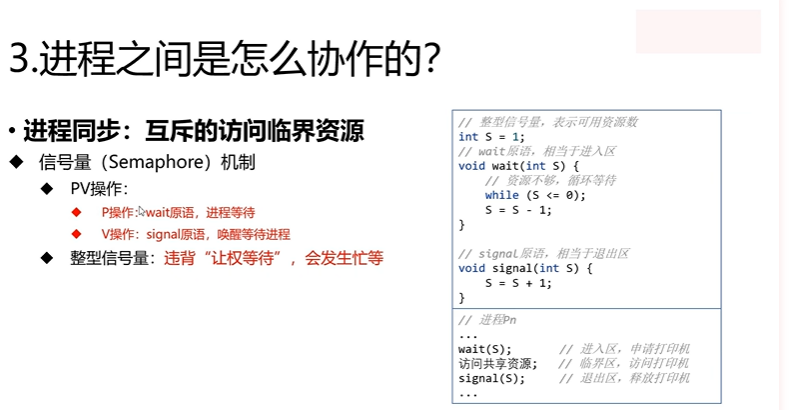

p 操作调用 wait()原语，进程等待
v 操作调用 signal()原语，唤醒等待进程，释放资源
整型信号量，使用一个整型来表示资源的数量，有就加一，无就减一
整型信号量违背了让全等待，就是会一直死循环，会发生忙等

记录型信号量


```C++ 
// 信号量的实现 写个伪代码
typedef struct{
    int value;// 剩余资源数量
    struct process *list;// 等待队列

}semaphore;
value = 1 // 信号量的初始值假设就一个临界资源，然后3个进程要访问这个临界资源
// p 操作，申请资源
void wait(semaphore s){
    // 如果成功
    s.value--;// 剩余资源数量减一
    if(s.value<0){
        // 没资源了就进阻塞
        block(s.list)
    }
}
// v操作，释放资源
void signal(semaphore s){
    s.value++;// 剩余资源数量加一
    if(s.value<=0){
        //从队首唤醒一个进程
        wakeup(s.list)
    }
    //如果唤醒了这个进程以后，发现剩余资源还是小于等于0，那么在这里将会继续唤醒下一个进程，直到剩余资源大于0，有signalAll的函数
}


```

#### 分析进程同步和互斥问题的方法步骤

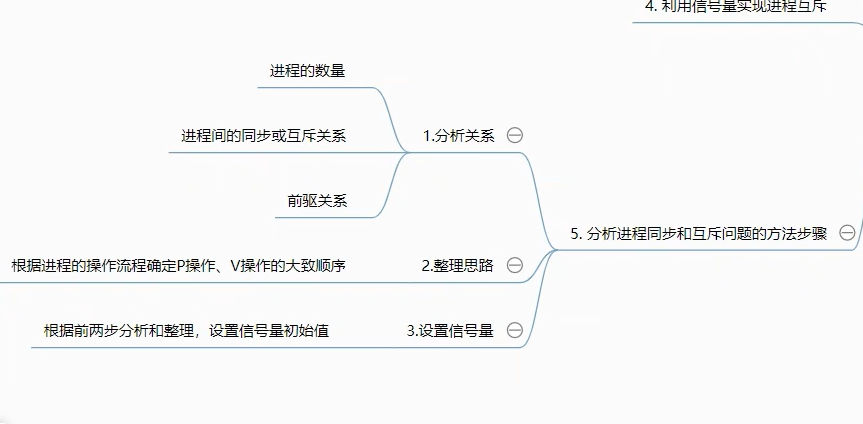

1. 分析关系，很关键的一点是进程的数量，然后进程之间的同步和互斥关系，前驱关系
2. 整理思路
   捋出 p 操作和 v 操作的的大致顺序

3. 设置信号量的初始值
   比如说，我有 2 个临界资源和 3 个进程，那么我就设置信号量的初始值为 2，然后 3 个进程都要访问这个临界资源，那么就会有一个进程访问不到，就会阻塞，然后等待，等待其他进程释放资源，然后唤醒，然后就可以访问了

### 管程

用于实现管理进程同步的工具
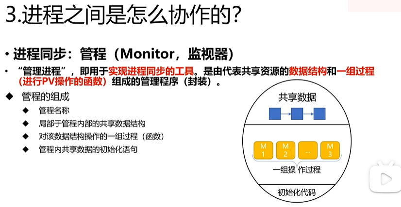

### 死锁

- 死锁的概念

死锁就是各个进程都在等待对方释放资源，但是一直等不到，就卡在这里了，这就是死锁
比如说哲学家筷子的例子，每个人都只有一个筷子，然后每个人都在等待另一个人释放筷子，但是又不释放自己的筷子，这就是死锁


#### 死锁产生的必要条件

**死锁产生原因**
资源的无序竞争，进程推进顺序非法

- **互斥条件**
  互斥条件比如说，像打印机，哲学家的筷子这种临界资源，是需要进程互斥的，因为这样才需要竞争资源，如果是那种音频设备，都不需要产生竞争了就不会发生死锁
- **请求并保持条件**
  死锁的本质就是，各个进程都拥有对方的锁，都不愿意释放，然后又在等待对方释放锁
- **循环等待条件**
  发生死锁时一定有循环等待，但是发生循环等待时未必死锁，循环等待是死锁的必要不充分条件
- **不可剥夺条件**
  进程已经获得的资源，在未使用完之前，不能被剥夺，只能自己释放，如果可以被剥夺那死锁个屁啊，一旦违背了有限等待原则就剥夺下来就好了

#### 死锁的预防条件

**破坏必要条件**

- **破坏互斥条件**
  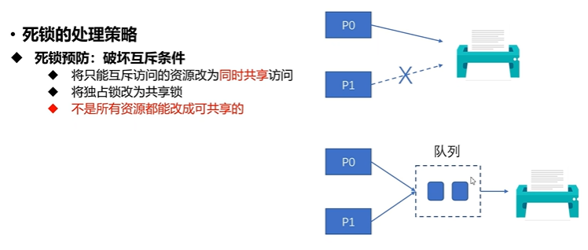
  将只能互斥访问的资源变成共享的，通过 spooling 技术实现，比如说打印机，就是把打印机变成共享的，然后通过缓冲区来实现
  不是所有的资源都能改成可共享的
- **破坏请求并保持条件**
  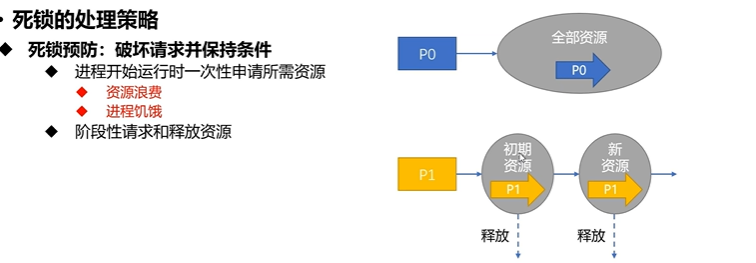
- **破坏不可剥夺条件**
  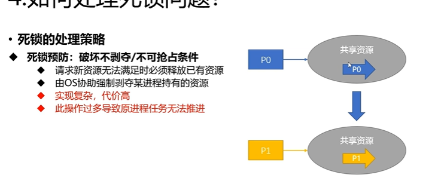
  就是这个共享资源在还没有用完的时候就被剥夺，但是这样的话会反复的申请释放，效率低下
- **破坏循环等待条件**
  
  对现有的资源现行排序，按序号请求资源

#### 死锁的处理策略(检测与解除)


- 剥夺死锁进程，分配资源给别的进程
- 撤销死锁进程，重新分配

- 设置还原点，还原到不发生死锁的时候

##### 安全性算法 （重要


银行家！
直接上例题
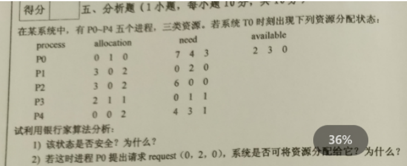


## 内存管理！


### 什么是内存管理

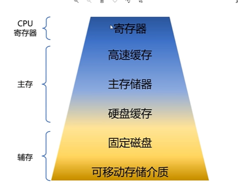

#### 先搞清楚核心的逻辑地址，物理地址，虚拟地址

物理地址很简单，就是在内存中的地址，比如说 0x0000-0xffff

逻辑地址，因为我们程序在装入的时候总不能每次都直接从物理地址的顺序开始装入吧，所以没一个程序都有一个逻辑地址，然后这个逻辑地址就是从 0 开始的，然后通过一系列的操作装入到内存中
装入的时候，有哪些地方是空闲的，就从哪一块开始装，顺延的去装入，然后要加上偏移量
虚拟地址，就是逻辑地址和物理地址的中间层，就是说，我要访问一个逻辑地址，那么这个逻辑地址就会被映射到物理地址，然后我就可以访问这个物理地址了
**逻辑地址转换到物理地址的过程叫地址重定位**
**重定位也有两种方式，静态重定位和动态重定位**

静态重定位是在编译的时候就确定了偏移量静态重定位的特点是在一个作业装入内存时，必须分配其要求的全部内存空间，如果没有足够的内存，就不能装入该作业。 作业一旦进入内存后，在运行期间就不能再移动，也不能再申  请内存空间。
动态重定位使用的是重定位寄存器
动态重定位是在装入的时候才确定偏移量，动态重定位的特点是在一个作业装入内存时，只要有足够的内存空间，就可以装入该作业。 作业在运行期间，可以在内存中移动，也可以申请更多的内存空间。

#### 存储器的储存结构

通用计算机而言，存储层次至少应具有三级：最高层为 CPU 寄存器，中间为主存，最底层是辅存。

#### 进程运行的基本原理

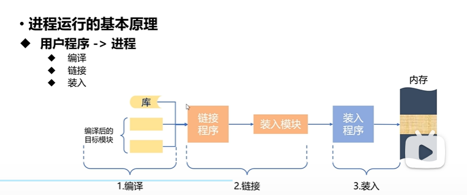
用户程序(代码)——>进程需要经过三个步骤

- 编译
  将代码编译成计算机可识别的二进制

##### 链接

链接也是个程序，链接程序，就是把编译好的代码和库文件等依赖链接起来，变成装入模块

链接有两种方式，静态链接和动态链接
静态链接指的是，把所有的依赖都链接到一个 exe 文件中，一次全部装入，但是这样的话可能太大了无法一次装入
装入时动态链接，一边装入一边链接，这样的话就可以节省内存空间了
**运行时动态链接**，就是如果发现了内存中缺页中断了，就需要重新走一遍编译，链接，装入，去重新链接装入，修复缺页

##### 装入

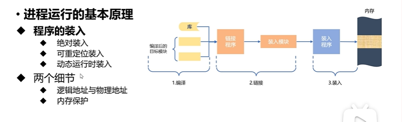
将链接好的模块装入内存，编译好的代码是无法直接进入内存的，就像程序是要变成 exe 才能点击运行的

绝对装入
绝对装入就是像单片机那样直接写到物理地址

可重定位装入
可重定位装入就是，把代码装入内存的时候，不是直接装入到物理地址，而是装入到逻辑地址，然后在运行时，通过重定位寄存器，把逻辑地址转换成物理地址，然后再去访问内存

动态运行时装入
动态运行时装入就是，运行时才装入，比如说我要访问一个函数，但是这个函数还没有装入内存，那么就会发生缺页中断，然后就会去装入这个函数，然后再去执行这个函数
**注意**
加入我有 2g 的应用程序需要运行，装入,而我只有 1g 的内存，那么就会发生缺页中断，然后就会把一部分内存中的程序换出到外存，然后再把这个程序装入内存，然后再去执行，这样就可以实现 2g 的程序在 1g 内存的运行了

#### 内存保护

内存保护就是让每一个内存不去访问其他进程的内存，这样就可以保证进程之间的安全性
实现方法就是通过**基址寄存器和界限寄存器**来实现的

#### 内存分配方式 （连续空间分配

**内部碎片**
内部碎片指的是，我申请了一块内存，但是我只用了一部分，剩下的就是内部碎片了，是申请的内存没用完剩下的

**外部碎片**
外部碎片指的是，我申请了一块内存，但是这块内存是分散的，比如说我申请了 1g 的内存，但是这 1g 的内存是分散的，比如说 100m，200m，300m，这样的话，就会产生外部碎片，因为这 1g 的内存是分散的，所以无法分配给其他的进程

简单来说就是太小太散了，无法分配给其他进程

##### 单一连续分配

**内存分区**
内存是分为用户区和系统区的，用户区的空间大是高地址，系统区的空间小，为低地址

只适用于单用户系统，比如说单片机，单用户系统，就是只有一个用户，那么这个用户就可以独占所有的内存，这样就不会出现内存碎片的问题了
会产生外碎片，就是内存中有一部分是空的，但是这部分空间太小了，无法分配给其他进程，这样就会浪费内存

##### 固定分区分配


就是把**内存预先划分好的**，每一个分区都是固定大小的，然后每一个分区都可以分配给一个进程，这样的话，就不会产生外部碎片了
但是缺点是会产生内部碎片，因为每一个分区都是固定大小的，比如说我有一个进程，我要分配 100m 的内存，但是我只有 200m 的分区，那么这个时候就会产生内部碎片，因为我只用了 100m，剩下的 100m 就是内部碎片了
回收的时候也是根据分区来回收的

##### 动态分区分配 （会考

动态分区就是在进程申请内存的时候才划分

**需要考虑的问题**

1. 怎么记录内存的使用情况
   用了一个空闲分区表，和空闲分区链，记录各个分区的分配和回收的情况
   
2. **选择哪个分区给新进程**
   这里有好多个算法，首次适应（first fit），最佳适应，最坏适应，临近适应
   **首次适应其实就是按照顺序，从低地址空间找到高地址，有位置就直接放**
   **最佳适应就是，优先查找容量小的，但是这个很容易会导致装不下，按容量递增（从小到大）的分区去找**
   **最坏适应，就是按容量从大到小去找能分配的，容易产生内部碎片**
   **临近的话，就是从上次查找的地方接着找，地址递增**
   
   直接看例题
   
3. 如何回收已使用的分区
   
   当我们需要回收的空间前后有空闲分区的时候，就需要合并空闲分区
   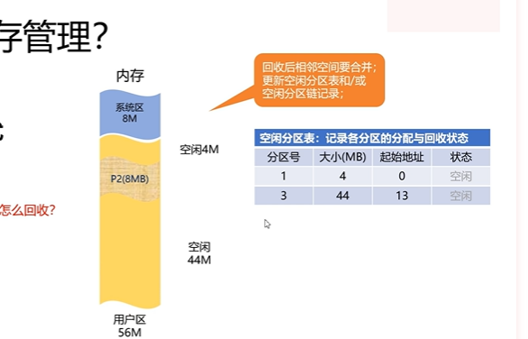

#### 内存分配方式 （非连续 分页，分段那些 必考！！！

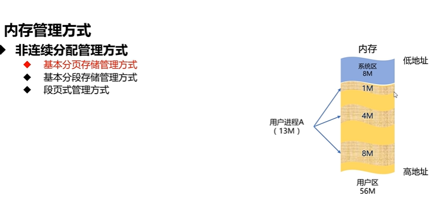
非连续分配指的是，一个进程在内存的空间不是连续的，而是被分成很多块

为什么要使用非连续，比如说我们的动态分区，就一直会分配空间，会产生外部碎片
使用非连续分配就是尽可能的减少外部碎片，提高内存的利用率

那非连续分配的弊端的话就是，需要使用一个表来管理这些分块分页，也是需要占用空间的，即页表，段表

#### 基本分页存储管理

**本质就是固定分区**
分页**一定不会**产生外部碎片，可能会产生(**页内碎片**)内部碎片，因为分区分的特别小

将内存分为大小相对的分区，这个小分区被称为页框/页帧/内存块/物理块
页框号/页号 从 0 开始
os 以页框为基本单位分配内存

然后页是逻辑地址，页框是物理地址，页号和页框号是通过页表来映射的

**页——>页表->地址变化机构——>页框**

##### 页表


从逻辑地址到物理地址，是需要通过页表来映射的
页表是存储在 pcb 中的，**页表的主要组成就是页号和块号**
页号表示逻辑地址的页，比如说第一页，第二页这样，块号表示的是映射到物理地址的快，那玩意叫页框，
然后有了页表以后，**将通过基本地址变换机构**来映射

##### 基本地址变换机构，大碟来了


这里有几个重要概念
物理地址 = 页号对应的块号+偏移量
页号 P = 逻辑地址/页大小
偏移量 W = 逻辑地址%页大小
p = A >> 页大小 W = A & 页大小


页式管理中地址空间是 1 维的
每次方寸都需要地址变换
页表不能太大，否则会降低内存利用率

页表寄存器存的是页表的基址，也就是页表的起始地址，cpu 直接访问页表寄存器可以提高效率

- 快表
  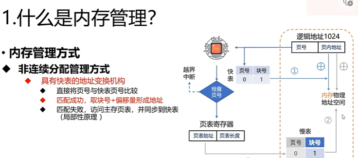
  快表是在高速缓冲区中的表，快表的结构是一样的，访存的时候先找快表，如果快表中有的话，就直接访问，如果没有的话，就去访问页表，然后再去访问内存
  快表相当于是一个缓存，然后每次访问以后一个个加进去的
  然后快表的话不能看成是一个一维数组，他是二维的，因为他的索引和慢表的内容不是一一对应的
  如果没有快表的话，我们已知一个逻辑地址，要先去查页表，然后知道页号以后再根据偏移量算页内地址，然后又访问了一次内存

**访问成功**
就取块号+偏移量形成地址
**访问失败**
访问主存中的页表（慢表）同步到快表（局部原理

##### 例题


第一种是十进制玩法的
如果算出来的页大于所给的页就会发生越界中断，就是索引超了
还有一种是在内存中找不到页就发生缺页中断
例子 2 二进制玩法，具体看牛奶墙
先看是在几 k 中划分，然后将逻辑地址转换成 2 进制，再划，再去找物理块，最后直接把划出来的这几位用物理地址的 2 进制换掉，计算要小心


#### 基本分段存储管理

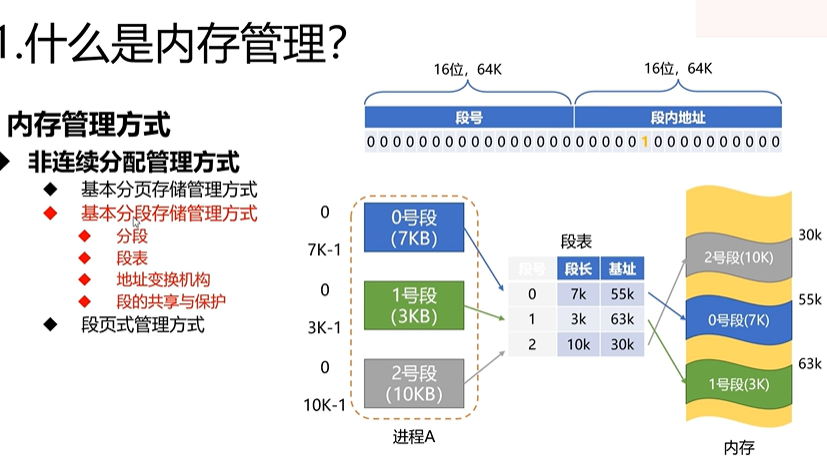
分段就是把进程分成多个段，然后每一个段内部的空间是连续的，但是段和段之间的空间是不连续的，比如说我有一个进程，我把这个进程分成 3 个段，那么这 3 个段内部的空间是连续的，但是这 3 个段之间的空间是不连续的，这样的话就会产生外部碎片，但是段内部是连续的，所以不会产生内部碎片

段表就是用来记录段号和段的基址的，段表也是存储在 pcb 中断

段表是 2 维的

#### 段页式存储管理

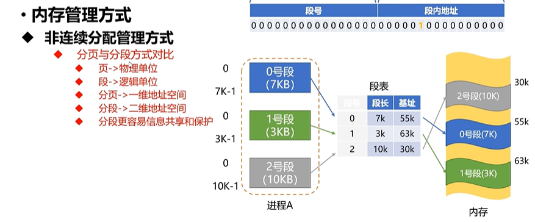

#### 虚拟存储器


##### 请求分页管理方式

缺页中断机构，找到页表项以后检查是否已经在内存，没有在内存就产生缺页中断，缺页中断处理中，要将目标页面调用内存，重新链接装入，

缺页中断属于内中断（故障
外中断（外中断是外部设备发出的中断信号

## 文件管理

## IO 设备

### 什么是输入输出设备

#### io 控制方式


- io 直接控制就是 cpu 直接控制 io 设备，这样的话 cpu 就会一直等待 io 设备的响应，会一直查看状态寄存器，然后后面从数据寄存器中读取数据，这样的话 cpu 就会一直等待，浪费时间

- 中断驱动方式就是，cup 发出 io 指令以后，就可以去干别的事情了，本次 io 完成以后 io 设备会发出中断信号

- dma 就是直接内存访问，就是 io 设备直接访问内存，不需要 cpu 参与，这样的话 cpu 就可以去干别的事情了，这样的话就会提高效率

- 通道控制方式就是，io 设备直接访问内存，不需要 cpu 参与，但是这个时候 cpu 不能去干别的事情，因为这个时候 cpu 还是要控制通道的，通道就是一个专门的硬件，专门用来控制 io 设备的，这个时候 cpu 就会去控制通道，然后通道去控制 io 设备，这样的话 cpu 就不会浪费时间了
