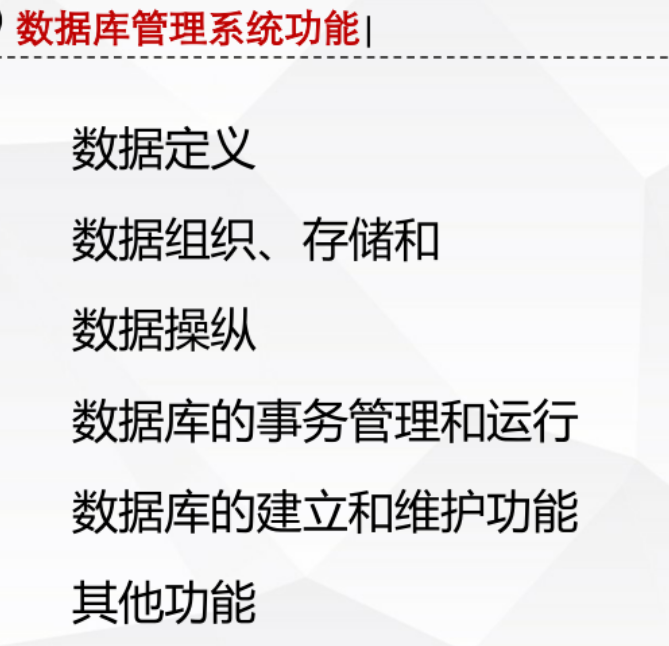
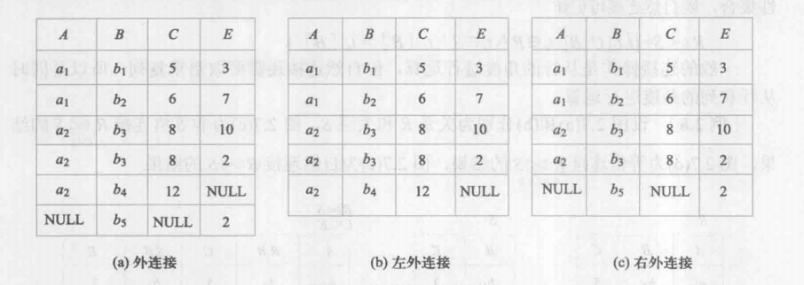
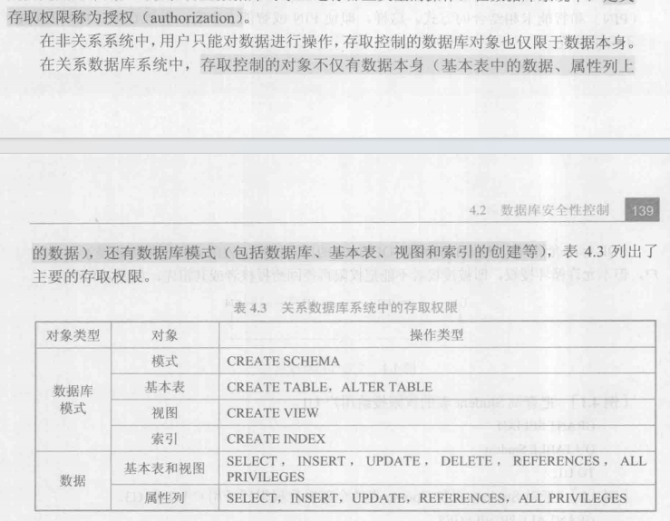
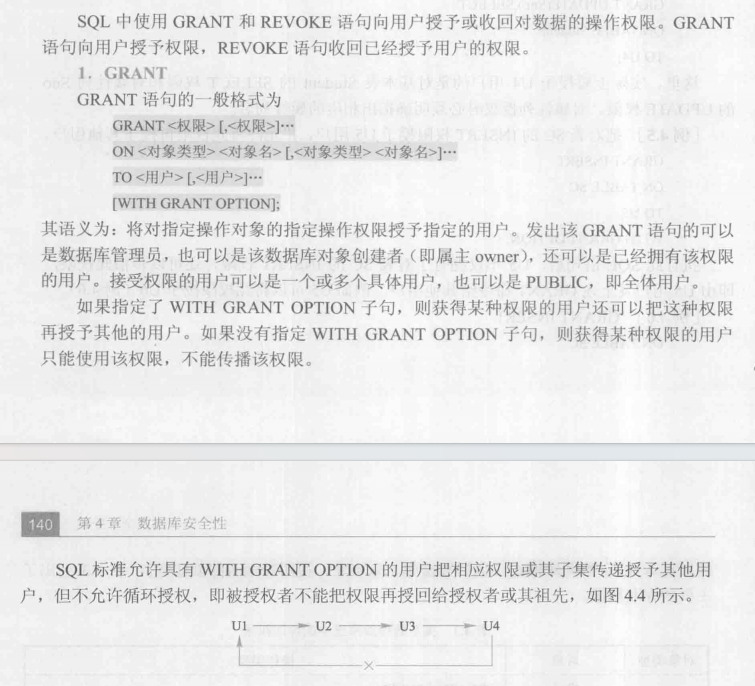

[toc]

# 数据库系统基础

## 数据库系统概述

### 基本概念

- 什么是信息
  信息是对客观事务的一种反映
- 什么是数据
  数据是对客观事务的一种符号表示，比如说，数字，字母，图像，声音，我都有对应的符号来表示
- 什么是数据库
  数据库是长期储存在计算机内，有**组织，可共享**的数据集合，不仅包括数据本身，还有数据之间的各种关系
- 什么是数据库管理系统 DBMS
  数据库管理系统简单理解就是像 Navicat 那样的，可以对数据库进行增删改查，储存数据库，数据表的运行管理等功能的系统
  
- 什么是数据库系统 DBS
  DBS 就是由数据库，数据库管理系统，数据管理员，应用开发人员，数据库设计人员，最终用户，组成的一个完整的数据库环境，就是数据库生态啦
  

### 概念模型

实体，实体就是现实的实体类，比如说学生，就是个实体
属性，属性就是实体拥有的特征，比如说学生，学生有姓名，年龄，性别，班级等属性
码，码就是实体的唯一标识，比如说学生，学生有学号，学号就是学号的码
实体类型，用实体名和属性名集合来抽象和刻画同类实体，比如说学生，姓名，性别，入学时间等来整合一类实体
联系，实体集的单个实体之间的联系是指不同实体集之间的联系，实体之间的联系有一对一，一对多，多对多，比如说，学生对应学校，课程和学生之间的联系

### 数据模型

#### 数据模型的组成要素

数据模型的组成要素
静态模型（特性）——数据结构
什么是数据库的数据结构，比如说数据库的组织形式就是数据结构
像关系型数据库，是用表的形式来组织数据的，那么表就是数据结构
动态模型——数据操作，比如说数据的插入，删除，修改
数据的完整性约束，完整性约束条件

#### 关系数据模型

##### 层次模型

层次模型是一种树形结构，数据之间的关系是一对多，比如说，一个学院，学院对应院系，学院对应专业，然后院系又可以对应老师，学生
一对多关系，简单理解，就是一个学校可以对应多个学生，但是一个学生只能是属于一个学校的
但是层次模型在描述非一对多关系时是很难做到的，比如说一个学生可以选很多门课程，一门课程也可以有很多学生，那么在树结构里面，是不能岔开的，所以层次模型不能描述这种情况

##### 网状模型

网状模型可以表示多对多的关系，就像一张网那样，但是数据大起来了以后，就会非常的可怕

#### 所以主角登场，关系模型

- 关系模型的一些概念

# 关系数据库

## 关系型数据库与非关系型数据库的区别

关系型数据库是按照二维表的形式来储存数据的
关系型数据库顾名思义，就是数据之间有关系，比如说说，学生表和课程表，这两个数据之间是有关系的，关系可以是一对一，也可以是一对多，比如说，学生表里面的学生和课程表里面的课程，一个学生可以有多门课程，但是一门课程只能有一个学生，这就是一对多的关系
而且在关系型数据库中，数据是以表的形式来表示的，数据之间彼此有关联，比如说，数据域，在表的每一个元组里，数据的格式都是一样的，比如说我的表有学号，姓名，班级，那么我的整个表的每一个元组都是按照这样的格式的
而非关系型数据库的数据是以键值对的形式来储存的，数据之间不一定会有相对应的关系，数据的结构也不一定要按照一样的规范，更加灵活
关系型数据库使用表格（表）来组织和存储数据，其中每个表包含固定数量的列和行。表之间可以建立关系，通过主键和外键来实现数据之间的连接。关系型数据库使用结构化查询语言（SQL）进行数据查询和操作。常见的关系型数据库包括 MySQL、Oracle 和 Microsoft SQL Server 等。

非关系型数据库则采用不同的数据组织方式，如键值对、文档、列族和图等。非关系型数据库不需要遵循固定的模式，可以更加灵活地存储和处理数据。非关系型数据库通常具有高度可扩展性和性能，适用于大规模数据和分布式系统。常见的非关系型数据库包括 MongoDB、Cassandra 和 Redis 等。

## 关系数据库结构即形式化定义

## 关系代数

https://blog.csdn.net/qq_45978890/article/details/114139520

## 数据库关系计算

- 并
- 交
- 减
- 笛卡尔积
- 选择
  相当于 select，得到的结果是元组
- 投影
  直接拿一列
- 除

### 数据库中的连接

#### 自然连接

自然连接是关注于列的，只匹配具有相同列的项，怎么看结果呢，一开始先找有没有相同的列，然后列出来，然后再看行，当列里面的项相同时的行再进行匹配
然后按照看笛卡尔积的方式，去看对应的列，如果有相同项的，就并起来

#### 等值连接

等值连接就是直接一行一行看，如果有相同的行，就把他们并起来

#### 外连接

外连接就是，自然连接其实是会筛除掉没有匹配的项，但是外连接就不会，会把没有匹配的项也显示出来，然后用 null 来填充
也就是说在自然连接的前提下，看左右表，左表没用上的写上去，然后空的项拿 null 填

也就是说左表+右表

## 数据字典

数据项；
数据项 === 数据元素 === 数据表里面的目 === 数据表里面的字段 也就是说在一个数据表里面，每一列都是一个数据项
数据项的定义；
比如说在一个学生管理系统里，学生信息的数据项可以包括学号，科目，成绩等等
对应到表里面，就是学号，科目，成绩这些字段
数据结构；
数据结构就是数据项的组织形式，比如说，学生信息的数据项，可以组织成一张表，表里面有学号，科目，成绩这些字段
数据流；
数据流表示在一个系统里面，数据的流向
比如说，用户点击登录，然后输入账号密码，然后点击登录，这个过程中，数据的流向就是从用户输入的账号密码，到数据库里面去验证，然后返回结果，这个过程中，数据的流向就是从用户输入的账号密码，到数据库里面去验证，然后返回结果
数据存储；
数据存储就是数据的储存形式，比如说，数据可以储存在数据库里面，也可以储存在文件里面，也可以储存在内存里面
**处理过程：**
增删改查

## 数据库完整性约束

## 数据库安全性

数据库安全性等级
从 db2 开始，数据库安全性分为四个等级，分别是 C1，C2，B1，B2，B3，A1，C1 是最低的，目前还没有能达到 a 的数据库系统

计算机系统的安全等级

有关数据库的安全性，主要包括用户身份鉴别，多层存取控制，审计，数据加密等安全技术

用户身份鉴别：
用户身份鉴别就是在用户登录的时候，验证用户的身份，比如说，用户输入账号密码，然后点击登录，这个过程中，就是在验证用户的身份，如果账号密码正确，就可以登录，如果账号密码错误，就不能登录

多层存取控制：
多层存取控制就是在用户登录以后，对用户的权限进行控制，比如说，用户 A 只能查看自己的信息，用户 B 可以查看所有人的信息，这个就是多层存取控制
存取控制，在关系数据库中，用户除了存储数据结构以外，还会储存模式什么的

审计
审计就是对用户的操作进行记录，比如说，用户 A 在什么时间，对什么数据进行了什么操作，这个就是审计

权限授予取消
使用 grant 命令授予用户权限，使用 revoke 命令取消用户权限

grant to with grant option
revoke from
