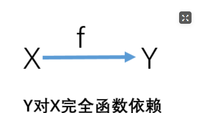
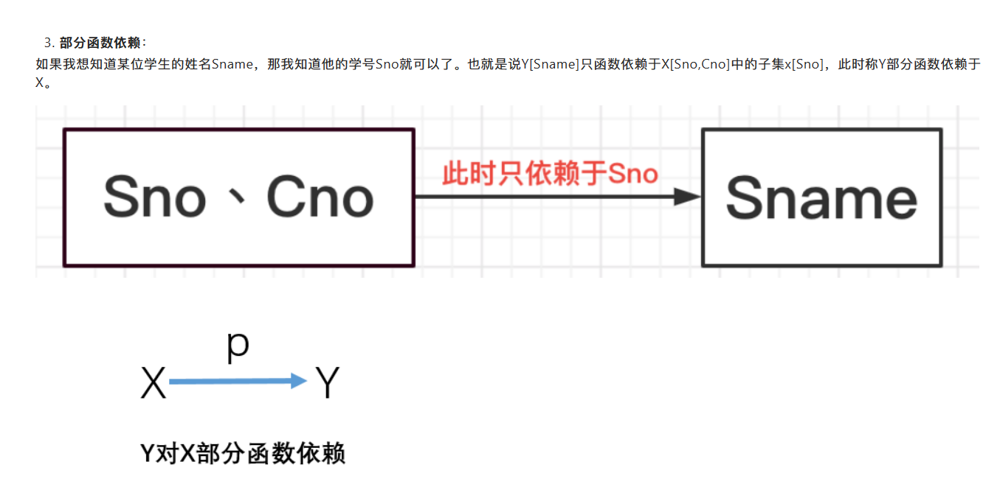
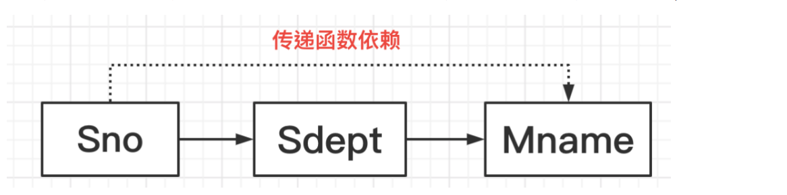
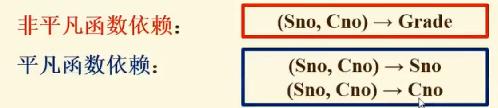
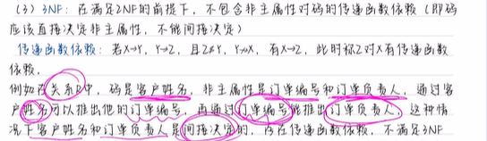
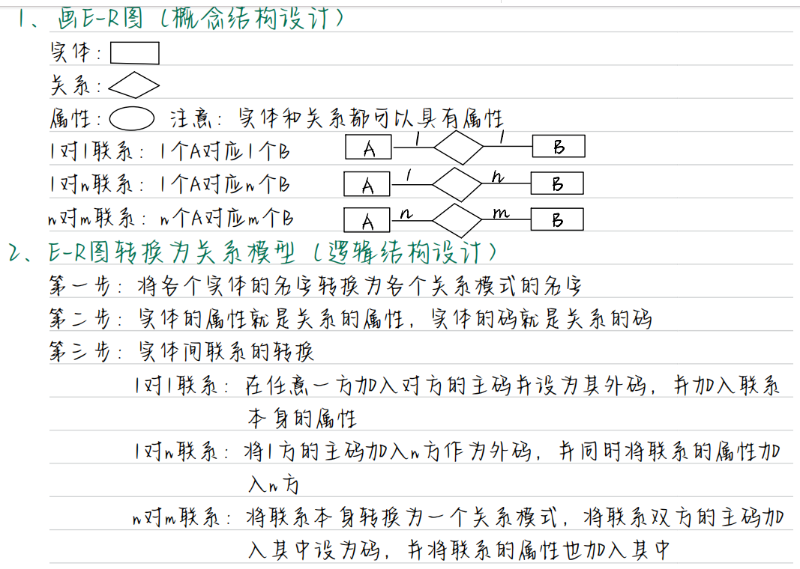

[toc]

## from the beginning

我们要知道的考试的最核心的重点
首先关系数据库，关系代数不用多说
数据库完整性，考什么关系范式的，必考
数据库的设计，什么逻辑设计，物理设计，必考
数据库的安全性，提一嘴
并发控制，必考，他上课说了挺久的
还有什么关系型数据库的函数依赖，这 b 东西必考，而且选填肯定很多
就是函数依赖，部分依赖什么的

## 数据库系统的基本概念(绪论)

什么是模式
模式有内模式和外模式，其实就是用户可以看到的数据库结构，包括表的结构，数据什么的
应该数据库可以有多个外模式，也就是，多个用户看到的这个数据结构可能是不一样的，那内模式就是数据库的所有物理结构和存储方式的一个描述
也可以从权限去理解，超管可以看到内模式

### 数据库系统的基本概念

数据，描述事务的符号抽象
数据库，长期存储在计算机中的，有组织的，可共享的数据集合
DBMS 像 Navicat 那种，是位于用户和操作系统之家的一层数据管理软件，它的主要功能就是定义，创建，操纵数据库，管理数据库的安全性和完整性，以及数据的备份和恢复等

DBS 数据库系统，就是加上完整的应用和人员管理的

### 数据库系统的特点

数据结构化
数据的共享程度高，冗余度低，可扩展，什么意思呢，就是这些数据可以被多个用户共享，而且可以被多个应用程序共享，而且这些数据是可以扩展的，比如说，我们可以在数据库中添加新的数据

**数据的独立性高**
物理独立性，**应用程序**与物理存储相互独立，数据的物理存储改变，应用程序不改变，逻辑独立性
应用程序与数据的逻辑结构相互独立，数据的逻辑结构改变，应用程序不改变

其实很简单，就是把数据放在了数据库，如果我不执行 sql 的话，我的数据是不会改变的，我改表，我不更新查询也不会改变

### 数据模型

数据模型的组成要素，**数据结构**，**数据操作**，**数据的完整性约束**
数据结构好理解，就是表结构那些东西
数据操作就是增删改查的集合，即我们导出来的 sql 语句
数据的完整性约束就是，比如说给一张表设置主键，设置外键什么的

数据库的三级结构模式，外模式，模式，内模式

外模式就是用户视图
模式就是数据库管理员视图
内模式就是数据库的物理存储结构

## 关系型数据库

### 关系数据库理论

#### 函数依赖

在一个表里面，属性 X 可以映射到属性 Y，也就是知道了 x 就能确定 y，就像函数那样，是映射的
比如说在一个学生表里面，我们知道了一个学生的学号，我们就可以确定他的姓名和年龄，那如果有重名的话，我们就不能确定他的姓名，那这个就不是函数依赖了

- 完全函数依赖
  比如说，只有课程号+学号才能确定成绩，用式子表达就是
  x[sno],x[sco] -> Y[score]
  就是我们后面会经常看到的 AC->B 这种，就叫做完全函数依赖
  -

- 部分函数依赖
  其实部分函数依赖是不太好的，比如说我想知道某个学生的成绩，我只需要知道学号就可以
  只有左边是组合的情况才有可能出现部分函数依赖
  

- 传递函数依赖
  比如说，我知道了一个学生的学号，那我就可以知道这个学生的所在系，就可以知道他的系主任是谁，其实这里学生和系主任并不存在直接的函数依赖，这种情况就叫做传递函数依赖
  
  **注意，这里的所在系却不能反推出学号，也就是说在传递函数依赖中是不能反推的**
  再举个例子，我知道一个学生的学号，然后我就可以知道这个学生的班级，然后我就可以知道这个学生的班主任，但是班级却不能反推出学号
- 平凡/非平凡函数依赖
  是一种非常傻逼的东西。。。。
  
  也就是如果是平凡函数依赖，你要做到学号和课程号推出学号，课程号推出课程号
  一般都是非平凡

【1】**函数依赖是语义范畴的概念**
【2】**函数依赖不是关系模式 R 的某个或者某些关系实例的约束条件，而是关系模式 R 之下一切可能的关系实例都要满足的约束条件**

如果是 1:1 的关系，那么 x<->Y

#### 码

**例题**
主码，候选码，外码

- 主码就是主键，唯一的标识一条记录
  比如说在一个学生表里面，学号就是主码
  用关系数据库的理论讲就是，主码可以决定其他的属性
  在比较复杂一点的表里面，主码可能由两个以上的属性组成
  比如说可能需要学号和班级号才能唯一的标识一条记录
- 候选码就是可能的主码，比如说，学号和姓名都可以作为主码，预备候选，但是我们只能选一个作为主码
- 主属性
  包含在任何一个候选码中的属性都是主属性，比如说学号，姓名
- 非主属性
  不包含在任何一个候选码中的属性都是非主属性，比如说年龄，性别
- 外码
  外码的定义是有一个属性或者属性组，不是这个关系的码而是另一个关系中的码，那这玩意不就是外键嘛
- 全码
  一个关系的所有属性都是主属性，那这个关系的码就是全码

#### 范式

#### 闭包操作

#### NF

证明是否满足 NF 的方法就是求反例，而不是根据定义去证明

##### 1NF

就是每一个属性都是不可继续拆分的，比如说学校，如果拆成高中大学就不满足 1nf 了

##### 2NF

就是在满足 1nf 的前提下，不包含**非主属性**对 **码** 的部分依赖
什么意思呢
比如说，学号和班级是主码，那么，我的学号就可以决定姓名了，但是在这里就变成了 [学号，班级] -> 姓名 存在部分依赖了，这样就不满足 2NF 那么满足 2NF 的应该是 [学号,班级]->姓名

##### 3NF

3NF 就是在满足 2NF 的前提下，不包含**非主属性**对**码**的传递依赖，也就是，主码就应该直接决定非主属性，一个学号直接全部决定完了

##### BCNF

bcnf 就是在满足 3nf 的前提下，不包含主属性对码的部分依赖和传递依赖，**也就是每一个决定因素都包含候选码**
比如说 ac->d abc->e 然后这个的候选码是 ad 那就不属于 bcnf 了，正确的应该是 ad->d ad->e

##### 4NF

不考不理
4NF 是

#### 多值依赖

## 数据库编程(sql 语句)

## 数据库的安全性 (权限管理)

其实本质上的安全性就是指授权那一块的

### 不安全因素

1 非授权用户对数据库的破坏
2 数据库中重要数据的泄露
3 安全环境的脆弱性

### 数据库安全性控制

用户身份识别 静态口令识别，动态口令识别，生物特征鉴别，智能卡识别

**存取控制**

**自主存取控制方法**
自主存取控制就是指 给每一个用户权限相应权限访问相应数据
但是缺陷是，这些数据是可以拷贝出来的
自主存取控制实现的方法就是通过授权和收回权限
即 grant 和 revoke

**强制存取控制 基于安全策略的访问控制机制**
强制存取控制就是指，每一个用户都有一个安全级别，每一个数据也有一个安全级别，那么只有当用户的安全级别大于等于数据的安全级别的时候，才能访问这个数据

**视图机制**
为不同的用户定义不同的视图，反正用户也看不到，也不能改

**审计**
审计要注意，审核是在出事前审核的
审计是把所有操作都记录在日志里，然后查看日志可以知道错误信息
**审计要注意的是，先写入日志再执行操作**
**这里是数据恢复那块的内容**

## 数据库完整性

### 数据库的完整性约束

数据库的完整性约束分为四类

#### 实体完整性

实体完整性就是，主属性不能为 null，主码不能重复，主键和候选键都不能为空

#### 参照完整性

很好理解，这玩意就是外键
就是使用外键对属性进行约束，如果外键的值为空，那么就不能插入

#### 用户定义完整性

针对自定义字段进行约束，比如说，年龄不能小于 0，性别只能是男或者女

#### 域完整性

域我们回忆一下，就是取值范围，我们的数据是什么类型，长度是多少之类的
那么域完整性是针对数据库表的**字段**的，比如说，我们的年龄字段，我们就可以设置为 int 类型，长度为 3，那么如果插入的时候，年龄是 1000，那么就会报错，这就是域完整性

## 数据库的设计

### 画 ER 图的大题做法

首先看题，把关系捋一下，比如说，学校，学院，班级，学生之类的

然后画出大概的 er 图，得到 1 对 1,1 对 n 的关系
然后要注意先把所有的属性都写上去，画圆圈

然后最重要的一步来了
1 对 1 关系就是，把一方的主码作为自己的外码，比如说，学校和学院之间，那么在学院的表里当然要加上学校名称或者学校号

1 对多关系就是，比如学生和班级，那么就把 1 的主码作为外码加入到 n 的一方，同时将联系的属性加入
比如说，学生表里就有班级号

n 对 m 的关系就是，他们的联系本身就是一张表了，两个表的主键加入到联系表里面，同时将联系的属性加入
比如最经典的，学生的课程表和学生成绩表得到的选课成绩表
那么选课成绩表的主键就是学生号和课程号，同时加入成绩

## 数据库恢复技术

### 事务的概念

事务的概念是恢复的基本单位，也是并发控制的基本单位
事务是数据库操作序列
一个事务可以是一个 sql 语句或者是一个程序

### 事务的特性 ACID

原子性，一致性，隔离性，持续性

### 数据库系统的故障种类

事务内部的故障，系统故障，介质故障，计算机病毒

## 并发控制

### 数据加锁

常见的两种锁 X 锁和 S 锁在 S 锁上加了共享锁不能加排他锁，X 锁上加了锁不能加其他任何的锁
